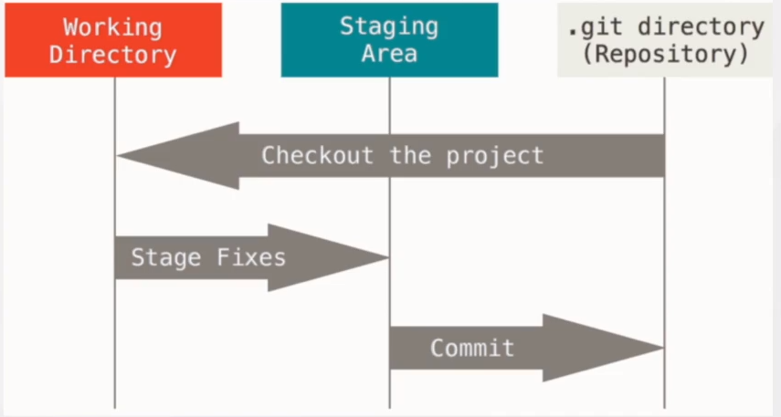

# 什么是版本控制


版本控制

版本控制是一种记录一个或若干文件内容变化，以便将来查阅特定版本修订情况的系统。


# 什么是Git

## Git 简介

Git是一种分布式版本控制系统，与SVN类似的集中化版本控制系统相比，集中化版本控制系统虽然能够令多个团队成员一起协作开发，

但有时如果中央服务器岩机的话，谁也无法在岩机期间提交更新和协同开发。甚至有时，中央服务器磁盘故障，

恰巧又没有做备份或备份没及时，那就可能有丢失数据的风险。

## 为什么要用Git

能够对文件版本控制和多人协作开发拥有强大的分支特性，所以能够灵活地以不同的工作流协同开发分布式版本控制系统，

即使协作服务器岩机，也能继续提交代码或文件到本地仓库，当协作服务器恢复正常工作时，再将本地仓库同步到远程仓库。

当团队中某个成员完成某个功能fatkun时，通过pullrequest操作来通知其他团队成员，其他团队成员能够reviewcode后再合并代码。

## Git特性

几乎所有操作都是本地执行；直接记录快照，而非差异比较；时刻保持数据完整性

### Git 的三种状态

Git 有三种状态，你的文件可能处于其中之一：已提交（committed）、已修改（modified）和已暂存（staged）

### Git的使用流程

1.在git 版本控制的目录下修改某个文件

2.使用git add 命令对修改后的文件快照，保存到暂存区域

3.使用git commit命令提交更新，将保存在暂存区域的文件快照永久转储到Git自录中



# Git使用


## 创建仓库

```bash 
# 初始化空仓库
git init
# 克隆远程项目
git clone user.name libai user.email libai@gmail.com
# 添加配置
git config
# --global 全局配置
git --global config user.name libai user.email libai@gmail.com
```

## 保存修改

```bash
# 将修改提交到暂存区
git add <项目>
# 提交更新
git commit -s -m "this is a git example"
```

## 查看仓库

```bash
#查看修改状态
git status
# 查看历史提交
git log -oneline
```

## 重写Git历史记录

```bash
git commit --amend

git rebase

git refloa
```

## 配置帐号信息

```bash
git config --global user.email "xxx"
git config --global user.name "xxx"
```

## 提交地址

```bash
git remote add origin <远程地址>
```

## 推送到远程项目

```
git push origin <分支>
```

## 通过版本号查看提交信息

```bash
git cat-file -p <版本号>
```

## 恢复误删文件

```bash
git restore <文件名>
```

## 恢复至某个版本

```bash
git reset --hard <版本号> # 可以通过 git log获取该信息
```

## 恢复至某个版本保留提交

```bash
git revert <版本号> # 相当于还原了数据但提交了新版本
```

## 分支操作

### 添加分支

添加分支前主分支必须有提交

```bash
git branch <分支名>
```

### 查看分支情况

```bash
git branch -v
```

### 切换分支

```bash
git checkout <分支名>
```

### 添加分区并切换至该分支

```bash
git checkout -b <分支名>
```

### 删除分支

```bash
git branch -d <分支名>
```

### 分支合并

```bash
git branch <分支名>
```

## 标签

### 查看标签

```bash
git tag
```

### 添加标签

```bash
git tag <标签名> <版本号>
```

### 通过标签查看log

```bash
git log <标签名>
```

## 关联远程仓库

```bash
git remote add origin <远程地址>

# 移除关联
git remote remove origin <远程地址>
```


## 提交反复验证密码问题

在git工作目录下执行

```bash
git config --global credential.helper store
```

## ssh方式处理远程操作

### 生成ssh key

```bash
ssh-keygen -t rsa -C<远程ssh地址>
```

默认生成位置/home/<用户名>/.ssh/id_rsa

找到文件,将内容复制,抬到对应git仓库即可