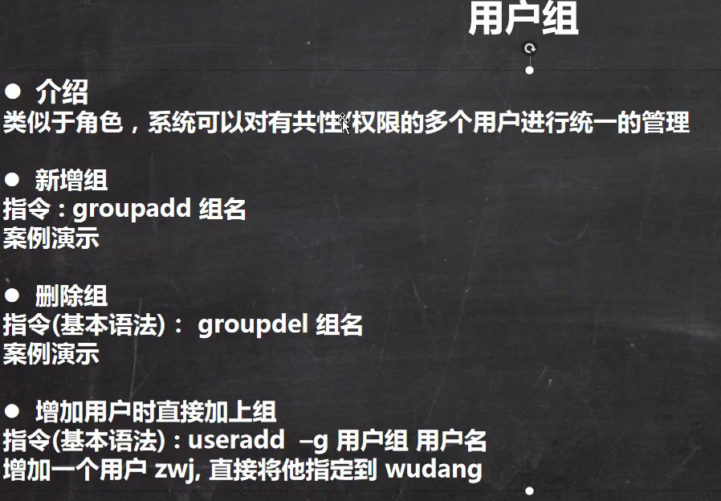
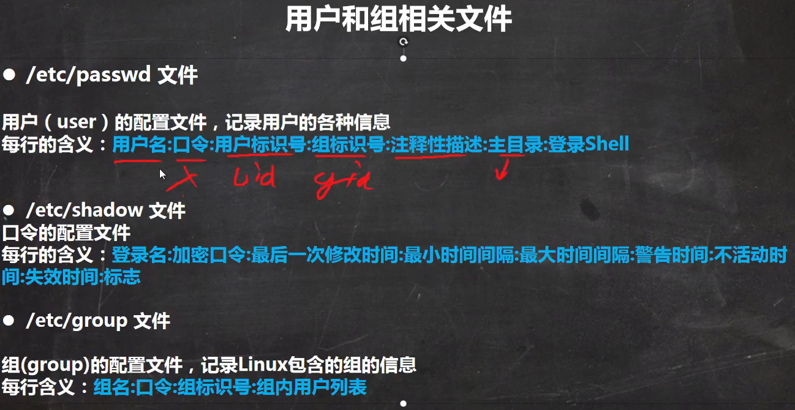
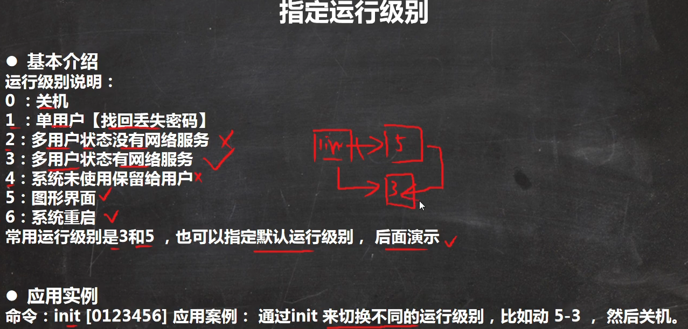
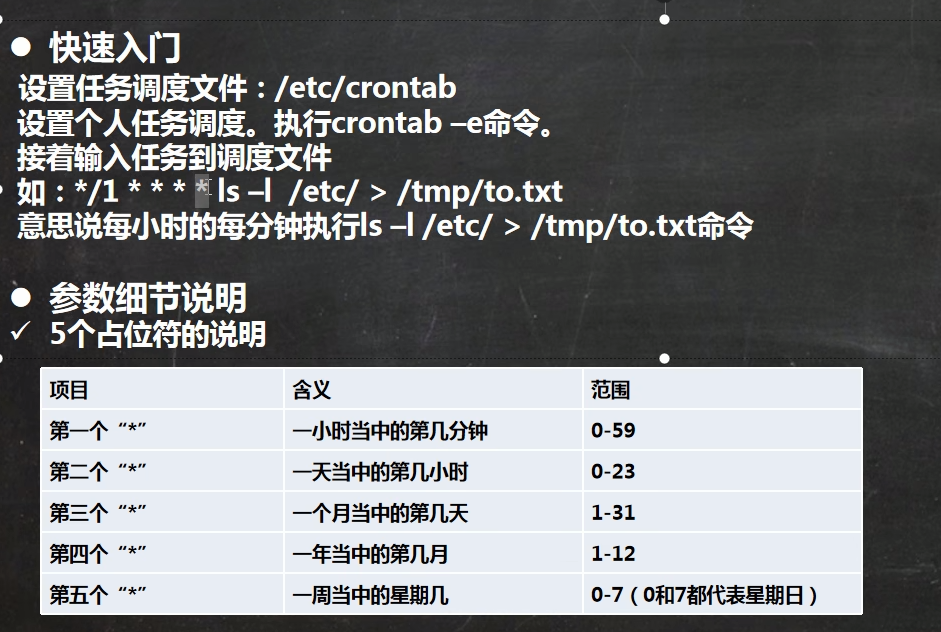
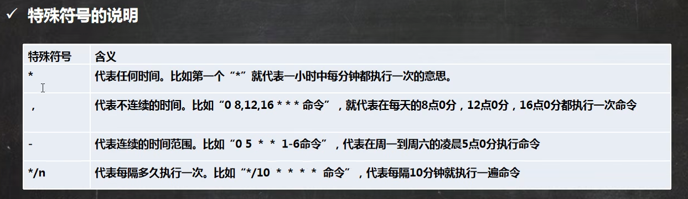
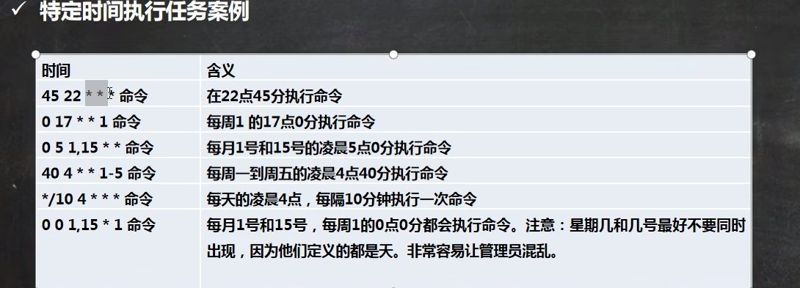
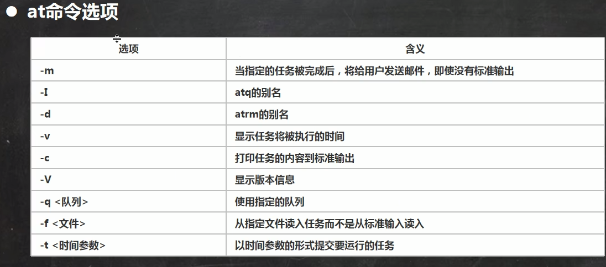
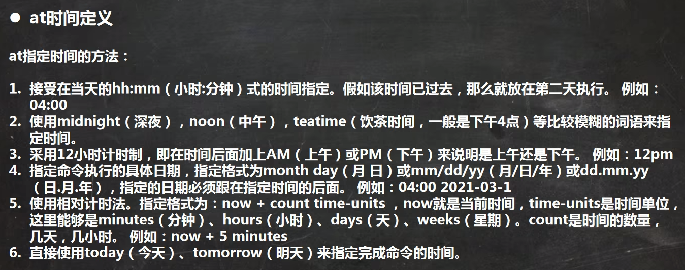
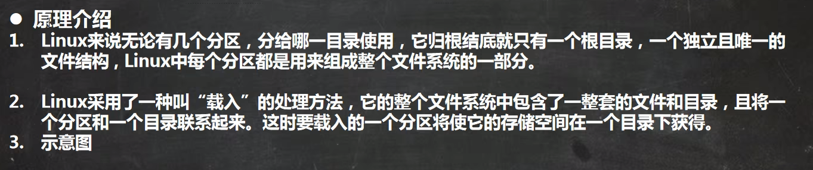
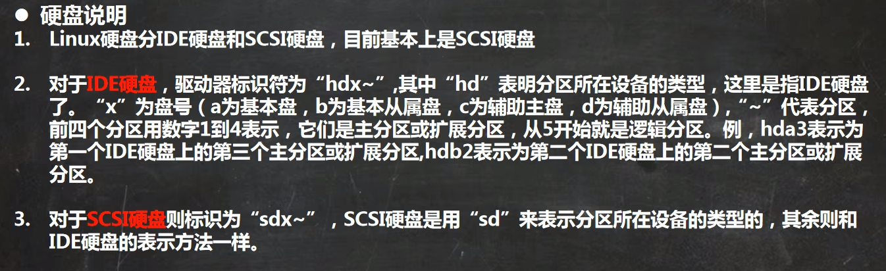

# 安装vmtools

1.
进入centos
2.
点击vm菜单的->installvmwaretools
3.
centos会出现一个vm的安装包，xx.tar.gz
4.
拷贝到/opt
5.
使用解压命令tar，得到一个安装文件
6.
进入该vm解压的目录，/opt目录下
7.
安装/vmware-install.pl
8.
全部使用默认设置即可，就可以安装成功
9.
注意：安装vmtools需要有gcc.

# 目录结构

## /bin

[常用]

Vusr/bin .Jusr/local/bin)

是Binary的缩写，这个目录存放着最经常使用的命令

## /sbin 

Vusr/sbin./usr/local/sbin)

S就是SuperUser的意思，这里存放的是系统管理员使用的系统管理程序。

## /home[常用]

存放普通用户的主目录，在Linux中每个用户都有一个自己的目录，一般该目录名是以用户的账

号命名，老师演示，体验

## /root [常用]

该目录为系统管理员，也称作超级权限者的用户主目录

## /lib

系统开机所需要最基本的动态连接共享库，其作用类似于Windows里的DLL文件。几乎所

有的应用程序都需要用到这些共享库

## /ost+found

这个目录一般情况下是空的，当系统非法关机后，这里就存放了一些文件

## /etc[常用]

所有的系统管理所需要的配置文件和子目录，比如安装mysql数据库my.conf

## /usr[常用]

这是一个非常重要的目录，用户的很多应用程序和文件都放在这个目录下，类似与windows下

的programfiles目录，

## /boot

[常用]存放的是启动Linux时使用的一些核心文件，包括一些连接文件以及镜像文件

## /proc

这个目录是一个虚拟的目录，它是系统内存的映射，访问这个目录来获取系统信息

## /srv 

service缩写，该目录存放一些服务启动之后需要提取的数据

## /sys

这是linux2.6内核的一个很大的变化。该目录下安装了2.6内核中新出现的一个文件系统sysfs

## /tmp

这个目录是用来存放一些临时文件的

## /usr/local[常用]

这是另一个给主机额外安装软件所安装的目录。一般是通过编译源码方式安装的程序

## /var[常用]

这个目录中存放着在不断扩充着的东西，习惯将经常被修改的目录放在这个目录下。包括各种日
志文件

## /selinux Isecurity-enhanced linux]

SELinux是一种安全子系统，它能控制程序只能访问特定文件，有三种工作模式，可以自行设置

# 用户

## 添加用户

### 默认添加

```shell
useradd 用户名 
```

### 指定主目录添加

```shell
useradd -d 目录名 用户名
```

## 删除用户

默认删除

```shell
userdel 用户名 # 会保留家目录
```

删除用户和家目录

```shell
userdel -r 用户名
```

# 用户组



## 添加组

```shell
groupadd 用户组 
```

## 删除组

```shell
groupdel 用户组 
```

## 增加用户时指定组

```shell
useradd -g 用户组 用户名
```

默认添加用户会直接创建一个和用户名一样的组，该用户在该组中

## 修改用户的组

```shell
usermod -g 用户组  用户名
```

## 相关文件

### /etc/passwd

### /etc/shadow

### /etc/group



# 运行级别



指定运行级别

基本介绍

运行级别说明：

0：关机

1：单用户【找回丢失密码】

2：多用户状态没有网络服务

3：多用户状态有网络服务

4：系统未使用保留给用户

5：图形界面

6：系统重启

常用运行级别是3和5，也可以指定默认运行级别，后面演示

·应用实例

命令：init[0123456]应用案例：通过init来切换不同的运行级别，比如动5-3，然后关机。

cat /etc/inittab

```shell
# inittab is no longer used when using systemd.
#
# ADDING CONFIGURATION HERE WILL HAVE NO EFFECT ON YOUR SYSTEM.
#
# Ctrl-Alt-Delete is handled by /usr/lib/systemd/system/ctrl-alt-del.target
#
# systemd uses 'targets' instead of runlevels. By default, there are two main targets:
#
# multi-user.target: analogous to runlevel 3
# graphical.target: analogous to runlevel 5
#
# To view current default target, run:
# systemctl get-default
#
# To set a default target, run:
# systemctl set-default TARGET.target
#

```

查看运行级别

```
systemctl get-default
```

# 忘记密码

系统启动选择界面时按`e键`

在Linux16所在行后添加 `init=/bin/bash`

`ctrl + x `保存

重启后在单用户模式下输入 `mount -o remount,rw /`

修改密码 `passwd`

输入 `touch /.autorelabel`

shoe `exec /sbin/init`

# 帮助指令


## man 命令

## help 命令

目录操作

## cp -r

\cp 覆盖不提示

## tail


## history 

历史命令记录

history  n 

显示最近n条指令

!命令编号 执行历史执行的命令编号所对应的命令

## date

查看当前时间

date -s + '字符串'  将本地时间替换为字符串时间

date "+%Y-%m-%d %H:%M:%S"  按照 年-月-日 时:分:秒 格式输出当前时间

## hwclock -s 

同步回当前时间

## cal

显示当前月的日历

cal 2020 显示所给定年份的所有月份

cal 8 2020 显示所给年份所对应月份的日历

## find

查找文件指令

find +搜索范围 [选项]

-name 按照指定的文件名查找文件

```shell
find /home/ljw -name hello.txt
```

 查找以l开头的MP4文件并忽略大小写。

```bash
find /home/ -iname 'l*.mp4'
```

-user 查找指定用户名所有文件

```bash
find -user ljw
```

-size [文件大小] 按照指定的文件大小查找该文件

```bash
find -size +200M /home/ljw/ 
```

 -mmin 查找5分钟内修改的文件 ,+5 未被在指定时间修改的文件

```bash
find /home/ -mmin -5
```

-type f 查找目录下的文件 f文件 d目录 l软连接

```bash
find /home/ -type f 
```

  -a 同时满足条件  -o 符合所需条件之一

```bash
find /home/ -iname 'l*.mp4' -a -iname '*d.mp4'
```

-inum 用文件id查找文件  ls -i 可获得id

```bash
find -inum 34316373
```

-atime +10 查找十天内的文件

```bash
find /home -atime +10 
```


## locate

快速查找文件指令 通过数据库实现

如第一次执行,先执行 updatedb

且需要过段时间继续执行维护最新结果

locate  文件名

## which 

which 命令 输出命令所在位置

## grep

查找过滤指令

用法1

```shell
cat /etc/passwd |grep -in "root"
```

用法2

```shell
grep -in "root" /etc/passwd
```

## gzip

压缩文件为.gz压缩文件

```shell
gzip hello.txt
```

解压gz文件

## gunzip

```
gunzip hello.txt.gz
```

## zip

压缩文件 .zip

```shell
zip hello.txt
```

-r  递归压缩 即压缩目录

```shell
zip -r /home/test
```

## unzip

解压缩

```shell
unzip hello.txt hello.txt.zip
```

-d 指定目录解压

## tar

打包指令 .tar.gz

tar [选项] xxx.tar.gz 打包的内容

压缩

```shell
tar -zcvf pc.tar.gz /home/pig.txt /home/cat.txt
```

解压缩

```shell
tar -zxvf  pc.tar.gz
```

-C 指定解压缩目录

```shell
tar -zxvf  pc.tar.gz -C tmp
```

## chown

修改文件所有者

chown 用户名 文件名

```shell
chown ljw test.txt
```

## chgrp

chgrp 组名 文件名

```shell
chgrp ljw test.txt
```

```shell
chgrp -R ljw /home/test
```


## usermod 

usermod -g 新组名 

usermod -d 目录名 用户名 改变该用户登入的初始登入目录

# 权限的基本介绍

ls-l中显示的内容如下：

-rwxrw-r-- 1 root root 1213Feb2 09:39 abc

)

0-9位说明

1.

第0位确定文件类型（d，l,c,b)

I是链接，相当于windows的快捷方式

d是目录，相当于windows的文件夹

c是字符设备文件，鼠标，键盘

b是块设备，比如硬盘

2.

第1-3位确定所有者（该文件的所有者）拥有该文件的权限。---User

3.

第4-6位确定所属组（同用户组的）拥有该文件的权限，---Group

4.

第7-9位确定其他用户拥有该文件的权限---Other

# crond任务调度


crontab进行定时任务的设置

## 概述

任务调度：是指系统在某个时间执行的特定的命令或程序。

任务调度分类：1.系统工作：有些重要的工作必须周而复始地执行。如病毒扫描等

个别用户工作：个别用户可能希望执行某些程序，比如对mysql数据库的备份。

## 基本语法

crontab【选项]

常用选项

-e 编辑crontab定时任务

-l 查询crontab任务

-r 删除当前用户所有的crontab任务

## 参数说明



快速入门

设置任务调度文件：/etc/crontab

设置个人任务调度。执行crontab-e命令。

接着输入任务到调度文件

如：*/1****Is-l/etc/>/tmp/to.txt

意思说每小时的每分钟执行ls-l/etc/>/tmp/to.txt命令

参数细节说明

5个占位符的说明

项目

含义

范围

第一个“*"

一小时当中的第几分钟

0-59

第二个“*"

一天当中的第几小时

0-23

第三个“*"

一个月当中的第几天

1-31

第四个“*"

一年当中的第几月

1-12

第五个“*"

一周当中的星期几

0-7（0和7都代表星期日）

## 特殊符号



含义

\*代表任何时间。比如第一个“*”就代表一小时中每分钟都执行一次的意思

, 代表不连续的时间。比如“08,12,16＊＊＊命令”，就代表在每天的8点0分，12点0分，16点0分都执行一次命令

\- 代表连续的时间范围。比如“05＊＊1-6命令”，代表在周一到周六的凌晨5点0分执行命令

 */n代表每隔多久执行一次。比如"\*/10命令”，代表每隔10分钟就执行一遍命令

## 特定时间执行任务案例



时间 含义

45 22 * * * 命令  在22点45分执行命令

0 17**1命令  每周1的17点0分执行命令

0 5 1,15 * *命令 每月1号和15号的凌晨5点0分执行命令

40 4 * * 1-5命令 每周一到周五的凌晨4点40分执行命令

\*/10 4 * * * 命令 每天的凌晨4点，每隔10分钟执行一次命令

0 0 1,15 * 1命令

每月1号和15号，每周1的0点0分都会执行命令。注意：星期几和几号最好不要同时

出现，因为他们定义的都是天。非常容易让管理员混乱。

# at定时任务


## 基本介绍

1. at命令是一次性定时计划任务，at的守护进程atd会以后台模式运行，检查作业队列来运行

2. 默认情况下，atd守护进程每60秒检查作业队列，有作业时，会检查作业运行时间，如果时间与当前时间匹配，则运行此作业。

3. at命令是一次性定时计划任务，执行完一个任务后不再执行此任务了

4. 在使用at命令的时候，一定要保证atd进程的启动，可以使用相关指令来查看
5. ps -ef |grep atd

## at命令格式

at【选项】时间]

Ctrl + D 结束at命令的输入

## at命令选项



选项      含义

### -M

当指定的任务被完成后，将给用户发送邮件，即使没有标准输出

### -I

atq的别名

### -d

atrm的别名

### -v

显示任务将被执行的时间

### -c

打印任务的内容到标准输出

### -V

显示版本信息

### -q <队列>

使用指定的队列

### -f <文件>

从指定文件读入任务而不是从标准输入读入

### -t<时间参数>

以时间参数的形式提交要运行的任务

## at时间定义



at指定时间的方法：

1.

接受在当天的hh:mm（小时:分钟）式的时间指定。假如该时间已过去，那么就放在第二天执行。例如：

04:00

2.

使用midnight（深夜），noon（中午），teatime（饮茶时间，一般是下午4点）等比较模糊的词语来指

定时间。

3

采用12小时计时制，即在时间后面加上AM（上午）或PM（下午）来说明是上午还是下午。例如：12pm

4.指定命令执行的具体日期，指定格式为monthday（月日）或mm/dd/yy（月/日/年）或dd.mm.yy

（日.月.年），指定的日期必须跟在指定时间的后面。例如：04:00 2021-03-1

5、

使用相对计时法。指定格式为：now +count time-units，now就是当前时间，time-units是时间单位，

这里能够是minutes（分钟）、hours（小时）、days（天）、weeks（星期）。count是时间的数量

几天，几小时。例如：now +5 minutes

6.直接使用today（今天）、tomorrow（明天）来指定完成命令的时间

## atq

输出任务列表

## atrm 

删除任务

```shell
atrm 编号
```

# Linux分区



## 原理介绍

1.

Linux来说无论有几个分区，分给哪一目录使用，它归根结底就只有一个根目录，一个独立且唯一的

文件结构，Linux中每个分区都是用来组成整个文件系统的一部分。

2.

Linux采用了一种叫“载入”的处理方法，它的整个文件系统中包含了一整套的文件和目录，且将一

个分区和一个目录联系起来。这时要载入的一个分区将使它的存储空间在一个目录下获得。

3.

示意图

## 硬盘说明




1.

Linux硬盘分IDE硬盘和SCSI硬盘，目前基本上是SCSI硬盘

对于IDE硬盘，驱动器标识符为“hdx~”,其中"hd”表明分区所在设备的类型，这里是指IDE硬盘

了。“x"”为盘号（a为基本盘，b为基本从属盘，c为辅助主盘，d为辅助从属盘），“～”代表分区，

前四个分区用数字1到4表示，它们是主分区或扩展分区，从5开始就是逻辑分区。例，hda3表示为

第一个IDE硬盘上的第三个主分区或扩展分区，hdb2表示为第二个IDE硬盘上的第二个主分区或扩展

分区。

2.

对于SCSI硬盘则标识为“sdx~”，SCSI硬盘是用“sd”来表示分区所在设备的类型的，其余则和

IDE硬盘的表示方法一样。

## 挂载案例

下面我们以增加一块硬盘为例来熟悉下磁盘的相关指令和深入理解磁盘分区、挂载、卸载的概念。

如何增加一块硬盘

1.

## 虚拟机添加硬盘


add


next


scsi


create a new virtual disk


选择需要的大小


finish

重启系统后查看分区情况

### lsblk

查看分区情况

### lsblk -f

更详细的查看


2.

## 分区

### fdisk

对新增硬盘进行分区

```shell
fdisk /dev/sdb
```

m 查看帮助

n 增加新分区

​	p 添加主分区

w 退出分区编辑

q 保存分区修改	


3.

## 格式化

### mkfs 

mkfs  -t ext4 /dev/sdb1


4.

## 挂载

### mount

mount /dev/sdb1 /media/data


5.

## 设置可以自动挂载

vi /etc/fstab

| 字段           | 含义                                                         |
| :------------- | :----------------------------------------------------------- |
| <file systems> | 要挂载的分区或存储设备. 设备名称，LABEL，UUID，伪文件系统名称 |
| <dir>          | <file systems>的挂载位置。                                   |
| <type>         | 要挂载设备或是分区的文件系统类型，支持许多种不同的文件系统：ext2, ext3, ext4, reiserfs, xfs, jfs, smbfs, iso9660, vfat, ntfs, swap 及 auto。 设置成auto类型，mount 命令会猜测使用的文件系统类型，对 CDROM 和 DVD 等移动设备是非常有用的。 |
| <options>      | 挂载时使用的参数，注意有些mount 参数是特定文件系统才有的。一些比较常用的参数有：auto - 在启动时或键入了 mount -a 命令时自动挂载。noauto - 只在你的命令下被挂载。exec - 允许执行此分区的二进制文件。noexec - 不允许执行此文件系统上的二进制文件。ro - 以只读模式挂载文件系统。rw - 以读写模式挂载文件系统。user - 允许任意用户挂载此文件系统，若无显示定义，隐含启用 noexec, nosuid, nodev 参数。users - 允许所有 users 组中的用户挂载文件系统.nouser - 只能被 root 挂载。owner - 允许设备所有者挂载.sync - I/O 同步进行。async - I/O 异步进行。dev - 解析文件系统上的块特殊设备。nodev - 不解析文件系统上的块特殊设备。suid - 允许 suid 操作和设定 sgid 位。这一参数通常用于一些特殊任务，使一般用户运行程序时临时提升权限。nosuid - 禁止 suid 操作和设定 sgid 位。noatime - 不更新文件系统上 inode 访问记录，可以提升性能(参见 atime 参数)。nodiratime - 不更新文件系统上的目录 inode 访问记录，可以提升性能(参见 atime 参数)。relatime - 实时更新 inode access 记录。只有在记录中的访问时间早于当前访问才会被更新。（与 noatime 相似，但不会打断如 mutt 或其它程序探测文件在上次访问后是否被修改的进程。），可以提升性能(参见 atime 参数)。flush - vfat 的选项，更频繁的刷新数据，复制对话框或进度条在全部数据都写入后才消失。defaults - 使用文件系统的默认挂载参数，例如 ext4 的默认参数为:rw, suid, dev, exec, auto, nouser, async. |
| <dump>         | dump 工具通过它决定何时作备份. dump 会检查其内容，并用数字来决定是否对这个文件系统进行备份。 允许的数字是 0 和 1 。0 表示忽略， 1 则进行备份。大部分的用户是没有安装 dump 的 ，对他们而言 <dump> 应设为 0。转储频率： 0表示不进行dump备份，1代表每天进行dump备份，2代表不定日期的进行dump备份 |
| <pass>         | fsck 读取 <pass> 的数值来决定需要检查的文件系统的检查顺序。允许的数字是0, 1, 和2。 根目录应当获得最高的优先权 1, 其它所有需要被检查的设备设置为 2. 0 表示设备不会被 fsck 所检查。开机时自检（非0），自检次序：（如果开机系统自检不过，就无法正常开机）0：不自检 1：最先自检，一般为/ 2…：数越小优先级最大 |

```shell
1 
      2 #
      3 # /etc/fstab
      4 # Created by anaconda on Sun Mar 14 22:13:25 2021
      5 #
      6 # Accessible filesystems, by reference, are maintained under '/dev/disk'
      7 # See man pages fstab(5), findfs(8), mount(8) and/or blkid(8) for more info
      8 #
      9 /dev/mapper/centos-root /                       xfs     defaults        0 0
     10 UUID=4bd81a5e-7a92-44bc-af98-9e8ee23cfd2a /boot                   xfs     defaults        0 0
     	# 磁盘分区 uuid 或 /dev/sdb1均可  挂载点 分区文件格式  defaults 0 0
     11 UUID=1462ee34-a0b6-4fbd-8be0-94ee8507fbce  /media/data                   ext4     defaults        0 0
     12 /dev/mapper/centos-swap swap                    swap    defaults        0 0

```

fstab文件立即生效

```shell
mount -a
```

6.

## 卸载

### unmount

```shel
unmount /dev/sdb1
```

# 磁盘情况查询

## 基本语法

### du

查询指定目录的磁盘占用情况，默认为当前目录

#### -s

指定自录占用大小汇总

#### -h

带计量单位

#### - a 

含文件

#### -max-depth=1

子目录深度

### df

#### -Th

1.

汇总统计/opt文件夹下文件的个数

```shell
ls -l /opt |grep "^-" | wc -l
```

2.

统计/opt文件夹下目录的个数

```shell
ls -l /opt |grep "^d" | wc -l
```

3

统计/opt文件夹下文件的个数，包括子文件夹里的

```shell
Is -lR /opt |grep "^_"l wc -l
```

4

统计/opt文件夹下目录的个数，包括子文件夹里的

```shell
ls -lR /opt |grep "^d"| wc -l
```

以树状显示自录结构tree目录，注意，如果没有tree，则使用yuminstalltree安装

```shell
tree 
```

# 主机名和host映射

## 设置主机名

1.

为了方便记忆，可以给linux系统设置主机名，也可以根据需要修改主机名

2.

### hostname

指令hostname：查看主机名

3.

### /etc/hostname

修改文件在/etc/hostname指定

4.

修改后，重启生效

### hosts文件映射

```
[root@ljw ~]# cat /etc/hosts
127.0.0.1   localhost localhost.localdomain localhost4 localhost4.localdomain4 ljw
::1         localhost localhost.localdomain localhost6 localhost6.localdomain6

```

### Hosts是什么

一个文本文件，用来记录IP和Hostname(主机名)的映射关系

### DNS

1

DNS，就是DomainNameSystem的缩写，翻译过来就是域名系统

2.

是互联网上作为域名和IP地址相互映射的一个分布式数据库


# 进程

## 基本介绍

在LINUX中，每个执行的享都称为一个进程。每一个进程都分配一个ID号(pid，进程号)

每个进程都可能以两种方式存在的。前台与后台，所谓前台进程就是用户目前的屏幕上可以进行操作！

的。后台进程则是实际在操作，但由于屏幕上无法看到的进程，通常使用后台方式执行。

般系统的服务都是以后台进程的方式存在，而且都会常驻在系统中。直到关机才才结束，


ps详解

1.

指令：ps-auxIgrep xxx，比如我看看有没有sshd服务

2.

指令说明

SystemV展示风格

USER：用户名称

PID：进程号

%CPU：进程占用CPU的百分比

%MEM：进程占用物理内存的百分比

VSZ：进程占用的虚拟内存大小（单位：KB）

RSS：进程占用的物理内存大小（单位：KB）

TT：终端名称，缩写

STAT：进程状态，其中S-睡眠，S-表示该进程是会话的先导进程，N-表示进程拥有比普通优先级更低

的优先级，R-正在运行，D-短期等待，Z-僵死进程，T-被跟踪或者被停止等等

STARTED：进程的启动时间

TIME：CPU时间，即进程使用CPU的总时间

COMMAND：启动进程所用的命令和参数，如果过长会被截断显示

## ps

### -aux

```shell
ps -aux
```

### H -eo a,b,c

```shell
ps H -eo pid,tid,%cpu,%mem
```

### -ef

ps-ef是以全格式显示当前所有的进程

```shell
ps -ef
```


## ●应用实例

要求：以全格式显示当前所有的进程，查看进程的父进程。查看sshd的父进程信息

ps-ef是以全格式显示当前所有的进程

-e显示所有进程。-f全格式

ps -eflgrep xxx

是BSD风格

UID：用户ID

PID：进程ID

PPID：父进程ID

C：CPU用于计算执行优先级的因子。数值越大，表明进程是CPU密集型运算，执行优先级会降低；

数值越小，表明进程是1/O密集型运算，执行优先级会提高

STIME：进程启动的时间

TTY：完整的终端名称

TIME：CPU时间

CMD：启动进程所用的命令和参数


## 终止进程kill和killal

○介绍：

若是某个进程执行一半需要停止时，或是已消了很大的系统资源时，此时可以考虑停止该进程。使用kill！

命令来完成此项任务。

·基本语法

### kill pid

kill［选项】进程号（功能描述：通过进程号杀死进程）

### killall 进程名

killall进程名称（功能描述：通过进程名称杀死进程，也支持通配符，这在系统因负载过大而变得很慢

时很有用）

常用选项

### kill -9 pid

-9：表示强迫进程立即停止

最佳实践

案例1：踢掉某个非法登录用户

案例2：终止远程登录服务sshd，在适当时候再次重启sshd服务

案例3：终止多个gedit

案例4：强制杀掉一个终端

## pstree

```shell
yum -y install psmisc
```


基本语法

pstree【选项]，可以更加直观的来看进程信息

常用选项

### -p

显示进程的PID

### -u

显示进程的所属用户

# 服务（service)管理


○介绍：

服务（service）本质就是进程，但是是运行在后台的，通常都会监听某个端口，等待其它程序的请求，比

如(mysql，sshd防火墙等），因此我们又称为守护进程，是Linux中非常重要的知识点。

【原理图）

## service管理指令

### service 服务名

1. service 服务名 [start | stop lrestart |reload I status]

2.在Centos7.0后很多服务不再使用service，而是

systemctl

!（后面专门讲）

3.service指令管理的服务在/etc/init.d查看

[root@hspedu01 ~]# Ls -1 /etc/init.d/

总用量 88

-rW-r--r--．1 root root 18281 8月

24 2018 functions

-rwxr-xr-x.1 root root 4569 8月

24 2018 netconsole

-rwxr-xr-X. 1 root root

7923 8月

24 2018 network

-rW-r--r--.

.1 root root 1160 10月 31 2018 README

service管理指令案例

请使用service指令，查看，关闭，启动network[注意：在虚拟系统演示，因为网络连接会关闭1

## setup

## checkconfig


服务（service)管理

chkconfig指令

### 介绍

1.

通过chkconfig命令可以给服务的各个运行级别设置自启动/关闭

2.

chkconfig指令管理的服务在/etc/init.d查看

3.

注意：Centos7.0后，很多服务使用systemctl

管理（后面马上讲)

### chkconfig基本语法

查看服务chkconfig

#### --list

--list [lgrep xxx]

chkconfig  服务名

--list

#### chkconfig --level 5 服务名 on/off

案例演示：对network服务

进行各种操作

使用细节

chkconfig重新设置服务后自启动或关闭，需要重启机器reboot生效

## systemctl


### systemctl管理指令

1.

基本语法： systemctl [start|stop|restart|status]服务名

2.

systemctl指令管理的服务在`/usr/lib/systemd/system`查看

### systemctl设置服务的自启动状态

1.`systemctl list-unit-files`［lgrep服务名】（查看服务开机启动状态，grep可以进行过滤)

2.`systemctl enable`	服务名（设置服务开机启动)

3.`systemctl disable`服务名(关闭服务开机启动)

4.`systemctl is-enabled`服务名（查询某个服务是否是自启动的）

●应用案例：

查看当前防火墙的状况，关闭防火墙和重启防火墙。

```bash
systemctl list-unit-files |grep firewalld
```

细节讨论：

1.

关闭或者启用防火墙后，立即生效。[telnet测试某个端口即可

2,

这种方式只是临时生效，当重启系统后，还是回归以前对服务的设置，

3.

如果希望设置某个服务自启动或关闭永久生效，要使用systemctl

［enableldisable]服务名，[演示]

## firewalld


·打开或者关闭指定端口

在真正的生产环境，往往需要将防火墙打开，但问题来了，如果我们把防火墙打开，那么外部请求数据包就不

能跟服务器监听端口通讯。这时，需要打开指定的端口。比如80、22、8080等，这个又怎么做呢？老韩给给

大家讲一讲。[示意图]

firewal|指令

### 打开端口

```shell
firewall-cmd --permanent--add-port=端口号/协议
```


### 关闭端口

```shell
firewall-cmd --permanent--remove-port=端口号/协议
```


### 重新载入

重新载入，才能生效：

```shell
firewall-cmd --reload
```


### 查询端口是否开放

```shell
firewall-cmd --query-port=端口/协议
```

查看所有开放的服务

```shell
firewall-cmd --list-all
```

应用案例：

1.

启用防火墙，测试111端口是否能telnet

2.

开放111端口

3.

再次关闭111端口

# 动态监控


## top

### 介绍

top与ps命令很相似。它们都用来显示正在执行的进程。Top与ps最大的不同之处，在于top在执行一段

时间可以更新正在运行的的进程。

### 基本语法

top【选项]

选项 功能

#### -d 秒数

指定top命令每隔几秒更新。默认是3秒

使top不显示任何闲置或者死进程。

#### -p

通过指定监控进程ID来仅仅监控某个进程的状态。

### 交互操作

操作 功能

#### P

以CPU使用率排序，默认就是此项

#### M

以内存的使用率排序

#### N

以PID排序

#### q

退出top

### 应用实例

案例1.监视特定用户，比如我们监控tom用户

top：输入此命令，按回车键，查看执行的进程

#### u  用户名

监控特定用户

u：然后输入"u”回车，再输入用户名，即可

案例2：终止指定的进程

top：输入此命令，按回车键，查看执行的进程。

#### k  pid

结束进程

k：然后输入“k”回车，再输入要结束的进程ID号

案例3：指定系统状态更新的时间（每隔10秒自动更新）：

# 网络监控

## netstat


查看系统网络情况netstat

### 基本语法

#### netstat 【选项]

选项说明

#### -an 

按一定顺序排列输出

#### -P

显示哪个进程在调用

应用案例

请查看服务名为sshd的服务的信息。

）检测主机连接命令ping：

是一种网络检测检测工具，它主要是用检测远程主机是否正常，或是两部主机间的网线或网卡故障

如：ping 对方ip地址

#### -tunlp

查看端口占用情况

## ping

ping ip

## ss

发布于2020-10-19 14:44:19阅读 10.5K0

ss 是 Socket Statistics 的缩写。ss 命令可以用来获取 socket 统计信息，它显示的内容和 netstat 类似。但 ss 的优势在于它能够显示更多更详细的有关 TCP 和连接状态的信息，而且比 netstat 更快。当[服务器](https://cloud.tencent.com/product/cvm?from=10680)的 socket 连接数量变得非常大时，无论是使用 netstat 命令还是直接 cat /proc/net/tcp，执行速度都会很慢。ss 命令利用到了 TCP 协议栈中 tcp_diag。tcp_diag 是一个用于分析统计的模块，可以获得 Linux 内核中第一手的信息，因此 ss 命令的性能会好很多。

**常用选项**

-h, –help 帮助 

-V, –version 显示版本号

 -t, –tcp 显示 TCP 协议的 sockets 

-u, –udp 显示 UDP 协议的 sockets 

-x, –unix 显示 unix domain sockets，与 -f 选项相同

 -n, –numeric 不解析服务的名称，如 “22” 端口不会显示成 “ssh” 

-l, –listening 只显示处于监听状态的端口

 -p, –processes 显示监听端口的进程(Ubuntu 上需要 sudo) 

-a, –all 对 TCP 协议来说，既包含监听的端口，也包含建立的连接

 -r, –resolve 把 IP 解释为[域名](https://cloud.tencent.com/act/pro/domain-sales?from=10680)，把端口号解释为协议名称

查看主机监听的端口

```shell
ss -tnl
```

通过 -r 选项解析 IP 和端口号

```shell
ss -tlr
```

**使用 -p 选项查看监听端口的程序名称**

```shell
ss -tlp
```


# rpm包的管理

rpm包的简单查询指令

## rpm -qa 

```shell
rpm -qa |grep firewall
```

查询已安装的rpm列表`rpm-qa | grep xx*`

举例：看看当前系统，是否安装了firefo

rpm包名基本格式

一个rpm包名：firefox-60.2.2-1.el7.centos.x86_64

名称：firefox

版本号：60.2.2-1

适用操作系统：el7.centos.x86_64

表示centos7.x的64位系统

如果是i686、i386表示32位系统，noarch表示通用。。

## rpm -q 软件包名

查询软件包是否安装

```shell
rpm -q firewalld
```


## rpm -qi 软件包名

```shell
rpm -qi firewalld
```

查询软件包信息

rpm -ql 软件包名

```shell
rpm -ql firewalld
```

查询软件包中的文件

## rpm -qf   文件全路径名

 查询文件所属的软件包

```shell
rpm -qf /etc/passwd 
```

## rpm -e 软件包名 

```shell
rpm -e firewalld 
```

### 细节讨论

1.如果其它软件包依赖于您要卸载的软件包，卸载时则会产生错误信息。

如：

```shell
rpm-e foo
```

removing these packages would break dependencies:foo is needed by bar-1.0-1

1.

如果我们就是要删除foo这个rpm包，可以增加参数`--nodeps`，就可以强制删除，但是一般不推荐

这样做，因为依赖于该软件包的程序可能无法运行

```shell
rpm -e --nodeps foo
```

## 安装rpm包

基本语法

### rpm-ivh RPM 包全路径名称

参数说明

### i=install安装

### V=verbose提示

### h=hash进度条

应用实例

演示卸载和安装firefox浏览器

# yum


## 介绍

Yum是一个Shell前端软件包管理器。基于RPM包管理，能够从指定的服务器自动

下载RPM包并且安装，可以自动处理依赖性关系，并且一次安装所有依赖的软件包，

示意图

## yum的基本指令

yum listlgrep xx 软件列表

查询yum服务器是否有需要安装的软件

安装指定的yum包

yum install xxx下载安装

yum应用实例：

案例：请使用yum的方式来安装firefox

## yum换源

### 备份

第一步，首先备份/etc/yum.repos.d/CentOS-Base.repo

```shell
mv /etc/yum.repos.d/CentOS-Base.repo /etc/yum.repos.d/CentOS-Base.repo.backup
```

### 下载repo文件

第二步，下载对应版本repo文件, 放入/etc/yum.repos.d/

切换到yum.repos.d目录

```shell
cd /etc/yum.repos.d/
```

下载163 repo文件

```shell
wget http://mirrors.163.com/.help/CentOS7-Base-163.repo
```

### 清空并生成缓存

接着，运行下面的命令生成缓存：

```shell
yum clean all
yum makecache
```

# jdk安装


# Shell编程

## 

## 为什么要学习shell编程

1.Linux运维工程师在进行服务器集群管理时，需要编写Shell程序来进行服务器管理

2.

对于JavaEE和Python程序员来说，工作的需要，你的老大会要求你编写一些Shel脚本进行程序或者

是服务器的维护，比如编写一个定时备份数据库的脚本。对于大数据程序员来说，需要编写Shell程序来管理集群

## Shell是什么

Shell是一个命令行解释器，它为用户提供了一个向Linux内核发送请求以便运行程序的界面系统级程序

用户可以用Shell来启动、挂起、停止甚至是编写一些程序。看一个示意图


## Shel脚本的执行方式

### 要求

脚本以#！/bin/basli开头

脚本需要有可执行权限

### 编写第一个Shel脚本

需求说明：创建一个Shel脚本，输出helloworld！

脚本的执行方式

方式1（输入脚本的绝对路径或相对路径)

说明：首先要赋予helloworld.sh脚本的+x权限，再执行脚本

方式2（sh+脚本）

说明：不用赋予脚本+x权限，直接执行即可。


### sh 文件名

./ 文件名(需要权限)

### 全路径名

## Shell的变量


### Shell变量介绍

1.

LinuxShell中的变量分为`系统变量`和`用户自定义变量`。

2.

系统变量：$HOME、$PWD、$SHELL、$USER等等，比如：echo $HOME

3.

显示当前shell中所有变量：set

### shell变量的定义

#### 基本语法

1.

##### 定义变量：变量=值

2.

##### 撤销变量：unset变量

3.

##### 声明静态变量：readonly变量，注意：不能unset

### 快速入门

```bash
  1 #!/bin/bash
  2 # 定义变量
  3 A=100
  4 # 输出变量
  5 echo "A=$A"
  6 # unset 撤销变量
  7 unset A
  8 echo "A=$A"
  9 # readonly 定义只读变量
 10 readonly B=20
 11 echo "B=$B"
 12 # 尝试修改
 13 B=20
 14 echo "B=$B"
 15 # 尝试撤销
 16 unset $B
 17 echo "B=$B"
 # 输出
    A=100
    A=
    B=20
    variables.sh:行13: B: 只读变量
    

```


#### 案例1：定义变量A

```bash
A = 10
```

#### 案例2：撤销变量A

```bash
unset A
```

#### 案例3：声明静态的变量B=2，不能unset

```bash
readonly B=10
```


#### 案例4：可把变量提升为全局环境变量


## 定义变量的规则

1.

变量名称可以由字母、数字和下划线组成，但是不能以数字开头。5A=200（×）

2.

等号两侧不能有空格

3.

变量名称一般习惯为大写，这是一个规范，我们遵守即可

### 将命令的返回值赋给变量

#### 变量=\`命令\`

A=date`反引号，运行里面的命令，并把结果返回给变量A

#### 变量=$(命令)

A=$（date)等价于反引号

## 设置环境变量

### 基本语法

1.

export变量名=变量值（功能描述：将shell变量输出为环境变量/全局变量）

2.

source 配置文件

（功能描述：让修改后的配置信息立即生效）

3.

echo $变量名

（功能描述：查询环境变量的值）

### 快速入门

1.

在/etc/profile文件中定义TOMCAT_HOME环境变量

```bash
export TOMCAT_HOME=/usr/local/apache-tomcat-10.1.5
```

2.

查看环境变量TOMCAT_HOME的值

```bash
echo $TOMCAT_HOME
```

3.

在另外一个shell程序中使用TOMCAT_HOME

```shell
# 使用全局变量
 echo $TOMCAT_HOME
# /usr/local/apache-tomcat-10.1.5
```

注意：在输出TOMCAT_HOME环境变量前，需要让其生效

```bash
source /etc/profile
```

## 位置参数变量


### 介绍

当我们执行一个shel脚本时，如果希望获取到命令行的参数信息，就可以使用到位置参数变量

比如：./myshell.sh 100 200，这个就是一个执行shel的命令行，可以在myshell脚本中获取到参数信息

### 基本语法

#### `$n`

（功能描述：n为数字，`$0`代表命令本身，`$1`-`$9`代表第一到第九个参数，十以上的参数，十以上的

参数需要用大括号包含，如`${10}`

#### `$*`

*（功能描述：这个变量代表命令行中所有的参数，$*把所有的参数看成一个整体）

#### `$@`

（功能描述：这个变量也代表命令行中所有的参数，不过$@把每个参数区分对待）

#### `$#`

（功能描述：这个变量代表命令行中所有参数的个数）

案例：编写一个shel脚本`position.sh`,获取到命令行的各个参数信息

```bash
#!/bin/bash
echo "命令本身: $0 参数1: $1 参数2: $2"
echo "所有参数,所有参数为一个整体: $*"
echo "所有参数,每个参数区别对待: $@"
echo "参数个数: $#"
:<<!
	命令本身: position.sh 参数1: 10 参数2: 20
    所有参数,所有参数为一个整体: 10 20
    所有参数,每个参数区别对待: 10 20
    参数个数: 2

!
```

## 预定义变量


### 基本介绍

就是shel设计者事先已经定义好的变量，可以直接在she脚本中使用

### 基本语法

$$ 公式 $$
$$
a*a+b*b=c*c
$$


#### `$$`

（功能描述：当前进程的进程号（PID））

#### `$!`

（功能描述：后台运行的最后一个进程的进程号（PID））

#### `$？`

（功能描述：最后一次执行的命令的返回状态。如果这个变量的值为0，证明上一个命令正确执行；

如果这个变量的值为0（具体是哪个数，由命令自己来决定），则证明上一个命令执行不正确了。

·应用实例

在一个shel脚本中简单使用一下预定义变量

`preVar.sh`

```bash
#!/bin/bash
echo "当前执行的进程的id=$$"
echo "后台运行的最后一个进程的进程号=$!"
date
echo "返回最后一个任务的执行状态=$?"
```


## 注释

### 单行注释 #

### 多行注释:<<!内容!

## 运算符

### 基本介绍

学习如何在shell中进行各种运算操作。

### 基本语法

1.

#### $（(运算式))

#### $[运算式]

#### expr m + n

2.

#### 注意expr运算符间要有空格

3.

#### expr \\*,/,% 乘，除，取余

应用实例

案例1：计算（2+3）X4的值 `expression.sh`

```bash
#!/bin/bash
A=$(((1+1)*4))
B=$[(1+1)*4]
C=`expr 2 + 3`
echo "A=$A"
echo "B=$B"
echo "C=$C"
```

案例2：请求出命令行的两个参数[整数]的和 `expression2.sh`

```bash
#!/bin/bash
echo $(($1+$2))
```

```shell
sh expression2.sh 2 3
```

## 字符串

字符串是shell编程中最常⽤最有⽤的数据类型（除了数字和字符串，也没啥其它类型好⽤了），字符串可以⽤单引号，也可以⽤双引号，也可以不 

⽤引号。 

### 单引号

```bash
str='this is a string'
```

单引号字符串的限制： 

单引号⾥的任何字符都会原样输出，单引号字符串中的变量是⽆效的； 

单引号字串中不能出现单独⼀个的单引号（对单引号使⽤转义符后也不⾏），但可成对出现，作为字符串拼接使⽤。 

### 双引号

```bash
your_name="runoob"

str="Hello, I know you are \"$your_name\"! \n"

echo -e $str
# Hello, I know you are "runoob"!
```

双引号的优点： 

双引号⾥可以有变量 

双引号⾥可以出现转义字符 

### 拼接字符串

```bash
your_name="runoob"
```

####  使⽤双引号拼接

```bash
greeting="hello, "$your_name" !"

greeting_1="hello, ${your_name} !"

echo $greeting $greeting_1
```

#### 使⽤单引号拼接

```bash
greeting_2='hello, '$your_name' !'

greeting_3='hello, ${your_name} !'

echo $greeting_2 $greeting_3

# 输出结果为：

hello, runoob ! hello, runoob !

hello, runoob ! hello, ${your_name} ! 
```

### 获取字符串⻓度

```bash
string="abcd"

echo ${#string} *#**输出* *4
```

### 提取⼦字符串 

以下实例从字符串第 **2** 个字符开始截取 **4** 个字符：

```bash
string**="runoob is a great site"

echo ${string:1:4} *#* *输出* *unoo
```

注意：第⼀个字符的索引值为 **0**。 

### 查找⼦字符串 

查找字符 **i** 或 **o** 的位置(哪个字⺟先出现就计算哪个)：

```bash
string="runoob is a great site"

echo `expr index "$string" io` *#* *输出* *4
```

注意： 以上脚本中 **`** 是反引号，⽽不是单引号 **'**，不要看错了哦。 

##  数组

bash⽀持⼀维数组（不⽀持多维数组），并且没有限定数组的⼤⼩。 

类似于 C 语⾔，数组元素的下标由 0 开始编号。获取数组中的元素要利⽤下标，下标可以是整数或算术表达式，其值应⼤于或等于 0。 

### 定义数组 

在 Shell 中，⽤括号来表⽰数组，数组元素⽤"空格"符号分割开。定义数组的⼀般形式为： 

数组名=(值1 值2 ... 值n) 

例如：

```bash
array_name=(value0 value1 value2 value3) 
```

或者

```
array_name=(
value0
value1
value2
value3
)
```

还可以单独定义数组的各个分量：

```bash
array_name[0]=value0

array_name[1]=value1

array_name[n]=valuen
```

可以不使⽤连续的下标，⽽且下标的范围没有限制。

### 读取数组 

读取数组元素值的⼀般格式是： 

```bash
${数组名[下标]}
```

例如：

```bash
valuen=${array_name[n]}
```

使⽤ **@** 符号可以获取数组中的所有元素，例如：

```bash
echo ${array_name[@]}
```

### 获取数组的⻓度 

获取数组⻓度的⽅法与获取字符串⻓度的⽅法相同，例如：

#### 取得数组元素的个数

```bash
length=${#array_name[@]}
```

或者

```bash
length=${#array_name[*]}
```

#### 取得数组单个元素的⻓度

```bash
lengthn=${#array_name[n]}
```


## 条件判断


判断语句

### 基本语法

[ condition ]（注意condition前后要有空格）

\#非空返回true，可使用$?验证（0为true，>1为false）

### 应用实例

[ hspEdu J

返回true

[i

返回false

[ condition 1 && echo OK Jl echo notok

条件满足，执行后面的语句


### 判断语句

常用判断条件

#### =字符串比较

#### 两个整数的比较

##### -lt 小于

##### -le小于等于

##### -eq等于

##### -gt 大于

##### -ge 大于等于

##### -ne 不等于

#### 按照文件权限进行判断

##### -r 有读的权限

##### -w 有写的权限

##### -x 有执行的权限

#### 按照文件类型进行判断

##### -f 文件存在并且是一个常规的文件

##### -e 文件存在

##### -d 文件存在并是一个目录

## 流程控制

### if判断


#### 基本语法

if［条件判断式】

then

代码

fi

或者，多分支

##### if［条件判断式]

##### then

##### 代码

##### elif【条件判断式]

##### then

##### 代码

##### fi

注意事项：[条件判断式］，中括号和条件判断式之间必须有空格

应用实例ifCase.sh

案例：请编写一个shel程序，如果输入的参数，大于等于60，则输出”及格了”，如果小于60，则输出“不及格

```bash
#!/bin/bash
if [ $1 -ge 60 ]
then 
echo "及格..."
else
echo "不及格"
fi

```

### case语句


#### 基本语法

##### case $变量名 in

##### “值1"）

##### 如果变量的值等于值1，则执行程序1

##### ;;

##### “值2"）

##### 如果变量的值等于值2，则执行程序2

##### ;;

##### ...省略其他分支..

##### *)

##### 如果变量的值都不是以上的值，则执行此程序

##### ;;

##### esac

#### 应用实例

`testCase.sh`

案例1：当命令行参数是1时，输出“周一"，是2时，就输出”周二”，其它情况输出"other

```bash
#!/bin/bash
case $1 in 
    "1") echo "星期一";;
    "2") echo "星期二";;
    *) echo "不知道星期几";;
esac   
```

### for循环


#### 基本语法1

##### for 变量 in 值1 值2 值3..

##### do

##### 程序

##### done

##### 应用实例

testFor1.sh

案例1：打印命令行输入的参数[这里可以看出$*和$@的区别］

```bash
#!/bin/bash
# 案例1：打印命令行输入的参数[这里可以看出$*和$@的区别］

echo "is \$*.."
for i in "$*":
do 
    echo "num is $i"
done    

echo "is \$@..."

for i in "$@"
do
    echo "num is $i"
done    
```


### 基本语法2

##### for（（初始值；循环控制条件：变量变化））

##### do

##### 程序

##### done

##### 应用实例

testFor2.sh

案例1：从1加到$1的值输出显示

```bash
#!/bin/bash
# 案例1：打印命令行输入的参数[这里可以看出$*和$@的区别］

echo "is \$*.."
for i in "$*":
do
    echo "num is $i"
done

echo "is \$@..."

for i in "$@"
do
    echo "num is $i"
done

# 案例1：从1加到$1的值输出显示
S=0

for (( i=1; i<=$1; i++ ))
do
    S=$[$S+$i]
done
echo "1-100 num is $S"


# 案例3 0-50,每隔7的倍数输出一次
for num in {0..500..7}; do  
  echo "${num}" 
done

```

### while循环


#### 基本语法1

##### While【条件判断式]

##### do

##### 程序

##### done

##### 应用实例

testWhile.sh

案例1：从命令行输入一个数n，统计从1+..+n的值是多少？

```bash
#!/bin/bash
SUM=0
I=0
while [ $I -le $1 ]
do
    SUM=$[$SUM+$I]
    I=$[$I+1]
done
echo "sum is $SUM"  
```

## read读取控制台输入


### 基本语法

#### read(选项（参数）

##### 选项：

###### -p

指定读取值时的提示符；

###### -t

指定读取值时等待的时间（秒），如果没有在指定的时间内输入，就不再等待了。

##### 参数

###### 变量：指定读取值的变量名

### 应用实例

testRead.sh

案例1：读取控制台输入一个NUM值

案例2：读取控制台输入一个num值，在10秒内输入。

```bash
#!/bin/bash
read -p "请输入一个值: " NUM
echo "NUM=$NUM"

read -t 10 -p "请输入一个值(10秒内有效): " NUM2
echo "NUM2=$NUM2"
```

## 函数


### 函数介绍

shell编程和其它编程语言一样，有系统函数，也可以自定义函数。系统函数中，我们这里就介绍两个。

#### 系统函数

##### basename 基本语法

功能：返回完整路径最后/的部分，常用于获取文件名

 basename [pathnamel Isuffix]

basename [stringl [suffix]

（功能描述：basename命令会删掉所有的前缀包括最后

一个（"）字符，然后将字符串显示出来。

选项：

Suffix为后缀，如果suffix被指定了，basename会将pathname或string中的suffix去掉

应用实例

案例1：请返回yhome/aaa/test.txt的"test.txt"部分

```bash
#!/bin/bash
S=`basename /home/aaa/test.txt`
echo "基本文件名是: $S"
J=`basename /home/aaa/test.txt .txt`
echo "去除基本文件名后缀是: $J"
```


##### dirname基本语法

功能：返回完整路径最后/的前面的部分，常用于返回路径部分

dirname文件绝对路径（功能描述：从给定的包含绝对路径的文件名中去除文件名（非目

录的部分），然后返回剩下的路径（目录的部分））

应用实例

案例1：请返回/home/aaa/test.txt的/home/aaa

```bash
#!/bin/bash
S=`dirname /home/aaa/test.txt`
echo "路径名是:$S"
```

### 自定义函数


#### 基本语法

[ function ] funname[()]

{ 

​	Action;

​	[return int;]

}


##### 调用直接写函数名：funname [值]

#### 应用实例

案例1：计算输入两个参数的和，getSum

```bash
#!/bin/bash
# 自定义函数
function get_sum()
{
    S=$[$n1+$n2]
    echo "sum is $S"
}

# 输入两个值
read -p "请输入一个数n1: " n1
read -p "请输入一个数n2: " n2

# 调用
get_sum $n1 $n2

```

### sort

[ Linux 命令大全](https://www.runoob.com/linux/linux-command-manual.html)

Linux sort 命令用于将文本文件内容加以排序。

sort 可针对文本文件的内容，以行为单位来排序。

#### 语法

```
sort [-bcdfimMnr][-o<输出文件>][-t<分隔字符>][+<起始栏位>-<结束栏位>][--help][--verison][文件][-k field1[,field2]]
```

##### **参数说明**

- -b 忽略每行前面开始出的空格字符。
- -c 检查文件是否已经按照顺序排序。
- -d 排序时，处理英文字母、数字及空格字符外，忽略其他的字符。
- -f 排序时，将小写字母视为大写字母。
- -i 排序时，除了040至176之间的ASCII字符外，忽略其他的字符。
- -m 将几个排序好的文件进行合并。
- -M 将前面3个字母依照月份的缩写进行排序。
- -n 依照数值的大小排序。
- -u 意味着是唯一的(unique)，输出的结果是去完重了的。
- -o<输出文件> 将排序后的结果存入指定的文件。
- -r 以相反的顺序来排序。
- -t<分隔字符> 指定排序时所用的栏位分隔字符。
- +<起始栏位>-<结束栏位> 以指定的栏位来排序，范围由起始栏位到结束栏位的前一栏位。
- --help 显示帮助。
- --version 显示版本信息。
- [-k field1[,field2]] 按指定的列进行排序。

#### 实例

在使用 sort 命令以默认的式对文件的行进行排序，使用的命令如下：

```
sort testfile 
```

sort 命令将以默认的方式将文本文件的第一列以 ASCII 码的次序排列，并将结果输出到标准输出。

使用 cat 命令显示 testfile 文件可知其原有的排序如下：

```bash
cat testfile      # testfile文件原有排序  
:<<!
test 30  
Hello 95  
Linux 85 
!
```

使用 sort 命令重排后的结果如下：

```bash
sort testfile # 重排结果 
:<<!
Hello 95  
Linux 85  
test 30 
!
```

使用 **-k** 参数设置对第二列的值进行重排，结果如下：

```bash
sort testfile -k 2
:<<!
test 30  
Linux 85 
Hello 95  
!
```

###  uniq 

[ Linux 命令大全](https://www.runoob.com/linux/linux-command-manual.html)

Linux uniq 命令用于检查及删除文本文件中重复出现的行列，一般与 sort 命令结合使用。

uniq 可检查文本文件中重复出现的行列。

#### 语法

```
uniq [-cdu][-f<栏位>][-s<字符位置>][-w<字符位置>][--help][--version][输入文件][输出文件]
```

##### **参数**

- -c或--count 在每列旁边显示该行重复出现的次数。
- -d或--repeated 仅显示重复出现的行列。
- -f<栏位>或--skip-fields=<栏位> 忽略比较指定的栏位。
- -s<字符位置>或--skip-chars=<字符位置> 忽略比较指定的字符。
- -u或--unique 仅显示出一次的行列。
- -w<字符位置>或--check-chars=<字符位置> 指定要比较的字符。
- --help 显示帮助。
- --version 显示版本信息。
- [输入文件] 指定已排序好的文本文件。如果不指定此项，则从标准读取数据；
- [输出文件] 指定输出的文件。如果不指定此选项，则将内容显示到标准输出设备（显示终端）。

#### 实例

文件testfile中第 2、3、5、6、7、9行为相同的行，使用 uniq 命令删除重复的行，可使用以下命令：

```
uniq testfile 
```

testfile中的原有内容为：

```
$ cat testfile      #原有内容  
test 30  
test 30  
test 30  
Hello 95  
Hello 95  
Hello 95  
Hello 95  
Linux 85  
Linux 85 
```

使用uniq 命令删除重复的行后，有如下输出结果：

```
$ uniq testfile     #删除重复行后的内容  
test 30  
Hello 95  
Linux 85 
```

检查文件并删除文件中重复出现的行，并在行首显示该行重复出现的次数。使用如下命令：

```
uniq -c testfile 
```

结果输出如下：

```
$ uniq -c testfile      #删除重复行后的内容  
3 test 30             #前面的数字的意义为该行共出现了3次  
4 Hello 95            #前面的数字的意义为该行共出现了4次  
2 Linux 85            #前面的数字的意义为该行共出现了2次 
```

当重复的行并不相邻时，uniq 命令是不起作用的，即若文件内容为以下时，uniq 命令不起作用：

```
$ cat testfile1      # 原有内容 
test 30  
Hello 95  
Linux 85 
test 30  
Hello 95  
Linux 85 
test 30  
Hello 95  
Linux 85 
```

这时我们就可以使用 sort：

```
$ sort  testfile1 | uniq
Hello 95  
Linux 85 
test 30
```

统计各行在文件中出现的次数：

```
$ sort testfile1 | uniq -c
   3 Hello 95  
   3 Linux 85 
   3 test 30
```

在文件中找出重复的行：

```
$ sort testfile1 | uniq -d
Hello 95  
Linux 85 
test 30  
```

### tr

[ Linux 命令大全](https://www.runoob.com/linux/linux-command-manual.html)

Linux tr 命令用于转换或删除文件中的字符。

tr 指令从标准输入设备读取数据，经过字符串转译后，将结果输出到标准输出设备。

#### 语法

```
tr [-cdst][--help][--version][第一字符集][第二字符集]  
tr [OPTION]…SET1[SET2] 
```

##### **参数说明**

- -c, --complement：反选设定字符。也就是符合 SET1 的部份不做处理，不符合的剩余部份才进行转换
- -d, --delete：删除指令字符
- -s, --squeeze-repeats：缩减连续重复的字符成指定的单个字符
- -t, --truncate-set1：削减 SET1 指定范围，使之与 SET2 设定长度相等
- --help：显示程序用法信息
- --version：显示程序本身的版本信息

字符集合的范围：

- \NNN 八进制值的字符 NNN (1 to 3 为八进制值的字符)
- \\ 反斜杠
- \a Ctrl-G 铃声
- \b Ctrl-H 退格符
- \f Ctrl-L 走行换页
- \n Ctrl-J 新行
- \r Ctrl-M 回车
- \t Ctrl-I tab键 \t Ctrl—I tab子体
- \v Ctrl-X 水平制表符
- CHAR1-CHAR2 ：字符范围从 CHAR1 到 CHAR2 的指定，范围的指定以 ASCII 码的次序为基础，只能由小到大，不能由大到小。
- [CHAR*] ：这是 SET2 专用的设定，功能是重复指定的字符到与 SET1 相同长度为止
- [CHAR*REPEAT] ：这也是 SET2 专用的设定，功能是重复指定的字符到设定的 REPEAT 次数为止(REPEAT 的数字采 8 进位制计算，以 0 为开始)
- [:alnum:] ：所有字母字符与数字
- [:alpha:] ：所有字母字符
- [:blank:] ：所有水平空格
- [:cntrl:] ：所有控制字符
- [:digit:] ：所有数字
- [:graph:] ：所有可打印的字符(不包含空格符)
- [:lower:] ：所有小写字母
- [:print:] ：所有可打印的字符(包含空格符)
- [:punct:] ：所有标点字符
- [:space:] ：所有水平与垂直空格符
- [:upper:] ：所有大写字母
- [:xdigit:] ：所有 16 进位制的数字
- [=CHAR=] ：所有符合指定的字符(等号里的 CHAR，代表你可自订的字符)

#### 实例

将文件testfile中的小写字母全部转换成大写字母，此时，可使用如下命令：

```BASH
cat testfile |tr a-z A-Z 
```

testfile文件中的内容如下：

```
$ cat testfile         #testfile原来的内容  
Linux networks are becoming more and more common, 
but scurity is often an overlooked  
issue. Unfortunately, in today’s environment all networks 
are potential hacker targets,  
fro0m tp-secret military research networks to small home LANs.  
Linux Network Securty focuses on securing Linux in a 
networked environment, where the  
security of the entire network needs to be considered
rather than just isolated machines.  
It uses a mix of theory and practicl techniques to 
teach administrators how to install and  
use security applications, as well as how the 
applcations work and why they are necesary. 
```

使用 tr 命令大小写转换后，得到如下输出结果：

```
$ cat testfile | tr a-z A-Z #转换后的输出  
LINUX NETWORKS ARE BECOMING MORE AND MORE COMMON, BUT SCURITY IS OFTEN AN OVERLOOKED  
ISSUE. UNFORTUNATELY, IN TODAY’S ENVIRONMENT ALL NETWORKS ARE POTENTIAL HACKER TARGETS,  
FROM TP-SECRET MILITARY RESEARCH NETWORKS TO SMALL HOME LANS.  
LINUX NETWORK SECURTY FOCUSES ON SECURING LINUX IN A NETWORKED ENVIRONMENT, WHERE THE  
SECURITY OF THE ENTIRE NETWORK NEEDS TO BE CONSIDERED RATHER THAN JUST ISOLATED MACHINES.  
IT USES A MIX OF THEORY AND PRACTICL TECHNIQUES TO TEACH ADMINISTRATORS HOW TO INSTALL AND  
USE SECURITY APPLICATIONS, AS WELL AS HOW THE APPLCATIONS WORK AND WHY THEY ARE NECESARY. 
```

大小写转换，也可以通过[:lower][:upper]参数来实现。例如使用如下命令：

```
cat testfile |tr [:lower:] [:upper:] 
```

输出结果如下：

```
$ cat testfile | tr [:lower:] [:upper:] #转换后的输出  
LINUX NETWORKS ARE BECOMING MORE AND MORE COMMON, BUT SCURITY IS OFTEN AN OVERLOOKED  
ISSUE. UNFORTUNATELY, IN TODAY’S ENVIRONMENT ALL NETWORKS ARE POTENTIAL HACKER TARGETS,  
FROM TP-SECRET MILITARY RESEARCH NETWORKS TO SMALL HOME LANS.  
LINUX NETWORK SECURTY FOCUSES ON SECURING LINUX IN A NETWORKED ENVIRONMENT, WHERE THE  
SECURITY OF THE ENTIRE NETWORK NEEDS TO BE CONSIDERED RATHER THAN JUST ISOLATED MACHINES.  
IT USES A MIX OF THEORY AND PRACTICL TECHNIQUES TO TEACH ADMINISTRATORS HOW TO INSTALL AND  
USE SECURITY APPLICATIONS, AS WELL AS HOW THE APPLCATIONS WORK AND WHY THEY ARE NECESARY. 
```

### awk 

[ Linux 命令大全](https://www.runoob.com/linux/linux-command-manual.html)

AWK 是一种处理文本文件的语言，是一个强大的文本分析工具。

之所以叫 AWK 是因为其取了三位创始人 Alfred Aho，Peter Weinberger, 和 Brian Kernighan 的 Family Name 的首字符。

#### 语法

```
awk [选项参数] 'script' var=value file(s)
或
awk [选项参数] -f scriptfile var=value file(s)
```

**选项参数说明：**

- -F fs or --field-separator fs -F fs或--字段分隔符fs
  指定输入文件折分隔符，fs是一个字符串或者是一个正则表达式，如-F:。
- -v var=value or --asign var=value
  -v变量=值或--指定变量=值
  赋值一个用户定义变量。
- -f scripfile or --file scriptfile
  -f脚本文件或--file脚本文件
  从脚本文件中读取awk命令。
- -mf nnn and -mr nnn -mf nnn及-nnn先生
  对nnn值设置内在限制，-mf选项限制分配给nnn的最大块数目；-mr选项限制记录的最大数目。这两个功能是Bell实验室版awk的扩展功能，在标准awk中不适用。
- -W compact or --compat, -W traditional or --traditional
  -W小型或--小型，-W传统或--传统
  在兼容模式下运行awk。所以gawk的行为和标准的awk完全一样，所有的awk扩展都被忽略。
- -W copyleft or --copyleft, -W copyright or --copyright
  -W版权或--版权，-W版权或--版权
  打印简短的版权信息。
- -W help or --help, -W usage or --usage
  —W help or——help，—w usage or——usage使用帮助
  打印全部awk选项和每个选项的简短说明。
- -W lint or --lint —W Lint or——Lint（林）
  打印不能向传统unix平台移植的结构的警告。
- -W lint-old or --lint-old —W lint—old或者—lint—old
  打印关于不能向传统unix平台移植的结构的警告。
- -W posix posix的
  打开兼容模式。但有以下限制，不识别：/x、函数关键字、func、换码序列以及当fs是一个空格时，将新行作为一个域分隔符；操作符**和**=不能代替^和^=；fflush无效。
- -W re-interval or --re-inerval —W re—interval（重新进入）
  允许间隔正则表达式的使用，参考(grep中的Posix字符类)，如括号表达式[[:alpha:]]。
- -W source program-text or --source program-text
  —W source program—text or——source program—text（英文）
  使用program-text作为源代码，可与-f命令混用。
- -W version or --version —W version或—version版本
  打印bug报告信息的版本。

------

#### 基本用法

log.txt文本内容如下：

```
2 this is a test
3 Do you like awk
This's a test
10 There are orange,apple,mongo
```

用法一：

```
awk '{[pattern] action}' {filenames}   # 行匹配语句 awk '' 只能用单引号
```

实例：

```
# 每行按空格或TAB分割，输出文本中的1、4项
 $ awk '{print $1,$4}' log.txt
 ---------------------------------------------
 2 a
 3 like
 This's
 10 orange,apple,mongo
 # 格式化输出
 $ awk '{printf "%-8s %-10s\n",$1,$4}' log.txt
 ---------------------------------------------
 2        a
 3        like
 This's
 10       orange,apple,mongo
 
```

用法二：

```
awk -F  #-F相当于内置变量FS, 指定分割字符
```

实例：

```
# 使用","分割
 $  awk -F, '{print $1,$2}'   log.txt
 ---------------------------------------------
 2 this is a test
 3 Do you like awk
 This's a test
 10 There are orange apple
 # 或者使用内建变量
 $ awk 'BEGIN{FS=","} {print $1,$2}'     log.txt
 ---------------------------------------------
 2 this is a test
 3 Do you like awk
 This's a test
 10 There are orange apple
 # 使用多个分隔符.先使用空格分割，然后对分割结果再使用","分割
 $ awk -F '[ ,]'  '{print $1,$2,$5}'   log.txt
 ---------------------------------------------
 2 this test
 3 Are awk
 This's a
 10 There apple
```

用法三：

```
awk -v  # 设置变量
```

实例：

```
 $ awk -va=1 '{print $1,$1+a}' log.txt
 ---------------------------------------------
 2 3
 3 4
 This's 1
 10 11
 $ awk -va=1 -vb=s '{print $1,$1+a,$1b}' log.txt
 ---------------------------------------------
 2 3 2s
 3 4 3s
 This's 1 This'ss
 10 11 10s
```

用法四：

```
awk -f {awk脚本} {文件名}
```

实例：

```
 $ awk -f cal.awk log.txt
```

------

#### 运算符

| 运算符                                                      | 描述                             |
| :---------------------------------------------------------- | :------------------------------- |
| = += -= *= /= %= ^= **= 2019—11—16 00：00：00               | 赋值                             |
| ?:                                                          | C条件表达式                      |
| \|\|                                                        | 逻辑或                           |
| &&                                                          | 逻辑与                           |
| ~ 和 !~                                                     | 匹配正则表达式和不匹配正则表达式 |
| < <= > >= != == ======================================== == | 关系运算符                       |
| 空格                                                        | 连接                             |
| + - + —                                                     | 加，减                           |
| * / %                                                       | 乘，除与求余                     |
| + - ! + —！                                                 | 一元加，减和逻辑非               |
| ^ *** ◎ ◎ ◎ ◎ ◎                                             | 求幂                             |
| ++ -- +———                                                  | 增加或减少，作为前缀或后缀       |
| $                                                           | 字段引用                         |
| in                                                          | 数组成员                         |

过滤第一列大于2的行

```
$ awk '$1>2' log.txt    #命令
#输出
3 Do you like awk
This's a test
10 There are orange,apple,mongo
```

过滤第一列等于2的行

```
$ awk '$1==2 {print $1,$3}' log.txt    #命令
#输出
2 is
```

过滤第一列大于2并且第二列等于'Are'的行

```
$ awk '$1>2 && $2=="Are" {print $1,$2,$3}' log.txt    #命令
#输出
3 Are you
```

------

#### 内建变量

| 变量                      | 描述                                              |
| :------------------------ | :------------------------------------------------ |
| $n                        | 当前记录的第n个字段，字段间由FS分隔               |
| $0                        | 完整的输入记录                                    |
| ARGC                      | 命令行参数的数目                                  |
| ARGIND                    | 命令行中当前文件的位置(从0开始算)                 |
| ARGV                      | 包含命令行参数的数组                              |
| CONVFMT                   | 数字转换格式(默认值为%.6g)ENVIRON环境变量关联数组 |
| ERRNO                     | 最后一个系统错误的描述                            |
| FIELDWIDTHS FIELDWIDTHS的 | 字段宽度列表(用空格键分隔)                        |
| FILENAME FILENAME影片     | 当前文件名                                        |
| FNR                       | 各文件分别计数的行号                              |
| FS                        | 字段分隔符(默认是任何空格)                        |
| IGNORECASE Ignorecase的   | 如果为真，则进行忽略大小写的匹配                  |
| NF                        | 一条记录的字段的数目                              |
| NR                        | 已经读出的记录数，就是行号，从1开始               |
| OFMT                      | 数字的输出格式(默认值是%.6g)                      |
| OFS                       | 输出字段分隔符，默认值与输入字段分隔符一致。      |
| ORS                       | 输出记录分隔符(默认值是一个换行符)                |
| RLENGTH                   | 由match函数所匹配的字符串的长度                   |
| RS                        | 记录分隔符(默认是一个换行符)                      |
| RSTART                    | 由match函数所匹配的字符串的第一个位置             |
| SUBSEP                    | 数组下标分隔符(默认值是/034)                      |

```
$ awk 'BEGIN{printf "%4s %4s %4s %4s %4s %4s %4s %4s %4s\n","FILENAME","ARGC","FNR","FS","NF","NR","OFS","ORS","RS";printf "---------------------------------------------\n"} {printf "%4s %4s %4s %4s %4s %4s %4s %4s %4s\n",FILENAME,ARGC,FNR,FS,NF,NR,OFS,ORS,RS}'  log.txt
FILENAME ARGC  FNR   FS   NF   NR  OFS  ORS   RS
---------------------------------------------
log.txt    2    1         5    1
log.txt    2    2         5    2
log.txt    2    3         3    3
log.txt    2    4         4    4
$ awk -F\' 'BEGIN{printf "%4s %4s %4s %4s %4s %4s %4s %4s %4s\n","FILENAME","ARGC","FNR","FS","NF","NR","OFS","ORS","RS";printf "---------------------------------------------\n"} {printf "%4s %4s %4s %4s %4s %4s %4s %4s %4s\n",FILENAME,ARGC,FNR,FS,NF,NR,OFS,ORS,RS}'  log.txt
FILENAME ARGC  FNR   FS   NF   NR  OFS  ORS   RS
---------------------------------------------
log.txt    2    1    '    1    1
log.txt    2    2    '    1    2
log.txt    2    3    '    2    3
log.txt    2    4    '    1    4
# 输出顺序号 NR, 匹配文本行号
$ awk '{print NR,FNR,$1,$2,$3}' log.txt
---------------------------------------------
1 1 2 this is
2 2 3 Are you
3 3 This's a test
4 4 10 There are
# 指定输出分割符
$  awk '{print $1,$2,$5}' OFS=" $ "  log.txt
---------------------------------------------
2 $ this $ test
3 $ Are $ awk
This's $ a $
10 $ There $
```

------

#### 使用正则，字符串匹配

```
# 输出第二列包含 "th"，并打印第二列与第四列
$ awk '$2 ~ /th/ {print $2,$4}' log.txt
---------------------------------------------
this a
```

**~ 表示模式开始。// 中是模式。**

```
# 输出包含 "re" 的行
$ awk '/re/ ' log.txt
---------------------------------------------
3 Do you like awk
10 There are orange,apple,mongo
```

------

#### 忽略大小写

```
$ awk 'BEGIN{IGNORECASE=1} /this/' log.txt
---------------------------------------------
2 this is a test
This's a test
```

------

#### 模式取反

```
$ awk '$2 !~ /th/ {print $2,$4}' log.txt
---------------------------------------------
Are like
a
There orange,apple,mongo
$ awk '!/th/ {print $2,$4}' log.txt
---------------------------------------------
Are like
a
There orange,apple,mongo
```

------

#### awk脚本

关于 awk 脚本，我们需要注意两个关键词 BEGIN 和 END。

- BEGIN{ 这里面放的是执行前的语句 }
- END {这里面放的是处理完所有的行后要执行的语句 }
- {这里面放的是处理每一行时要执行的语句}

假设有这么一个文件（学生成绩表）：

```
$ cat score.txt
Marry   2143 78 84 77
Jack    2321 66 78 45
Tom     2122 48 77 71
Mike    2537 87 97 95
Bob     2415 40 57 62
```

我们的 awk 脚本如下：

```
$ cat cal.awk
#!/bin/awk -f
#运行前
BEGIN {
    math = 0
    english = 0
    computer = 0
 
    printf "NAME    NO.   MATH  ENGLISH  COMPUTER   TOTAL\n"
    printf "---------------------------------------------\n"
}
#运行中
{
    math+=$3
    english+=$4
    computer+=$5
    printf "%-6s %-6s %4d %8d %8d %8d\n", $1, $2, $3,$4,$5, $3+$4+$5
}
#运行后
END {
    printf "---------------------------------------------\n"
    printf "  TOTAL:%10d %8d %8d \n", math, english, computer
    printf "AVERAGE:%10.2f %8.2f %8.2f\n", math/NR, english/NR, computer/NR
}
```

我们来看一下执行结果：

```
$ awk -f cal.awk score.txt
NAME    NO.   MATH  ENGLISH  COMPUTER   TOTAL
---------------------------------------------
Marry  2143     78       84       77      239
Jack   2321     66       78       45      189
Tom    2122     48       77       71      196
Mike   2537     87       97       95      279
Bob    2415     40       57       62      159
---------------------------------------------
  TOTAL:       319      393      350
AVERAGE:     63.80    78.60    70.00
```

------

#### 另外一些实例

AWK 的 hello world 程序为：

```
BEGIN { print "Hello, world!" }
```

计算文件大小

```
$ ls -l *.txt | awk '{sum+=$5} END {print sum}'
--------------------------------------------------
666581
```

从文件中找出长度大于 80 的行：

```
awk 'length>80' log.txt
```

打印九九乘法表

```
seq 9 | sed 'H;g' | awk -v RS='' '{for(i=1;i<=NF;i++)printf("%dx%d=%d%s", i, NR, i*NR, i==NR?"\n":"\t")}'
```

> 更多内容：
>
> - [AWK 工作原理](https://www.runoob.com/w3cnote/awk-work-principle.html)
> - [AWK 数组](https://www.runoob.com/w3cnote/awk-arrays.html)
> - [AWK 条件语句与循环](https://www.runoob.com/w3cnote/awk-if-loop.html)
> - [AWK 用户自定义函数](https://www.runoob.com/w3cnote/awk-user-defined-functions.html)
> - [AWK 内置函数](https://www.runoob.com/w3cnote/awk-built-in-functions.html)
> - [8 个有力的 Awk 内建变量](https://www.runoob.com/w3cnote/8-awesome-awk-built-in-variables.html)
> - [AWK 官方手册](http://www.gnu.org/software/gawk/manual/gawk.html)

### cut

[ Linux 命令大全](https://www.runoob.com/linux/linux-command-manual.html)

Linux cut命令用于显示每行从开头算起 num1 到 num2 的文字。

#### 语法

```
cut  [-bn] [file]
cut [-c] [file]
cut [-df] [file]
```

#### **使用说明:**

cut 命令从文件的每一行剪切字节、字符和字段并将这些字节、字符和字段写至标准输出。

如果不指定 File 参数，cut 命令将读取标准输入。必须指定 -b、-c 或 -f 标志之一。

**参数:**

- -b ：以字节为单位进行分割。这些字节位置将忽略多字节字符边界，除非也指定了 -n 标志。
- -c ：以字符为单位进行分割。
- -d ：自定义分隔符，默认为制表符。
- -f ：与-d一起使用，指定显示哪个区域。
- -n ：取消分割多字节字符。仅和 -b 标志一起使用。如果字符的最后一个字节落在由 -b 标志的 List 参数指示的
  范围之内，该字符将被写出；否则，该字符将被排除

#### 实例

当你执行who命令时，会输出类似如下的内容：

```
$ who
rocrocket :0           2009-01-08 11:07
rocrocket pts/0        2009-01-08 11:23 (:0.0)
rocrocket pts/1        2009-01-08 14:15 (:0.0)
```

如果我们想提取每一行的第3个字节，就这样：

```
$ who|cut -b 3
c
c
```

### sed

[ Linux 命令大全](https://www.runoob.com/linux/linux-command-manual.html)

Linux sed 命令是利用脚本来处理文本文件。

sed 可依照脚本的指令来处理、编辑文本文件。

Sed 主要用来自动编辑一个或多个文件、简化对文件的反复操作、编写转换程序等。

#### 语法

```
sed [-hnV][-e<script>][-f<script文件>][文本文件]
```

**参数说明**：

- -e<script>或--expression=<script> 以选项中指定的script来处理输入的文本文件。
- -f<script文件>或--file=<script文件> 以选项中指定的script文件来处理输入的文本文件。
- -h或--help 显示帮助。
- -n或--quiet或--silent 仅显示script处理后的结果。
- -V或--version 显示版本信息。

**动作说明**：

- a ：新增， a 的后面可以接字串，而这些字串会在新的一行出现(目前的下一行)～
- c ：取代， c 的后面可以接字串，这些字串可以取代 n1,n2 之间的行！
- d ：删除，因为是删除啊，所以 d 后面通常不接任何东东；
- i ：插入， i 的后面可以接字串，而这些字串会在新的一行出现(目前的上一行)；
- p ：打印，亦即将某个选择的数据印出。通常 p 会与参数 sed -n 一起运行～
- s ：取代，可以直接进行取代的工作哩！通常这个 s 的动作可以搭配正则表达式！例如 1,20s/old/new/g 就是啦！

#### 实例

我们先创建一个 **testfile** 文件，内容如下：

```
$ cat testfile #查看testfile 中的内容  
HELLO LINUX!  
Linux is a free unix-type opterating system.  
This is a linux testfile!  
Linux test 
Google
Taobao
Runoob
Tesetfile
Wiki
```

在 **testfile** 文件的第四行后添加一行，并将结果输出到标准输出，在命令行提示符下输入如下命令：

```
sed -e 4a\newLine testfile 
```

使用 **sed** 命令后，输出结果如下：

```
$ sed -e 4a\newLine testfile 
HELLO LINUX!  
Linux is a free unix-type opterating system.  
This is a linux testfile!  
Linux test 
newLine
Google
Taobao
Runoob
Tesetfile
Wiki
```

#### 以行为单位的新增/删除

将 **testfile** 的内容列出并且列印行号，同时，请将第 2~5 行删除！

```
$ nl testfile | sed '2,5d'
     1  HELLO LINUX!  
     6  Taobao
     7  Runoob
     8  Tesetfile
     9  Wiki
```

sed 的动作为 **2,5d**，那个 **d** 是删除的意思，因为删除了 2-5 行，所以显示的数据就没有 2-5 行了， 另外，原本应该是要下达 sed -e 才对，但没有 -e 也是可以的，同时也要注意的是， sed 后面接的动作，请务必以 **'...'** 两个单引号括住喔！

只要删除第 2 行：

```
$ nl testfile | sed '2d' 
     1  HELLO LINUX!  
     3  This is a linux testfile!  
     4  Linux test 
     5  Google
     6  Taobao
     7  Runoob
     8  Tesetfile
     9  Wiki
```

要删除第 3 到最后一行：

```
$ nl testfile | sed '3,$d' 
     1  HELLO LINUX!  
     2  Linux is a free unix-type opterating system.  
```

在第二行后(即加在第三行) 加上**drink tea?** 字样：

```
$ nl testfile | sed '2a drink tea'
     1  HELLO LINUX!  
     2  Linux is a free unix-type opterating system.  
drink tea
     3  This is a linux testfile!  
     4  Linux test 
     5  Google
     6  Taobao
     7  Runoob
     8  Tesetfile
     9  Wiki
```

如果是要在第二行前，命令如下：

```
$ nl testfile | sed '2i drink tea' 
     1  HELLO LINUX!  
drink tea
     2  Linux is a free unix-type opterating system.  
     3  This is a linux testfile!  
     4  Linux test 
     5  Google
     6  Taobao
     7  Runoob
     8  Tesetfile
     9  Wiki
```

如果是要增加两行以上，在第二行后面加入两行字，例如 **Drink tea or .....** 与 **drink beer?**

```
$ nl testfile | sed '2a Drink tea or ......\
drink beer ?'

1  HELLO LINUX!  
     2  Linux is a free unix-type opterating system.  
Drink tea or ......
drink beer ?
     3  This is a linux testfile!  
     4  Linux test 
     5  Google
     6  Taobao
     7  Runoob
     8  Tesetfile
     9  Wiki
```

每一行之间都必须要以反斜杠 **\** 来进行新行标记。上面的例子中，我们可以发现在第一行的最后面就有 **\** 存在。

#### 以行为单位的替换与显示

将第 **2-5** 行的内容取代成为 **No 2-5 number** 呢？

```
$ nl testfile | sed '2,5c No 2-5 number'
     1  HELLO LINUX!  
No 2-5 number
     6  Taobao
     7  Runoob
     8  Tesetfile
     9  Wiki
```

透过这个方法我们就能够将数据整行取代了。

仅列出 testfile 文件内的第 5-7 行：

```
$ nl testfile | sed -n '5,7p'
     5  Google
     6  Taobao
     7  Runoob
```

可以透过这个 sed 的以行为单位的显示功能， 就能够将某一个文件内的某些行号选择出来显示。

#### 数据的搜寻并显示

搜索 testfile 有 **oo** 关键字的行:

```
$ nl testfile | sed -n '/oo/p'
     5  Google
     7  Runoob
```

如果 root 找到，除了输出所有行，还会输出匹配行。

#### 数据的搜寻并删除

删除 testfile 所有包含 **oo** 的行，其他行输出

```
$ nl testfile | sed  '/oo/d'
     1  HELLO LINUX!  
     2  Linux is a free unix-type opterating system.  
     3  This is a linux testfile!  
     4  Linux test 
     6  Taobao
     8  Tesetfile
     9  Wiki
```

#### 数据的搜寻并执行命令

搜索 testfile，找到 **oo** 对应的行，执行后面花括号中的一组命令，每个命令之间用分号分隔，这里把 **oo** 替换为 **kk**，再输出这行：

```
$ nl testfile | sed -n '/oo/{s/oo/kk/;p;q}'  
     5  Gkkgle
```

最后的 **q** 是退出。

#### 数据的查找与替换

除了整行的处理模式之外， sed 还可以用行为单位进行部分数据的查找与替换<。

sed 的查找与替换的与 **vi** 命令类似，语法格式如下：

```
sed 's/要被取代的字串/新的字串/g'
```

将 testfile 文件中每行第一次出现的 oo 用字符串 kk 替换，然后将该文件内容输出到标准输出:

```
sed -e 's/oo/kk/' testfile
```

**g** 标识符表示全局查找替换，使 sed 对文件中所有符合的字符串都被替换，修改后内容会到标准输出，不会修改原文件：

```
sed -e 's/oo/kk/g' testfile
```

选项 **i** 使 sed 修改文件:

```
sed -i 's/oo/kk/g' testfile
```

批量操作当前目录下以 **test** 开头的文件：

```
sed -i 's/oo/kk/g' ./test*
```

接下来我们使用 /sbin/ifconfig 查询 IP：

```
$ /sbin/ifconfig eth0
eth0 Link encap:Ethernet HWaddr 00:90:CC:A6:34:84
inet addr:192.168.1.100 Bcast:192.168.1.255 Mask:255.255.255.0
inet6 addr: fe80::290:ccff:fea6:3484/64 Scope:Link
UP BROADCAST RUNNING MULTICAST MTU:1500 Metric:1
.....(以下省略).....
```

本机的 ip 是 192.168.1.100。

将 IP 前面的部分予以删除：

```
$ /sbin/ifconfig eth0 | grep 'inet addr' | sed 's/^.*addr://g'
192.168.1.100 Bcast:192.168.1.255 Mask:255.255.255.0
```

接下来则是删除后续的部分，即：**192.168.1.100 Bcast:192.168.1.255 Mask:255.255.255.0**。

将 IP 后面的部分予以删除:

```
$ /sbin/ifconfig eth0 | grep 'inet addr' | sed 's/^.*addr://g' | sed 's/Bcast.*$//g'
192.168.1.100
```

#### 多点编辑

一条 sed 命令，删除 testfile 第三行到末尾的数据，并把 HELLO 替换为 RUNOOB :

```
$ nl testfile | sed -e '3,$d' -e 's/HELLO/RUNOOB/'
     1  RUNOOB LINUX!  
     2  Linux is a free unix-type opterating system.  
```

-e 表示多点编辑，第一个编辑命令删除 testfile 第三行到末尾的数据，第二条命令搜索 HELLO 替换为 RUNOOB。

#### 直接修改文件内容(危险动作)

sed 可以直接修改文件的内容，不必使用管道命令或数据流重导向！ 不过，由于这个动作会直接修改到原始的文件，所以请你千万不要随便拿系统配置来测试！ 我们还是使用文件 regular_express.txt 文件来测试看看吧！

regular_express.txt 文件内容如下：

```
$ cat regular_express.txt 
runoob.
google.
taobao.
facebook.
zhihu-
weibo-
```

利用 sed 将 regular_express.txt 内每一行结尾若为 . 则换成 !

```
$ sed -i 's/\.$/\!/g' regular_express.txt
$ cat regular_express.txt 
runoob!
google!
taobao!
facebook!
zhihu-
weibo-
```

:q:q

利用 sed 直接在 regular_express.txt 最后一行加入 **# This is a test**:

```
$ sed -i '$a # This is a test' regular_express.txt
$ cat regular_express.txt 
runoob!
google!
taobao!
facebook!
zhihu-
weibo-
# This is a test
```

由於 $ 代表的是最后一行，而 a 的动作是新增，因此该文件最后新增 **# This is a test**！

sed 的 **-i** 选项可以直接修改文件内容，这功能非常有帮助！举例来说，如果你有一个 100 万行的文件，你要在第 100 行加某些文字，此时使用 vim 可能会疯掉！因为文件太大了！那怎办？就利用 sed 啊！透过 sed 直接修改/取代的功能，你甚至不需要使用 vim 去修订！

# Shell编程综合案例


## 需求分析

每天凌晨2:30备份数据库hspedu到/data/backup/db

备份开始和备份结束能够给出相应的提示信息

备份后的文件要求以备份时间为文件名，并打包成.tar.gz的形式，比如：2021-03-

12 230201.tar.gz

在备份的同时，检查是否有10天前备份的数据库文件，如果有就将其删除

## 画一个思路分析图


## 代码

```bash
#!/bin/bash

# 备份目录
read -p "请输入备份目录:" BACKUP_PATH

#当前时间
DATETIME=$(date +%Y-%m-%d_%H_%M_%S)

# 数据库主机
read -p "请输入主机地址:" DB_HOST

# 用户名
read -p "请输入数据库用户名:" DB_USER

# 数据库密码
read -p "请输入数据库用户密码:" DB_PASSWORD

# 备份的数据库名
read -p "请输入需要备份的数据名称:" DATABASE

# 创建备份目录
#if [ ! -d "$BACKUP_PATH/$DATETIME" ]
#then
#    mkdir -p "$BACKUP_PATH/$DATETIME"
#fi

[ ! -d "$BACKUP_PATH/$DATETIME" ] && mkdir -p "$BACKUP_PATH/$DATETIME"

# 存放gz目录
ROOT="$BACKUP_PATH/$DATETIME"

# 文件名
FILE="$ROOT/$DATETIME.sql.gz"

# 备份数据库
mysqldump -u$DB_USER -p$DB_PASSWORD --host=$DB_HOST -q -R --databases $DATABASE | gzip > $FILE

# 进入到备份文件夹操作，否则无法正常使用tar
cd "$BACKUP_PATH"

# 判断$FILE是否存在，存在则进行tar压缩
[ -f "$FILE" ] && tar -zcvf "$DATETIME.tar.gz" "$DATETIME"

# 判断压缩包是否存在，存在则将$DATETIME文件夹删除
[ -f "$DATETIME.tar.gz" ] && rm -rf "$DATETIME"

# 检查备份目录下是否有10天前的备份

find "$BACKUP_PATH" -atime +10 -name "*.tar.gz"  |xargs rm -rf

# 超过10分钟修改过的文件
# find "$BACKUP_PATH" -mmin +10 -name "*.tar.gz"  |xargs rm -rf

echo "备份数据库（$DATABASE）成功..."

```

# apt介绍


apt是`AdvancedPackagingTool`的简称，是一款`安装包管理工具`。在Ubuntu下，我

们可以使用apt命令进行软件包的安装、删除、清理等，类似于Windows中的软件管理工具。

unbuntu软件管理的原理示意图：


## Ubuntu软件操作的相关命令


### 更新源

```bash
sudo apt-get update
```

### 安装包

```bash
sudo apt-get install  package 
```

### 删除包

```bash
sudo apt-get remove package
```

### 删除包及依赖包

```bash
sudo apt-get autoremove package
```

###  搜索软件包

```bash
sudo apt-cache search package
```

### 获取包的相关信息，如说明、大小、版本等

```bash
sudo apt-cache show package 
```

### 重新安装包

```bash
sudo apt-get install package --reinstall 
```

### 修复安装

```bash
sudo apt-get -f install
```

### 删除包，包括配置文件等

```bash
sudo apt-get remove package --purge
```

### 安装相关的编译环境

```bash
sudo apt-get build-dep package
```

### 更新已安装的包

```bash
sudo apt-get upgrade
```

### 升级系统

```bash
sudo apt-get dist-upgrade
```

### 了解使用该包依赖那些包

```bash
sudo apt-cache depends package
```

### 查看该包被哪些包依赖

```bash
sudo apt-cache rdepends package
```

### 下载该包的源代码

```bash
sudo apt-get source package
```

## 更新apt下载源


### 备份默认源

```bash
sudo cp /etc/apt/source.list /etc/apt/source.list.bak
```

### 清空源文件

```bash
echo '' > /etc/apt/source.list
```

### 阿里云源地址

```
deb https://mirrors.aliyun.com/ubuntu/ focal main restricted universe multiverse
deb-src https://mirrors.aliyun.com/ubuntu/ focal main restricted universe multiverse

deb https://mirrors.aliyun.com/ubuntu/ focal-security main restricted universe multiverse
deb-src https://mirrors.aliyun.com/ubuntu/ focal-security main restricted universe multiverse

deb https://mirrors.aliyun.com/ubuntu/ focal-updates main restricted universe multiverse
deb-src https://mirrors.aliyun.com/ubuntu/ focal-updates main restricted universe multiverse

# deb https://mirrors.aliyun.com/ubuntu/ focal-proposed main restricted universe multiverse
# deb-src https://mirrors.aliyun.com/ubuntu/ focal-proposed main restricted universe multiverse

deb https://mirrors.aliyun.com/ubuntu/ focal-backports main restricted universe multiverse
deb-src https://mirrors.aliyun.com/ubuntu/ focal-backports main restricted universe multiverse

```

### 写入到源文件

```bash
# 粘贴即可
sudo vi/etc/apt/source.list
```

### 更新源

```bash
sudo apt-get update
```

# 远程登录Ubuntu


## ssh介绍

SSH为Secure Shell的缩写，由IETF的网络工作小组（Network Working Group）所制

定；SSH为建立在应用层和传输层基础上的安全协议

SSH是目前较可靠，专为远程登录会话和其他网络服务提供安全性的协议。常用于远程登录。

几乎所有UNIX/LInux平台都可运行SSH。

使用SSH服务，需要安装相应的服务器和客户端。客户端和服务器的关系：如果，A机器想被

B机器远程控制，那么，A机器需要安装SSH服务器，B机器需要安装SSH客户端。

和CentOs不一样，Ubuntu默认没有安装SSHD服务（使用netstat指令查看：aptinstall

net-tools)，因此，我们不能进行远程登录。

## 安装SSH和启用


```bash
sudo apt-get install openssh-server
```

执行上面指令后，在当前这台Linux上就安装了SSH服务端和客户端

```bash
service sshd restart
```

执行上面的指令，就启动了sshd服务。会监听端口22

## ssh连接


在创建服务器集群时，会使用到该技术

基本语法

ssh `用户名@IP`

例：sshhspedu@192.168.200.130

使用ssh访问，如访问出现错误。可查看是否有该文件`～/.ssh/known_ssh`尝试删除该文件解决，一般不会有问题

登出命令：exit或者logout

# centos7和8对比


# 日志信息


## 基本介绍

1.

日志文件是重要的系统信息文件，其中记录了许多重要的系统事件，包括用户的登录信息、系统的
启动信息、系统的安全信息、邮件相关信息、各种服务相关信息等。

2.

日志对于安全来说也很重要，它记录了系统每天发生的各种事情，通过日志来检查错误发生的原因
或者受到攻击时攻击者留下的痕迹

3.

可以这样理解日志是用来记录重大事件的工具

## var/log/

自录就是系统日志文件的保存位置

常用系统日志


## 应用案例

使用root用户通过xshell6登陆，第一次使用错误的密码，第二次使用正确的密码登录成功

看看在日志文件/var/log/secure里有没有记录相关信息

## 日志管理服务(rsyslogd)


CentOs7.6日志服务是rsyslogd，CentOs6.x日志服务是syslogd。rsyslogd功能更强大

rsyslogd的使用、日志文件的格式，和syslogd服务兼容的。

查询Linux中的rsyslogd服务是否启动

```bash
ps aux|grep "rsyslog| grep -V "grep"
```

查询rsyslogd服务的自启动状态

```bash
systemctl list-unit-files | grep rsyslog
```

### /etc/rsyslog.conf

#### 日志类型


#### 日志级别


由日志服务rsyslogd记录的日志文件，日志文件的格式包含以下4列：

事件产生的时间

产生事件的服务器的主机名

产生事件的服务名或程序名

事件的具体信息

日志如何查看实例

查看一下/var/log/secure日志，这个日志中记录的是用户验证和授权方面的信息来分析如何查看

### 日志管理服务应用实例

在/etc/rsyslog.conf中添加一个日志文件/var/log/hsp.log，当有事件发送时（比如sshd服务相关事件），该

文件会接收到信息并保存.给小伙伴演示重启，录的情况，看看是否有日志保存

# 日志轮替


## 基本介绍

日志轮替就是把旧的日志文件移动并改名，同时建立新的空日志文件，当旧日志文件超出保存的范围之后就会进行删除

## 日志轮替文件命名

centos7使用`logrotate`进行日志轮替管理，要想改变日志轮替文件名字，通过`/etc/logrotate.conf`配

置文件中"`dateext`”参数：

如果配置文件中有"dateext”参数，那么日志会用日期来作为日志文件的后缀，例如"secure-

20201010”。这样日志文件名不会重叠，也就不需要日志文件的改名，只需要指定保存日志个数，删

除多余的日志文件即可。

如果配置文件中没有“dateext”参数，日志文件就需要进行改名了。当第一次进行日志轮替时，当前的

secure”

日志会自动改名为secure.1然后新建secure日志，用来保存新的日志。

当第二次进行日志轮替时，“secure.1”会自动改名为

“secure.2”，当前的“secure”日志会自动改名为‘secure.1”，然后也会新建“secure"

日志，用来保存新的日志，以此类推。

## /etc/logrotate.conf


```ini
# see "man logrotate" for details
# rotate log files weekly
weekly

# keep 4 weeks worth of backlogs
rotate 4

# create new (empty) log files after rotating old ones
create

# use date as a suffix of the rotated file
#dateext

# uncomment this if you want your log files compressed
#compress

# packages drop log rotation information into this directory
include /etc/logrotate.d

# system-specific logs may be also be configured here.

```

### 参数说明


```ini

daily
日志的轮替周期是每天
weekly
日志的轮替周期是每周
monthly
日志的轮替周期是每月
rotate 数字
保留的日志文件的个数。0指没有备份
compress
日志轮替时，旧的日志进行压缩
createmodeownergroup 建立新日志，同时指定新日志的权限与所有者和所属组
 mail address
当日志轮替时，输出内容通过邮件发送到指定的邮件地址。
missingok
如果日志不存在；则忽略该日志的警告信息
notifempty
如果日志为空文件，则不进行日志轮替
minsize 大小
日志轮替的最小值。也就是日志一定要达到这个最小值才会轮替，否则就算时间达到也
不轮替
size 大小
日志只有大于指定大小才进行日志轮替，而不是按照时间轮替
dateext
使用日期作为日志轮替文件的后缀
sharedscripts
在此关键字之后的脚本只执行一次。
prerotate/endscript
在日志轮替之前执行脚本命令。
postrotate/endscript
在日志轮替之后执行脚本命令

```


### 把自己的日志加入日志轮替

第一种方法是直接在`/etc/logrotate.conf`配置文件中写入该日志的轮替策略

第二种方法是在`/etc/logrotate.d/`目录中新建立该日志的轮替文件，在该轮替文件中写入正确的轮替策略，因

为该目录中的文件都会被"include”到主配置文件中，所以也可以把日志加入轮替。

推荐使用第二种方法，因为系统中需要轮替的日志非常多，如果全都直接写入/etc/logrotate.conf配置文件，

那么这个文件的可管理性就会非常差，不利于此文件的维护

在/etc/logrotate.d/配置轮替文件一览

## 日志轮替机制原理

日志轮替之所以可以在指定的时间备份日志，是依赖系统定时任务。在`/etc/cron.daily/`目录，就会发现这

个目录中是有`logrotate`文件（可执行)，logrotate通过这个文件依赖定时任务执行的

# 查看内存日志


## journalctl

可以查看内存日志，这里我们看看常用的指令

journalctl 

查看全部

journalctl -n 3

查看最新3条

journalctl --since 19:00 --until 19:10:10

 查看起始时间到结束时间的日志可加日期

journalctl -p err 

报错日志

journalctl -o verbose 

日志详细内容

journalctl _PID=1245 _COMM=sshd

查看包含这些参数的日志（在详细日志查看）

journalctl I grep sshd

注意：

journalctl查看的是内存日志，重启清空

演示案例：

使用journalctllgrepsshd来看看用户登录清空

重启系统，再次查询，看看日志有什么变化没有

# 定制化linux系统


## 基本介绍

通过裁剪现有Linux系统（Centos7.6)，创建属于自己的minLinux小系统，可以加深我们对linux的理解。

老韩利用centos7.6，搭建一个小小linux系统，很有趣

## 基本原理


启动流程介绍：

制作Linux小系统之前，再了解一下Linux的启动流程：

1、

首先Linux要通过自检，检查硬件设备有没有故障

2

如果有多块启动盘的话，需要在BIOS中选择启动磁盘

3.

启动MBR中的bootloader引导程序

加载内核文件

5、

执行所有进程的父进程、老祖宗systemd

6、欢迎界面

在Linux的启动流程中，加载内核文件时关键文件：

1）kernel文件：vmlinuz-3.10.0-957.el7.x86_64

2）initrd文件：initramfs-3.10.0-957.el7.x86_64.img

## 制作思路分析


在现有的Linux系统（centos7.6)上加一块硬盘/dev/sdb，在硬盘上分两个分区，一个是/boot，

一个是/，并将其格式化。需要明确的是，现在加的这个硬盘在现有的Linux系统中是/dev/sdb但是，

当我们把东西全部设置好时，要把这个硬盘拔除，放在新系统上，此时，就是/dev/sda

在/dev/sdb硬盘上，将其打造成独立的Linux系统，里面的所有·文件是需要拷贝进去的

作为能独立运行的Linux系统，内核是一定不能少，要把内核文件和initramfs文件也一起拷到/dev/sdb上

以上步骤完成，我们的自制Linux就完成，创建一个新的linux虚

拟机，将其硬盘指向我们创建的硬盘，启动即可

```bash
# 添加新硬盘20G
# 格式化，分两部分
fdisk /dev/sdb

p1 500M
p2 19.5G

# 格式化分区文件系统ext4
mkfs.ext4 /etc/sdb1
mkfs.ext4 /etc/sdb2

# 创建挂载目录
mkdir -p /mnt/boot /mnt/sysroot

# 挂载分区
mount /dev/sdb1 /mnt/boot
mount /dev/sdb2 /mnt/sysroot

# 安装grub 内核文件拷贝至目标磁盘
grub2-install --root-directory /mnt /dev/sdb

# 确认是否安装上
hexdump -C -n 512 /dev/sdb

# 拷贝内核文件至/mnt/boot
rm -rf /mnt/boot/* && cp -rf /boot/* /mnt/boot

# 修改 /mnt/boot/grub.cfg文件，将里面的uuid替换为现在的即可 lsblk -f 查看

```

/mnt/boot/grub.cfg

```ini
#
# DO NOT EDIT THIS FILE
#
# It is automatically generated by grub2-mkconfig using templates
# from /etc/grub.d and settings from /etc/default/grub
#

### BEGIN /etc/grub.d/00_header ###
set pager=1

if [ -s $prefix/grubenv ]; then
  load_env
fi
if [ "${next_entry}" ] ; then
   set default="${next_entry}"
   set next_entry=
   save_env next_entry
   set boot_once=true
else
   set default="${saved_entry}"
fi

if [ x"${feature_menuentry_id}" = xy ]; then
  menuentry_id_option="--id"
else
  menuentry_id_option=""
fi

export menuentry_id_option

if [ "${prev_saved_entry}" ]; then
  set saved_entry="${prev_saved_entry}"
  save_env saved_entry
  set prev_saved_entry=
  save_env prev_saved_entry
  set boot_once=true
fi

function savedefault {
  if [ -z "${boot_once}" ]; then
    saved_entry="${chosen}"
    save_env saved_entry
  fi
}

function load_video {
  if [ x$feature_all_video_module = xy ]; then
    insmod all_video
  else
    insmod efi_gop
    insmod efi_uga
    insmod ieee1275_fb
    insmod vbe
    insmod vga
    insmod video_bochs
    insmod video_cirrus
  fi
}

terminal_output console
if [ x$feature_timeout_style = xy ] ; then
  set timeout_style=menu
  set timeout=5
# Fallback normal timeout code in case the timeout_style feature is
# unavailable.
else
  set timeout=5
fi
### END /etc/grub.d/00_header ###

### BEGIN /etc/grub.d/00_tuned ###
set tuned_params=""
set tuned_initrd=""
### END /etc/grub.d/00_tuned ###

### BEGIN /etc/grub.d/01_users ###
if [ -f ${prefix}/user.cfg ]; then
  source ${prefix}/user.cfg
  if [ -n "${GRUB2_PASSWORD}" ]; then
    set superusers="root"
    export superusers
    password_pbkdf2 root ${GRUB2_PASSWORD}
  fi
fi
### END /etc/grub.d/01_users ###

### BEGIN /etc/grub.d/10_linux ###
menuentry 'CentOS Linux (3.10.0-1160.45.1.el7.x86_64) 7 (Core)' --class centos --class gnu-linux --class gnu --class os --unrestricted $menuentry_id_option 'gnulinux-3.10.0-1160.el7.x86_64-advanced-100bc024-0dd9-40b3-9941-a75eebe6028c' {
	load_video
	set gfxpayload=keep
	insmod gzio
	insmod part_msdos
	insmod xfs
	set root='hd0,msdos1'
	if [ x$feature_platform_search_hint = xy ]; then
	  search --no-floppy --fs-uuid --set=root --hint-bios=hd0,msdos1 --hint-efi=hd0,msdos1 --hint-baremetal=ahci0,msdos1 --hint='hd0,msdos1'  bb4d3ed3-07fa-4b3c-a4a5-4a8bf3a60e2a
	else
	  search --no-floppy --fs-uuid --set=root bb4d3ed3-07fa-4b3c-a4a5-4a8bf3a60e2a
	fi
	linux16 /vmlinuz-3.10.0-1160.45.1.el7.x86_64 root=/dev/mapper/centos-root ro crashkernel=auto rd.lvm.lv=centos/root rd.lvm.lv=centos/swap rhgb quiet LANG=zh_CN.UTF-8
	initrd16 /initramfs-3.10.0-1160.45.1.el7.x86_64.img
}
menuentry 'CentOS Linux (3.10.0-1160.el7.x86_64) 7 (Core)' --class centos --class gnu-linux --class gnu --class os --unrestricted $menuentry_id_option 'gnulinux-3.10.0-1160.el7.x86_64-advanced-100bc024-0dd9-40b3-9941-a75eebe6028c' {
	load_video
	set gfxpayload=keep
	insmod gzio
	insmod part_msdos
	insmod xfs
	set root='hd0,msdos1'
	if [ x$feature_platform_search_hint = xy ]; then
	  search --no-floppy --fs-uuid --set=root --hint-bios=hd0,msdos1 --hint-efi=hd0,msdos1 --hint-baremetal=ahci0,msdos1 --hint='hd0,msdos1'  bb4d3ed3-07fa-4b3c-a4a5-4a8bf3a60e2a
	else
	  search --no-floppy --fs-uuid --set=root bb4d3ed3-07fa-4b3c-a4a5-4a8bf3a60e2a
	fi
	linux16 /vmlinuz-3.10.0-1160.el7.x86_64 root=/dev/mapper/centos-root ro crashkernel=auto rd.lvm.lv=centos/root rd.lvm.lv=centos/swap rhgb quiet LANG=zh_CN.UTF-8 selinux=0 init=/bin/bash
	initrd16 /initramfs-3.10.0-1160.el7.x86_64.img
}
menuentry 'CentOS Linux (0-rescue-a8a93aea6abe4d86a851a8f698b9e21a) 7 (Core)' --class centos --class gnu-linux --class gnu --class os --unrestricted $menuentry_id_option 'gnulinux-0-rescue-a8a93aea6abe4d86a851a8f698b9e21a-advanced-100bc024-0dd9-40b3-9941-a75eebe6028c' {
	load_video
	insmod gzio
	insmod part_msdos
	insmod xfs
	set root='hd0,msdos1'
	if [ x$feature_platform_search_hint = xy ]; then
	  search --no-floppy --fs-uuid --set=root --hint-bios=hd0,msdos1 --hint-efi=hd0,msdos1 --hint-baremetal=ahci0,msdos1 --hint='hd0,msdos1'  bb4d3ed3-07fa-4b3c-a4a5-4a8bf3a60e2a
	else
	  search --no-floppy --fs-uuid --set=root bb4d3ed3-07fa-4b3c-a4a5-4a8bf3a60e2a
	fi
	linux16 /vmlinuz-0-rescue-a8a93aea6abe4d86a851a8f698b9e21a root=/dev/mapper/centos-root ro crashkernel=auto rd.lvm.lv=centos/root rd.lvm.lv=centos/swap rhgb quiet selinux=0 init=/bin/bash
	initrd16 /initramfs-0-rescue-a8a93aea6abe4d86a851a8f698b9e21a.img
}

### END /etc/grub.d/10_linux ###

### BEGIN /etc/grub.d/20_linux_xen ###
### END /etc/grub.d/20_linux_xen ###

### BEGIN /etc/grub.d/20_ppc_terminfo ###
### END /etc/grub.d/20_ppc_terminfo ###

### BEGIN /etc/grub.d/30_os-prober ###
### END /etc/grub.d/30_os-prober ###

### BEGIN /etc/grub.d/40_custom ###
# This file provides an easy way to add custom menu entries.  Simply type the
# menu entries you want to add after this comment.  Be careful not to change
# the 'exec tail' line above.
### END /etc/grub.d/40_custom ###

### BEGIN /etc/grub.d/41_custom ###
if [ -f  ${config_directory}/custom.cfg ]; then
  source ${config_directory}/custom.cfg
elif [ -z "${config_directory}" -a -f  $prefix/custom.cfg ]; then
  source $prefix/custom.cfg;
fi
### END /etc/grub.d/41_custom ###

```

# 为什么要阅读linux内核？


爱好，就是喜欢linux(黑客精神）

想深入理解linux底层运行机制，对操作系统有深入理解

阅读Linux内核，你会对整个计算机体系有一个更深刻的认识。作为开发者，不管

你从事的是驱动开发，应用开发还是后台开发；你都需要了解操作系统内核的运行

机制，这样才能写出更好的代码。

作为开发人员不应该只局限在自己的领域；你设计的模块看起来小，但是你不了解

进程的调用机制，你不知道进程为什么会阻塞、就绪、执行几个状态。那么很难写

出优质的代码。

找工作面试的需要

老韩忠告，作为有追求的程序员，还是应该深入的了解一个操作系统的底层机制，(比如

linux/unix）最好是源码级别的，这样你写多线程高并发程序，包括架构，优化，算法

等，高度不一样的，当然老韩也不是要求小伙伴儿把一个非常庞大的Linux内核每一行

都读懂。我觉得。你至少能看几个核心的模块把。

# linux0.01内核源码


## 基本介绍

Linux的内核源代码可以从网上下载，解压缩后文件一般也都位于linux目录下。内核源代码有很多版本，可以

从linux0.01内核入手，总共的代码1w行左右，最新版本5.9.8总共代码超过700w行，非常庞大。

内核地址：https://www.kernel.org/

The Linux Kernel Archives

5.9.10

很多人害怕读Linux内核，Linux内核这样大而复杂的系统代码，阅读起来确实有很多困难，但是也不象想象

的那么高不可攀。

老韩建议可以从linux0.01入手。

linux0.01内核源码目录&阅读

## 阅读内核源码技巧


linux0.01的阅读需要懂c语言

阅读源码前，应知道Linux内核源码的整体分布情况。现代的操作系统一般由进程管理、内存管理、文件

系统、驱动程序和网络等组成。Linux内核源码的各个目录大致与此相对应

在阅读方法或顺序上，有纵向与横向之分。所谓纵向就是顺着程序的执行顺序逐步进行；

所谓横向，就是按模块进行。它们经常结合在一起进行。

对于Linux启动的代码可顺着Linux的启动顺序一步步来阅读；对于像内存管理部分，可以单独拿出来进

行阅读分析。实际上这是一个反复的过程，不可能读一遍就理解

linux内核源码阅读&目录介绍&main.c说明

# centos升级内核

## 查看当前系统版本

```bash
uname -a 

# Linux Ljw-PC 5.15.77-amd64-desktop #1 SMP Wed Nov 9 15:59:34 CST 2022 x86_64 GNU/Linux
```


## 检测当前内核版本和可更新信息

```bash
yum info kernel -q 
```

## 升级内核

```bash
yum update kernel
```

查看已经安装的内核

```bash
yum list kernel -q
```

# 备份与恢复

## 基本介绍


实体机无法做快照，如果系统出现异常或者数据损坏，后果严重，要重做统，还会造成数据丢失。

所以我们可以使用备份和恢复技术

linux的备份和恢复很简单，有两种方式：

1.

把需要的文件（或者分区)用TAR打包就行，下次需要恢复的时候，再解压开覆盖即可

2.

使用dump和restore命令

## 使用dump完成备份


### 基本介绍

dump支持分卷和增量备份（所谓增量备份是指备份上次备份后修改/增加过的文件，也称差异备份）

#### dump语法说明

```shell
dump【-cu】［-1234567891【-f <备份后文件名>】［-T <日期>】［目录或文件系统]
```

```shell
dump [] -wW
```

##### -c

创建新的归档文件，并将由一个或多个文件参数所指定的内容写入归档文件的开头

##### -0123456789

备份的层级。0为最完整备份，会备份所有文件。若指定0以上的层级，

则备份至上一次备份以来修改或新增的文件，到9后，可以再次轮替

##### -f  <备份后文件名>

指定备份后文件名

调用bzlib库压缩备份文件，也就是将备份后的文件压缩成bz2格式，让文件更小

##### -T<日期

指定开始备份的时间与日期

##### -u

备份完毕后，在/etc/dumpdares中记录备份的文件系统，层级，日期与时间等。

##### -t

指定文件名，若该文件已存在备份文件中，则列出名称

##### -W


显示需要备份的文件及其最后一次备份的层级，时间，日期。

##### -w

与-W类似，但仅显示需要备份的文件。

##### 查看备份时间文件


### 示例


#### dump应用案例1

将/boot分区所有内容备份到/opt/boot.bak.bz2文件中，备份层级为"0"

```shell
dump -0uj -f /opt/boot.bak0.bz2 /boot
```

#### dump应用案例2

在/boot目录下拷贝一个文件，备份层级为

"1"（只备份上次使用层次“0”备份后发生过改变的数据），

注意比较看看这次生成的备份文件bootl.bak有多大

```shell
dump -1uj -f /opt/boot.bak1.bz2 /boot
```

老韩提醒：通过dump命令在配合crontab可以实现无人值守备份

## 使用restore完成恢复

### 基本介绍

restore命令用来恢复已备份的文件，可以从dump生成的备份文件中恢复原文件

### restore基本语法

```shell
restore［模式选项】[选项]
```

说明下面四个模式，不能混用，在一次命令中，只能指定一种

#### -C

使用对比模式，将备份的文件与已存在的文件相互对比。

#### -i

使用交互模式，在进行还原操作时，restors指令将依序询问用户

#### -r

进行还原模式

#### -t

查看模式，看备份文件有哪些文件

#### 选项

##### -f<备份设备>

从指定的文件中读取备份数据，进行还原操作

### 应用案例

restore命令比较模式，比较备份文件和原文件的区别

#### 比较修改

```bash
mv /boot/hello.java /boot/hello100.java

restore -C -f boot.bak1.bz2 #注意和最新的文件比较
```

```bash
mv /boot/hello100.java /boot/hello.java

restore -C -f boot.bak1.bz2
```

#### 查看备份信息

```bash
restore -t -f boot.bak1.bz2
```

#### 恢复备份

```bash
restore -r -f boot.bak1.bz2
```

# webmin


## 基本介绍

Webmin是功能强大的基于Web的Unix/linux系统管理工具。管理员通过浏览器访问Webmin的各种管理功能并完成相应的管理操作。

除了各版本的linux以外还可用于：AIX、HPUX、Solaris、Unixware、Irix和FreeBSD等系统

## 安装webmin&配置


### 1.下载

下载地址：http://download.webmin.com/download/yum/，用下载工具下载即可


也可以使用wgethttp://download.webmin.com/download/yum/webmin-1.700-1.noarch.rpm

### 2.安装

```bash
rpm -ivh webmin-2.013-1.noarch.rpm --force --nodeps
```

### 3.重置密码

```bash
/usr/libexec/webmin/changepass.pl /etc/webmin/ root test
```

root是webmin的用户名，不是OS的，这里就是把webmin的root用户密码改成了test

### 4.修改端口号

修改webmin服务的端口号（默认是10000出于安全目的）

```shell
vim /etc/webmin/miniserv.conf
```

#修改端口

将port=10000修改为其它端口，如port=6666

### 5.重启webmin

```bash
/etc/webmin/restart#重启

/etc/webmin/start#启动

/etc/webmin/stop#停止
```

### 6.防火墙放开端口

```shell
firewall-cmd --zone=public --add-port=6666/tcp --permanent# 配置防火墙开放6666端口

firewall-cmd --permanent --add-port=6666/tcp 

firewall-cmd--reload#更新防火墙配置

firewall-cmd --zone=public --list-ports #查看已经开放的端口号

firewall-cmd --list-all
```

### 7.登录webmin

http://ip:6666可以访问了

用root账号和重置的新密码test

# bt(宝塔）


## 基本介绍

bt宝塔Linux面板是提升运维效率的服务器管理软件，支持一键LAMP/LNMP/集群/监控/网站/FTP/数据库

/JAVA等多项服务器管理功能。

## 安装和使用

安装

```shell
wget -O install.sh https://download.bt.cn/install/install_6.0.sh && sh install.sh ed8484bec
```

安装成功后控制台会显示登录地址，账户密码，复制浏览器打开登录

## 忘记密码

```shell
bt default
```

# Linux面试题

分析日志t.log(访问量），将各个ip地址截取，并统计出现次数，并按从大到小排序（腾讯)

http://192.168.200.10/index1.html

http://192.168.200.10/index2.html

http://192.168.200.20/index1.html

http://192.168.200.30/index1.html

http://192.168.200.40/index1.html

http://192.168.200.30/order.html

http://192.168.200.10/order.html

```shell
cat cut_ip_count |awk NF | cut -d '/' -f 3 |sort|uniq -c|sort -r
```

统计连接到服务器的各个ip情况，并按连接数从大到小排序（腾讯）

```shell
netstat -an |grep ESTABLISHED |awk -F '' '{print $5}' |cut -d ':' -f 1 |awk NF | sort |uniq -c|sort -r
```

问题：如忘记了mysql5.7数据库的ROOT用户的密码，如何找回？（滴滴）

```bash
# 1.修改/etc/my.cnf
vim /etc/my.cnf
# 添加一句话
skip-grant-tables 
# 重启服务
systemctl restart mysqld
# 登入mysql，可直接空密码
mysql -uroot -p
# 修改密码
set password='xxx';
set password for 'username'@'hostname';
alter user user() identifled by 'xxx';
alter root root identifled by 'xxx';
# 刷新权限
flush privileges
```

写出指令：统计ip访问情况，要求分析nginx访问日志（access.log），找出访问页面数量在前十位的ip(美团）

```shell
192J168.130.21 aaa.html
192.168.130.20 aaa.htMl
192.168.130.20 aaa.html 
192.168.130.20aaa.htMl 
192.168.130.23 aaa.html 
192.168.130.20 aaa.htMl 
192.168.130.25 aaa.html 
192.168.130.20 aaa.hTMl
192.168.130.20 aaa.html
192.168.130.25 aaa.hTMl
192.168.130.20 aaa.hTMl

```

```shell
cat cut_ip_html |awk '{print $1}' |sort |uniq -c |sort -r |head -2
```

使用tcpdump监听本机，将来自ip192.168.200.1，tcp端口为22的数据，保存输出到tcpdump.log，用做将来数据分析（美团)

```shell
tcpdump -i enp2s0 host 192.168.0.102 and port 22 >> tcpdump.log
```

常用的Nginx模块，用来做什么（头条）

rewrite模块，实现重写功能

access模块：来源控制

ssl模块：安全加密

ngx_http-_gzip_module：网络传输压缩模块

ngx_http-_proxy_module模块实现代理

ngx_http_upstream_module模块实现定义后端服务器列表

ngx_cache_purge实现缓存清除功能


2.根据自己实际经验谈考虑因素

注意权限分离，比如：工作中，Linux系统权限和数据库权限不要在同一个部门

权限最小原则（即：在满足使用的情况下最少优先

减少使用root用户，尽量用普通用户+sudo提权进行日常操作。

重要的系统文件，比如/etc/passwd,/etc/shadowetc/fstab，/etc/sudoers等，日常建议使用

chattr(change attribute)锁定，需要操作时再打开。

【演示比如：锁定/etc/passwd让任何用户都不能随意除锁定

使用SUID，SGID殊权限。

可以利用工具，比如chkrootkit/rootkithunter检测rootkit脚本（rootkit是入侵者使用工具，在不察觉的建立

了入侵系统途径）[演示使用wget ftp://ftp.pangeia.com.br/pub/seg/pac/chkrootkit.tar.gz

利用工具Tripwire检测文件系统完整性


权限操作思考题

1。用户tom对目录/home/test有执行x和读r写w权限，/home/test/hello.java是只读文件，问tom对

hello.java文件能读吗（ok)？能修改吗（no)？能删除吗？（ok)

2.用户tom对目录/home/test只有读写权限，/home/test/hello.java是只读文件，问tom对hello.java

文件能读吗（no)？能修改吗（no）？能删除吗（no）？

3.用户tom对目录/home/test只有执行权限x，/home/test/hello.java是只读文件，向tom对

hello.java文件能读吗（ok?能修改吗（no）？能删除吗（no)？

用户tom对目录/home/test只有执行和写权限，/home/test/hello.java是只读文件，问tom对

hello.java文件能读吗（ok)?能修改吗（no）?能删除吗（ok)？


centos 6与centos 7启动流程
CentOS 7启动流程


开机
BIOS自检 cpu、内存、网卡等
MBR引导
GRUB菜单 选择不同内核
加载内核 /boot
systemd进程 CentOS 7第一个进程
读取C7运行级别的配置文件 /etc/systemed/system/default.target
初始化系统 /usr/lib/systemd/system/sysinit.target
启动服务
login界面
CentOS 6启动流程

开机
BIOS自检 cpu、内存、网卡等
MBR引导
GRUB菜单 选择不同内核
加载内核 /boot
init进程 CentOS 6 第一个进程
读取C7运行级别的配置文件 /etc/inittab
初始化系统 /etc/rc.sysinit
启动服务
login界面

问题：列举Linux高级命令，至少6个(百度）

netstat//网络状态监控

top//系统运行状态

Isblk//查看硬盘分区

find 查找文件

ps-aux//查看运行进程

chkconfig//查看服务启动状态

systemctl//管理系统服务器

问题：Linux查看内存、io读写、磁盘存储、端口占用、

进程查看命令是什么？（瓜子）

top

iotop

df -lh

netstat -tunlp

ps -aux | ps -ef


使用Linux命令计算t2.txt第二列的和并输出(美团）

```
张三 100
李四 200
王五 300
```

```shell
cat sum_ |awk 'BEGIN{sum=0} /[0-9]/ {sum+=$2} END {print sum}'
cat sum_ |awk '{sum+=$2} END {print sum}'
```

Shel脚本里如何检查一个文件是否存在？并给出提示(百度)

```shell
if [ -f 文件名]
then echo "存在"
else echo "不存在"
fi
```

用shel写一个脚本，对文本t3.txt中无序的一列数字排序，并将总和输出（百度)

```shell
sort -r  number_sort |awk '{sum+=$0; print $0 } END {print "和="sum}'
```

请用指令写出查找当前文件夹（/home）下所有的文本文件内容中包含有字符"cat"的文件名称（金山）

```shell
grep -r 'cat' /root |cut -d ':' -f 1 
```

请写出统计/home目录下所有文件个数和所有文件总行数的指令（在金山面试题扩展

```shell
find /root -name *.* |xargs wc -l
```

列出你了解的web服务器负载架构（滴滴）

Nginx

Haproxy

Keepalived

LVS

每天晚上10点30分，打包站点目录/var/spool/mail备份到/home自录下（每次备

份按时间生成不同的备份包）(滴滴）

```bash
crontab -e
30 22 * * * sh *.sh
# *.sh
cd /var/spool && tar -zcf /home/mail_`date '+%Y-%m-%d_%H%M%S'`.tar.gz mail
```

如何优化Linux系统，说出你的方法（瓜子）

1.对Linux的架构的优化，和原则分析(示意图）

2.对linux系统本身的优化-规则

（1）不用root，使用sudo提示权限

（2）定时的自动更新服务时间，使用nptdatenptl.aliyun.com，让croud定时更新

（3）配置yum源，指向国内镜像(清华，163）

（4）配置合理的防火墙策略，打开必要的端口，关闭不必要的端口

（5)打开最大文件数（调整文件的描述的数量）vim/etc/profileulimit-SHn65535

（6）配置合理的监控策略

（7）配置合理的系统重要文件的备份策略

（8）对安装的软件进行优化，比如nginx，apache

（9)内核参数进行优化/etc/sysctl.conf

（10)锁定一些重要的系统文件chattr/etc/passwd/ect/shadow/etc/inittab

(11）禁用不必要的服务setup，ntsysv

集群 -> 负载均衡

网络

磁盘Io

文件连接

安全性

防火墙

内部优化
