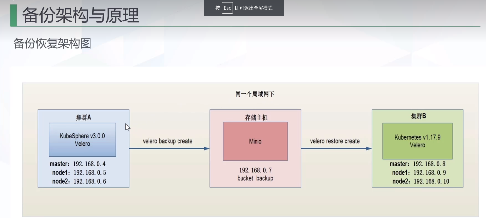
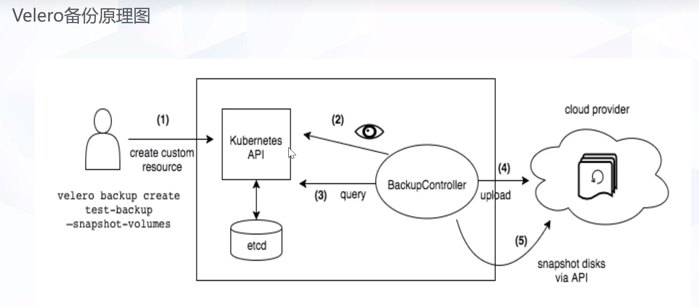
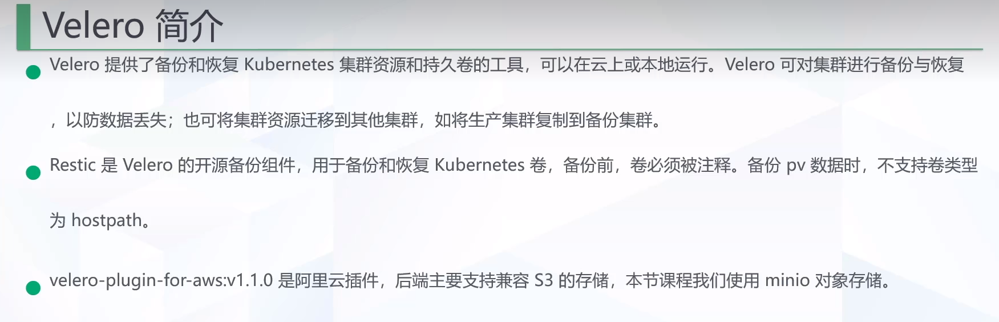
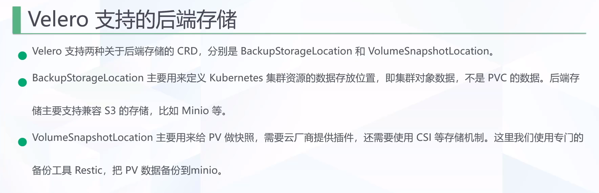
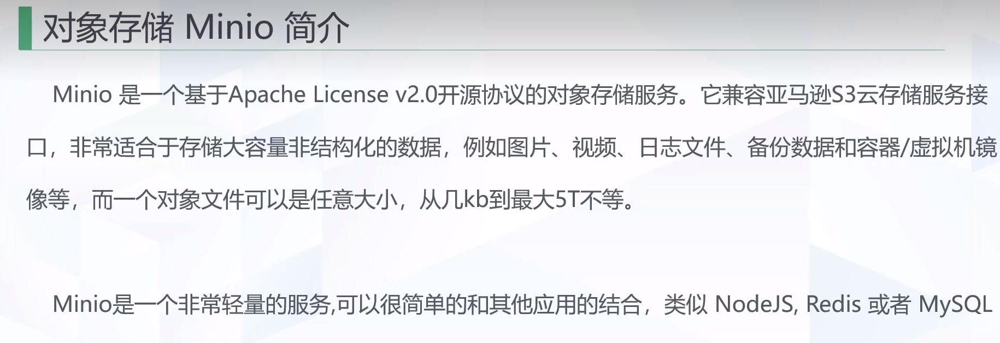
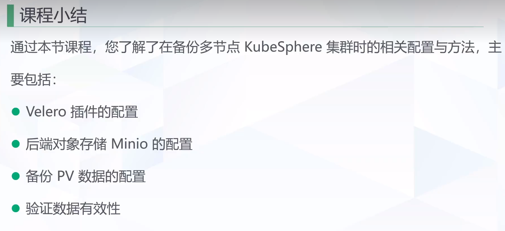

# 目的

备份源环境的多节点KubeSphere集群A，在目标环境上恢复此多节点KubeSphere集群.

## 前提

源集群 A(master，node1，node2)：已经部署 KubeSphere-V3.0.0

目标集群 B（master，node1，node2)：已经部署 Kubernetes-v1.17.9

独立的对象存储 Minio（虚机）

虚机操作系统：Centos7

# 备份与架构原理

# Velero备份原理

# Velero 简介

Velero提供了备份和恢复Kubernetes 集群资源和持久卷的工具，可以在云上或本地运行。Velero可对集群进行备份与恢复

以防数据丢失；也可将集群资源迁移到其他集群，如将生产集群复制到备份集群。

Restic是 Velero 的开源备份组件，用于备份和恢复Kubernetes 卷，备份前，卷必须被注释。备份 pv数据时，不支持卷类型

为 hostpath。

velero-plugin-for-aws:v1.1.0是阿里云插件，后端主要支持兼容S3的存储，本节课程我们使用minio对象存储。

## Velero支持的后端存储

Velero支持两种关于后端存储的CRD，分别是 BackupStorageLocation和 VolumeSnapshotLocation。

BackupStorageLocation主要用来定义Kubernetes 集群资源的数据存放位置，即集群对象数据，不是PVC的数据。后端存

储主要支持兼容S3的存储，比如Minio等。

VolumeSnapshotLocation主要用来给PV做快照，需要云厂商提供插件，还需要使用CSI等存储机制。这里我们使用专门的

备份工具Restic，把PV数据备份到minio.

# 对象存储Minio简介

Minio是一个基于Apache License V2.0开源协议的对象存储服务。它兼容亚马逊S3云存储服务接

口，非常适合于存储大容量非结构化的数据，例如图片、视频、日志文件、备份数据和容器/虚拟机镜

像等，而一个对象文件可以是任意大小，从几kb到最大5T不等。

Minio是一个非常轻量的服务,可以很简单的和其他应用的结合，类似 NodeJS，Redis 或者 MySQL

# 课程小结

通过本节课程，您了解了在备份多节点KubeSphere 集群时的相关配置与方法，主

要包括：

Velero插件的配置

后端对象存储Minio的配置

备份PV数据的配置

验证数据有效性