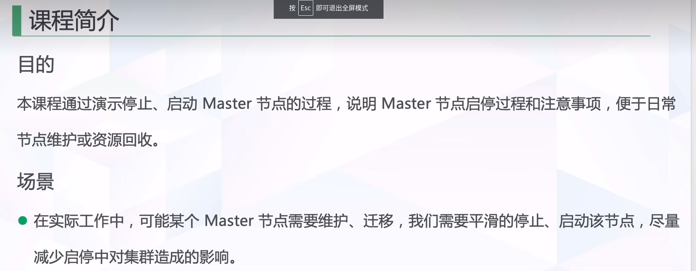
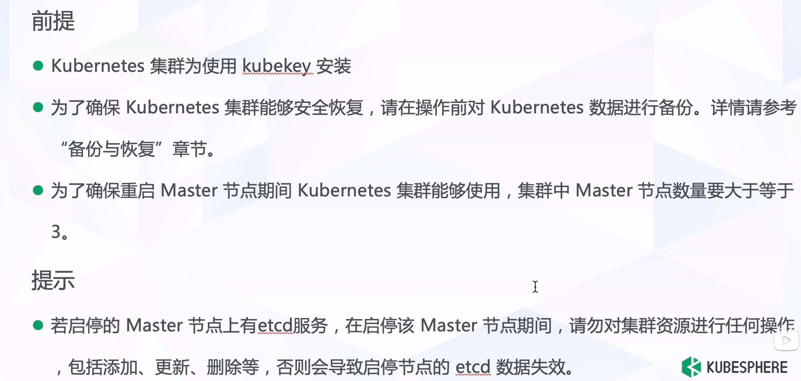
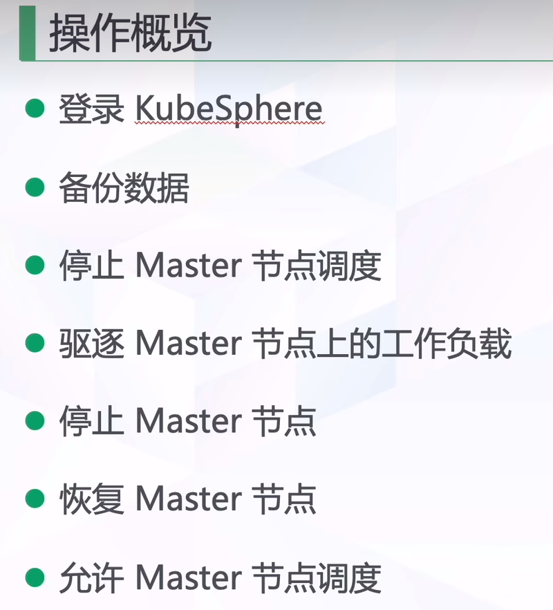
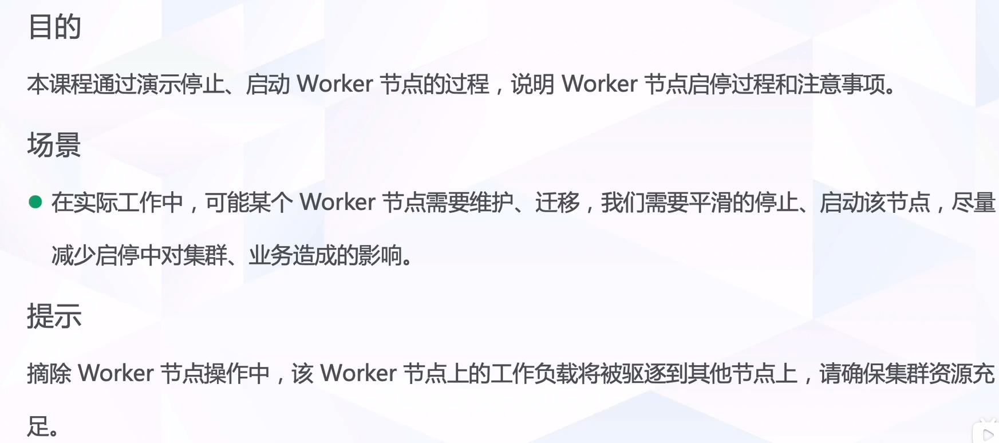
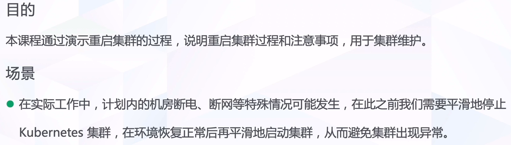

# 起停master节点

## 课程简介



### 目的

本课程通过演示停止、启动Master节点的过程，说明Master节点启停过程和注意事项，便于日常

节点维护或资源回收。

### 场景

●在实际工作中，可能某个Master节点需要维护、迁移，我们需要平滑的停止、启动该节点，尽量

减少启停中对集群造成的影响



### 前提

Kubernetes集群为使用kubekey安装

·为了确保Kubernetes集群能够安全恢复，请在操作前对Kubernetes数据进行备份。详情请参考

备份与恢复”章节。

·为了确保重启Master节点期间Kubernetes集群能够使用，集群中Master节点数量要大于等于

### 提示

若启停的Master节点上有etcd服务，在启停该Master节点期间，请勿对集群资源进行任何操作

包括添加、更新、删除等，否则会导致启停节点的etcd数据失效.

## 操作概览



### 登录 KubeSphere

### 备份数据

### 停止Master节点调度

进入master详情,点击停止调度

### 驱逐Master节点上的工作负载

```bash
kubectl drain <主机> --ignore-daemosets --delete-local-data
```

### 停止Master节点

#### 停止kubectl服务

```bash
systemctl stop kubectl
```

#### 停止etcd服务

```bash
systemctl stop etcd
```

#### 停止docker服务

```bash
systemctl stop docker
```

### 恢复Master节点

#### 启动docker服务

```bash
systemctl start docker
```

#### 启动etcd服务

```bash
systemctl start ectd
```

#### 启动kubectl服务

```bash
systemctl start kubectl
```

### 允许Master节点调度

进入master详情,开启调度

# 起停Worker节点



## 目的

本课程通过演示停止、启动Worker节点的过程，说明Worker节点启停过程和注意事项。

## 场景

·在实际工作中，可能某个Worker节点需要维护、迁移，我们需要平滑的停止、启动该节点，尽量

减少启停中对集群、业务造成的影响

## 提示

摘除Worker节点操作中，该Worker节点上的工作负载将被驱逐到其他节点上，请确保集群资源充足。


## 操作和master基本一致,步骤中取出ectd即可

# 集群起停



## '目的

本课程通过演示重启集群的过程，说明重启集群过程和注意事项，用于集群维护。

## 场景

在实际工作中，计划内的机房断电、断网等特殊情况可能发生，在此之前我们需要平滑地停止

kubernetes集群，在环境恢复正常后再平滑地启动集群，从而避免集群出现异常，

## 操作与起停master完全一致,每台node均做

