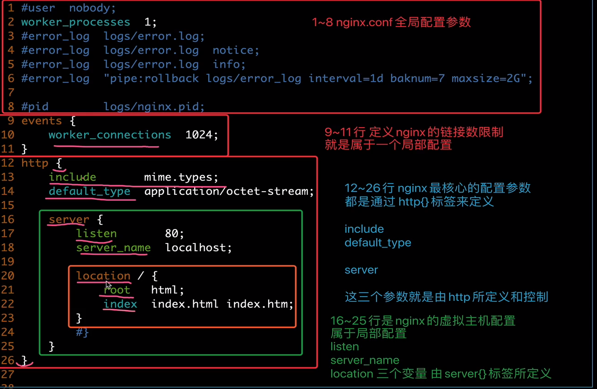

# 快速了解

Nginx是一款轻量级的Web服务器、反向代理服务器，由于它的内存占用少，启动极快，高并发能力强，在互联网项目中广泛应用。


上图基本上说明了当下流行的技术架构，其中Nginx有点入口网关的味道。

## 反向代理服务器？

经常听人说到一些术语，如反向代理，那么什么是反向代理，什么又是正向代理呢？

**正向代理：**


**反向代理：**


由于防火墙的原因，我们并不能直接访问谷歌，那么我们可以借助VPN来实现，这就是一个简单的正向代理的例子。这里你能够发现，正向代理“代理”的是客户端，而且客户端是知道目标的，而目标是不知道客户端是通过VPN访问的。

当我们在外网访问百度的时候，其实会进行一个转发，代理到内网去，这就是所谓的反向代理，即反向代理“代理”的是服务器端，而且这一个过程对于客户端而言是透明的。

## Nginx的Master-Worker模式


启动Nginx后，其实就是在80端口启动了Socket服务进行监听，如图所示，Nginx涉及Master进程和Worker进程。


Master进程的作用是？

**读取并验证配置文件nginx.conf；管理worker进程；**

Worker进程的作用是？

**每一个Worker进程都维护一个线程（避免线程切换），处理连接和请求；注意Worker进程的个数由配置文件决定，一般和CPU个数相关（有利于进程切换），配置几个就有几个Worker进程。**

## 思考：Nginx如何做到热部署？

所谓热部署，就是配置文件nginx.conf修改后，不需要stop Nginx，不需要中断请求，就能让配置文件生效！（nginx -s reload 重新加载/nginx -t检查配置/nginx -s stop）

通过上文我们已经知道worker进程负责处理具体的请求，那么如果想达到热部署的效果，可以想象：

方案一：

修改配置文件nginx.conf后，主进程master负责推送给woker进程更新配置信息，woker进程收到信息后，更新进程内部的线程信息。（有点valatile的味道）

方案二：

修改配置文件nginx.conf后，重新生成新的worker进程，当然会以新的配置进行处理请求，而且新的请求必须都交给新的worker进程，至于老的worker进程，等把那些以前的请求处理完毕后，kill掉即可。

Nginx采用的就是方案二来达到热部署的！

## 思考：Nginx如何做到高并发下的高效处理？

上文已经提及Nginx的worker进程个数与CPU绑定、worker进程内部包含一个线程高效回环处理请求，这的确有助于效率，但这是不够的。

**作为专业的程序员，我们可以开一下脑洞：BIO/NIO/AIO、异步/同步、阻塞/非阻塞...**

要同时处理那么多的请求，要知道，有的请求需要发生IO，可能需要很长时间，如果等着它，就会拖慢worker的处理速度。

**Nginx采用了Linux的epoll模型，epoll模型基于事件驱动机制，它可以监控多个事件是否准备完毕，如果OK，那么放入epoll队列中，这个过程是异步的。worker只需要从epoll队列循环处理即可。**

## 思考：Nginx挂了怎么办？

Nginx既然作为入口网关，很重要，如果出现单点问题，显然是不可接受的。

答案是：**Keepalived+Nginx实现高可用**。

Keepalived是一个高可用解决方案，主要是用来防止服务器单点发生故障，可以通过和Nginx配合来实现Web服务的高可用。（其实，Keepalived不仅仅可以和Nginx配合，还可以和很多其他服务配合）

Keepalived+Nginx实现高可用的思路：

第一：请求不要直接打到Nginx上，应该先通过Keepalived（这就是所谓虚拟IP，VIP）

第二：Keepalived应该能监控Nginx的生命状态（提供一个用户自定义的脚本，定期检查Nginx进程状态，进行权重变化,，从而实现Nginx故障切换）


## 我们的主战场：nginx.conf

很多时候，在开发、测试环境下，我们都得自己去配置Nginx，就是去配置nginx.conf。

nginx.conf是典型的分段配置文件，下面我们来分析下。

## 虚拟主机


其实这是把Nginx作为web server来处理静态资源。

第一：location可以进行正则匹配，应该注意正则的几种形式以及优先级。（这里不展开）

第二：Nginx能够提高速度的其中一个特性就是：动静分离，就是把静态资源放到Nginx上，由Nginx管理，动态请求转发给后端。

**第三：我们可以在Nginx下把静态资源、日志文件归属到不同域名下（也即是目录），这样方便管理维护。**

**第四：Nginx可以进行IP访问控制，有些电商平台，就可以在Nginx这一层，做一下处理，内置一个黑名单模块，那么就不必等请求通过Nginx达到后端在进行拦截，而是直接在Nginx这一层就处理掉。**

## 反向代理【proxy_pass】

所谓反向代理，很简单，其实就是在location这一段配置中的root替换成**proxy_pass**即可。root说明是静态资源，可以由Nginx进行返回；而proxy_pass说明是动态请求，需要进行转发，比如代理到Tomcat上。

反向代理，上面已经说了，过程是透明的，比如说request -> Nginx -> Tomcat，那么对于Tomcat而言，请求的IP地址就是Nginx的地址，而非真实的request地址，这一点需要注意。不过好在Nginx不仅仅可以反向代理请求，还可以由用户**自定义设置HTTP HEADER**。

## 负载均衡【upstream】

上面的反向代理中，我们通过proxy_pass来指定Tomcat的地址，很显然我们只能指定一台Tomcat地址，那么我们如果想指定多台来达到负载均衡呢？

第一，通过**upstream**来定义一组Tomcat，并指定负载策略（IPHASH、加权论调、最少连接），健康检查策略（Nginx可以监控这一组Tomcat的状态）等。

第二，将proxy_pass替换成upstream指定的值即可。

**负载均衡可能带来的问题？**

负载均衡所带来的明显的问题是，一个请求，可以到A server，也可以到B server，这完全不受我们的控制，当然这也不是什么问题，只是我们得注意的是：**用户状态的保存问题，如Session会话信息，不能在保存到服务器上。**

## 缓存

缓存，是Nginx提供的，可以加快访问速度的机制，说白了，在配置上就是一个开启，同时指定目录，让缓存可以存储到磁盘上。具体配置，大家可以参考Nginx官方文档，这里就不在展开了。

# 学习nginx的网络模型

## 网络IO模型概念

### 内核空间，用户空间

内核空间：一个操作系统的核心组件，称之为内核，独立于普通的应用程序，可以直接操作底层硬件，处理系统受保护的区域

操作系统为了保护系统的核心区域，也就是内核，使得用户无法直接修改系统底层，因此操作系统就开辟了两块虚拟内存空间，

一是内核空间，二是用户空间

### 进程切换

为了控制进程的执行，操作系统的内核需要有能力挂起CPU上运行的程序（暂停一个CPU正在处理的进程），还能

恢复之前已经挂起的进程，这种行为称之为进程切换

### 进程阻塞

正在执行中的进程，由于某些事件的等待，比如资源加载中，资源加载失败，操作系统自动的就会阻塞该进程，调

用内核的block语句，让该进程处于阻塞状态，因此阻塞的进程是一种主动的行为。

### 文件描述符

这是计算机科学里的一个术语，表示指向文件引用的一个抽象的概念，文件描述符是一个索引值，指向linux内核

为每一个进程打开的文件做记录的一个表。程序每打开一个文件夹，系统内核就向该进程发送一个文件描述符

## Linux IO模型

input 输入

output 输出

对于linux的文件读写操作

数据IO操作，比如文件的读取，数据优先会拷贝到操作系统的内核缓冲区，然后从缓冲区拷贝应用程序的内存空间

### 趣谈阻塞模型之（同步阻塞IO blockIo）

同步阻塞IO的特点是，jo执行的两个阶段都是阻塞的，

用户空间发起调用，内核准备数据时，阻塞

内核拷贝数据到用户空间，此时阻塞

直到最终内核返回结果，数据拷贝完毕，用户进程接触block阻塞状态，重新的运行

在linux默认的情况下，所有的socket套接字操作都是阻塞的，阻塞指的就是进程在等待中，cpu此时去做别的事了

### 同步阻塞

同步阻塞模型，主要优缺点如下

1.阻塞IO能够及时返回数据，无延迟

2.对于开发人员负担较低，开发负担较低

3.对于用户是很不友好的性能较弱

### 同步非阻塞

同步非阻塞就是每隔一会检索一次，进行轮巡调用的方式（你跟你媳妇去吃麦当劳，在你们点好餐，发起调用之后，餐厅开始准备食物，

但是此时你又不愿意干等着，又去跟你媳妇逛了会优衣库，但是在逛街过程中，又害怕食材准备好了，来迟了，

因此你们逛一会回来餐厅询问一下，好没好，如果没好，待会再来)

### 同步阻塞和非阻塞的区别

1.非阻塞的优点，在等待的时间内，可以继续处理其他的任务，当然也包括继续提交新的任务

2.非阻塞的缺点是，任务完成的延迟比较大，因为需要多次的发起系统轮训调用操作，并且很有可能在任务轮训过程中，数据

以及准备完毕了，造成延迟，对整体的系统吞吐性能有了降低

### IO多路复用

计算机系统后台可能存在多个进程任务，如果能自动的循环的查询查询多个任务的进度，而不需要用户进程主动发起轮训调

用，而是有人来帮忙着这些进度，那就很方便了

因此Linux系统下select，poll，epool就是来帮你做着进程进度的一个软件，并且epo11效率是最高的，并且nginx就是

使用的epool网络io模型

#### select事件

select就是做自动轮训的这件事，它和非阻塞轮训的区别在

其实IO多路复用和阻塞IO形式区别不大，并且有可能性能还更差一点，是因为IO多路复用还额外的调用了select事件，还有了额外的系统开销

IO多路复用好处就是select事件可以同时处理多个连接

如果你的服务器链接数不是很高的话，使用工0多路复用还不如用*（多线程+同步阻塞I）来的效率更好

IO多路复用优势在于可以同时处理更多的连接，而不是处理速度的优势

#### 异步非阻塞IO模型

前几个网络IO模型的总结

1.阻塞和非阻塞的区别

阻塞I0会一直阻塞对应的进程，直到数据操作完毕

非阻塞O是在内核空间准备数据的阶段会立即返回

2.同步IO和异步IO的区别

同步工O在进行IO操作的时候，进程会被阻塞

异步IO，是在进程发起IO操作之后，内核直接返回，直到内核发送一个信号，告诉该进程工O操作完成了，整个进程完全是没有阻塞的。


# nginx安装

## 配置

1.操作系统的选择，centos7

2.下载安装nginx的方式

rpm包安装

yum工具自动化安装

获取源代码，手动编译安装nginx（指定安装路径，额外的开启nginx第三方的功能)

3.选择了nginx编译安装，那么就得解决好1inux的编译开发环境，gccmake编译工具

使用yum工具之前，必须配置好阿里云的yum源

步骤1：确保有`wget`命令

```sh
yum install wget -y
```

步骤2：备份旧的`yum仓库文件`

```sh
mkdir /etc/yum.repos.d/repobak

mv/etc/yum.repos.d/*/etc/yum.repos.d/repobak
```

\#如上的操作，就是使得在yum仓库的一层目录，没有任何repo文件，因此就实现了1inux此时没有yum源了，此时没有yum

源，需要你再配置一个新的repo仓库文件

可以访问阿里云的镜像站：https://developer.aliyun.com/mirror/

用如下命令生成新的yum源，其实也就是下载了一个新的repo文件

```sh
wget -O /etc/yum.repos.d/centos-Base.repo http://mirrors.aliyun.com/repo/centos-7.repo

wget -O /etc/yum.repos.d/epel.repo http://mirrors.aliyun.com/repo/epel-7.repo
```

\#情况旧日的yum缓存

```sh
yum clean alll
```

\#生成新的阿里云的yum缓存，加速下次下载

```sh
yum makecache
```

在配置了阿里云的yum源之后，来安装如下编译工具

```sh
yum install -y gcc gcc-c++ autoconf automake make
```

\#安装使用nginx还得安装nginx所需的一些第三方系统库的支持，比如nginx的静态资源压缩功能所需的gzip1ib库，

nginx需要支持URL重写，所需的pcre库，per1开发的依赖库，以及nginx搭建加密站点 https，所需的openss1依赖库等

```sh
yum install zlib zlib-devel openssl openssl-devel pcre pcre-devel wget httpd-tools vim -y
```

\#安装完毕nginx所需的基础依赖库，还得检查系统的防火墙是否关闭，selinux关闭，yum配置，网络情况等等

\#执行如下命令检查

```sh
iptables -L

getenforce

ping baidu.com
```

## 编译安装

1.下载程序源代码，从nginx官网下载的代码是源nginx代码

```sh
wget https://nginx.org/download/nginx-1.23.4.tar.gz
```

还可以获取淘宝的nginx代码

http://tengine.taobao.org/#淘宝nginx官网

```sh
wget http://tengine.taobao.org/download/tengine-2.3.2.tar.gz
```

2.解压缩淘宝nginx或者官网nginx源代码都行，自行选择

```sh
tar -zxvf tengine-2.3.2.tar.gz
```

3.解压缩nginx源代码后，进入源代码的目录，准备开始编译安装

4.开始准备编译三部曲

第一曲：进入软件源代码目录，执行编译脚本文件，如制定安装路径，以及开启额外功能等

首先，查看编译脚本的信息

［root@rsync01 tengine-2.3.2]#./configure --help #查看编译帮助信息

执行编译脚本文件，释放makefile等信息

```sh
./configure --prefix=/opt/nginx_1_23_4 --with-http_ssl_module --with-http_flv_module --with-http_gzip_static_module --with-http_stub_status_module --with-threads --with-file-aio
```

第二曲

```sh
make
```

第三曲

```sh
make install
```

```bash
cd /opt/nginx_1_23_4
ls
conf html logs sbin
```

conf存放nginx的配置文件如nginx.conf

fatkunhtml存放nginx的网页根目录文件，存放站点的静态文件数据

logs 存放nginx的各种日志目录

## 启动nginx

```sh
/opt/nginx_1_23_4/sbin/nginx
```

## 停止nginx

```sh
/opt/nginx_1_23_4/sbin/nginx  -s stop
```

## 重载服务

```
/opt/nginx_1_23_4/sbin/nginx  -s reload
```


## 配置环境变量

```sh
vi /etc/profile.d/nginx.sh
```

```sh
export PATH="/opt/nginx_1_23_4/sbin:$NGINX_HOME"
```

```sh
source /etc/profile
```


# nginx配置文件

## 语法高亮

```sh
mkdir ~/.vim && cp -r nginx-1.23.4/contrib/vim/* ~/.vim
```

## 配置文件

```sh
vim /opt/nginx_1_23_4/conf/nginx.conf
```



## 配置文件语法

nginx.conf是由`指令`和`指令块`组成

每行语句都得有分号结束，指令和参数之间是有空格分割的

指令块可以由大括号组织多条语句

nginx.conf使用#号表示注释符

nginx支持用$变量名支持该语法

nginx支持include语句，组合多个配置文件

nginx部分指令支持正则表达式，如rewrite重写指令

```conf
# 定义Nginx运行的用户和用户组
#user nginx nginx;
worker_processes  2;
#全局错误日志定义类型
# debug info notice warn error crit
#error_log  logs/error.log;
#error_log  logs/error.log  notice;
error_log  logs/error.log  info;
# 进程pid文件
pid        logs/nginx.pid;


events {
	# 指定进程可以打开的最大描述符数目
    worker_connections  1024;
}


http {
	# 读取配置文件
    include       mime.types;
    default_type  application/octet-stream;

    #log_format  main  '$remote_addr - $remote_user [$time_local] "$request" '
    #                  '$status $body_bytes_sent "$http_referer" '
    #                  '"$http_user_agent" "$http_x_forwarded_for"';

    #access_log  logs/access.log  main;

    sendfile        on;
    #tcp_nopush     on;

    #keepalive_timeout  0;
    #tcp连接保持时间
    keepalive_timeout  65;

    #gzip  on;
	
    server {
        listen       80;
        server_name  localhost;

        #charset koi8-r;

        #access_log  logs/host.access.log  main;

        location / {
            root   html;
            index  index.html index.htm;
        }

        #error_page  404              /404.html;

        # redirect server error pages to the static page /50x.html
        #
        error_page   500 502 503 504  /50x.html;
        location = /50x.html {
            root   html;
        }

        # proxy the PHP scripts to Apache listening on 127.0.0.1:80
        #
        #location ~ \.php$ {
        #    proxy_pass   http://127.0.0.1;
        #}

        # pass the PHP scripts to FastCGI server listening on 127.0.0.1:9000
        #
        #location ~ \.php$ {
        #    root           html;
        #    fastcgi_pass   127.0.0.1:9000;
        #    fastcgi_index  index.php;
        #    fastcgi_param  SCRIPT_FILENAME  /scripts$fastcgi_script_name;
        #    include        fastcgi_params;
        #}

        # deny access to .htaccess files, if Apache's document root
        # concurs with nginx's one
        #
        #location ~ /\.ht {
        #    deny  all;
        #}
    }


    # another virtual host using mix of IP-, name-, and port-based configuration
    #
    #server {
    #    listen       8000;
    #    listen       somename:8080;
    #    server_name  somename  alias  another.alias;

    #    location / {
    #        root   html;
    #        index  index.html index.htm;
    #    }
    #}


    # HTTPS server
    #
    #server {
    #    listen       443 ssl;
    #    server_name  localhost;

    #    ssl_certificate      cert.pem;
    #    ssl_certificate_key  cert.key;

    #    ssl_session_cache    shared:SSL:1m;
    #    ssl_session_timeout  5m;

    #    ssl_ciphers  HIGH:!aNULL:!MD5;
    #    ssl_prefer_server_ciphers  on;

    #    location / {
    #        root   html;
    #        index  index.html index.htm;
    #    }
    #}

}

```

## nginx命令行参数

```sh
nginx -h
nginx version: nginx/1.23.4
Usage: nginx [-?hvVtTq] [-s signal] [-p prefix]
             [-e filename] [-c filename] [-g directives]

Options:
  -?,-h         : this help # 输出帮助信息
  -v            : show version and exit # 查看版本信息
  -V            : show version and configure options then exit # 查看版本信息和编译参数
  -t            : test configuration and exit # 检查nginx的配置文件语法是否正确
  -T            : test configuration, dump it and exit #检查nginx的配置文件语法是否正确和输出配置信息
  -q            : suppress non-error messages during configuration testing # 在检测期间屏蔽非错误信息
  -s signal     : send signal to a master process: stop, quit, reopen, reload # 发送信号给主进程 stop 停止  quit 优雅的停止 reload 重新读取配置文件
  # reopen 重新记录日志文件
  -p prefix     : set prefix path (default: /opt/nginx_1_23_4/) # 配置nginx目录前缀
  -e filename   : set error log file (default: logs/error.log) 
  -c filename   : set configuration file (default: conf/nginx.conf) # 指定配置文件启动
  -g directives : set global directives out of configuration file # 配置覆盖默认参数
  -m # 列出nginx所有支持的模块
  -l # 列出nginx的目录信息
  
```

1. master主进程是不处理请求的，而是分配请求发给worker进程，主进程负责重启，热加载，热部署等等

2. master是根据nginx.conf中worker_process定义启动时创建的工作进程数

3. 当worker运行后，master就处于一个等待的状态，等待用户的请求来临，或者系统信号

4. 系统管理员可以发送ki11指令，或者nginx-s信号，这样的形式操控nginx

### nginx信号集

nginx -s 对应的信号功能如下

| 参数   | 信号 | 含义                                       |
| ------ | ---- | ------------------------------------------ |
| stop   | TERM | 强制关闭nginx服务                          |
| null   | INT  | 强制关闭整个nginx服务                      |
| quit   | QUIT | 优雅的关闭整个服务                         |
| reopen | USR1 | 重新打开日志记录                           |
| reload | HUB  | 重新读取配置文件，并且优雅的退出旧的worker |

# nginx常用模块和功能

常用的Nginx模块，用来做什么（头条）

rewrite模块，实现重写功能

access模块：来源控制

ssl模块：安全加密

ngx_http-_gzip_module：网络传输压缩模块

ngx_http-_proxy_module模块实现代理

ngx_http_upstream_module模块实现定义后端服务器列表

ngx_cache_purge实现缓存清除功能

# nginx热部署功能

nginx作为一个优秀的web服务器，优秀的反向代理服务器，并且nginx也支持高可用的特性，nginx还支持热部署的特点。

热部署的特点：在不重启或者关闭进程的情况下，新的应用直接替换旧的应用

更换nginx的二进制命令版本

## 热部署大致流程

1. 备份旧的程序二进制文件备份nginx命令，/opt/tngx232/sbin/nginx

2. 编译安装新的二进制文件，覆盖旧的二进制文件，（再装一个版本的nginx，且替换旧的nginx命令）

3. 发送`USR2`信号发给旧的master进程

4. 发送`WINCH`信号给旧的master进程

5. 发送`QUIT`信号给旧的master进程

## nginx热部署操作

nginx工作模式是master-worker（包工头----千活工人）

刚才所所的nginx支持reload重载，仅仅是nginx的master进程，在检查配置文件正确之后，正常则更新，错误则返回异常，

正确的情况下也不会更改已经建立的worker，只会等待worker处理完毕请求之后，杀死旧的worker，然后再从新的配置文件中，

运行处新的worker（一旦更换了配置文件，reload master主进程，那么手底下的工人也就会被换一批了）

nginx还提供了热部署功能，特点是：在不影响用户体验下，进行软件版本升级，也就是不主动的杀死worker，就能够更换软件的二进制命令

```sh
# 1.检查当前机器环境的nginx版本

nginx -v
:<<!
nginx version: nginx/1.23.4
!

# 2.备份旧的二进制命令

mv nginx nginx.1.23.4
 
# 3.检查旧的二进制命令的编译参数
nginx.1.23.4 -V
:<<!
nginx version: nginx/1.23.4
built by gcc 4.8.5 20150623 (Red Hat 4.8.5-44) (GCC) 
built with OpenSSL 1.0.2k-fips  26 Jan 2017
TLS SNI support enabled
configure arguments: --prefix=/opt/nginx_1_23_4 --with-http_ssl_module --with-http_flv_module --with-http_gzip_static_module --with-http_stub_status_module --with-threads --with-file-aio
!
# 4.下载编译安装新版本的nginx
wget https://nginx.org/download/nginx-1.24.0.tar.gz
tar -zxvf nginx-1.24.0.tar.gz
cd nginx-1.24.0
# 5.指定完全一致的编译参数进行编译
./configure --prefix=/opt/nginx_1_23_4 --with-http_ssl_module --with-http_flv_module --with-http_gzip_static_module --with-http_stub_status_module --with-threads --with-file-aio
# 编译安装
make && make install 
# 进入到安装目录
cd /opt/nginx_1_23_4/sbin
# 6.再次检查版本
./nginx -v
:<<!
nginx version: nginx/1.24.0
!
# 7.发送USR2信号给master进程
ps -ef |grep nginx
:<<!
root     13283     1  0 10:51 ?        00:00:00 nginx: master process ./nginx
nobody   13284 13283  0 10:51 ?        00:00:00 nginx: worker process
nobody   13285 13283  0 10:51 ?        00:00:00 nginx: worker process
root     13287  7115  0 10:51 pts/0    00:00:00 grep --color=auto nginx
!
kill -USR2 `cat /opt/nginx_1_23_4/logs/nginx.pid`
# 8.再次检查nginx进程状态信息
ps -ef |grep nginx
:<<!
root     13283     1  0 10:51 ?        00:00:00 nginx: master process ./nginx
nobody   13284 13283  0 10:51 ?        00:00:00 nginx: worker process
nobody   13285 13283  0 10:51 ?        00:00:00 nginx: worker process
root     15697 13283  0 10:57 ?        00:00:00 nginx: master process ./nginx
nobody   15698 15697  0 10:57 ?        00:00:00 nginx: worker process
nobody   15699 15697  0 10:57 ?        00:00:00 nginx: worker process
root     16315  7115  0 10:58 pts/0    00:00:00 grep --color=auto nginx
!
# 9.优雅的退出旧进程
kill -WINCH `cat /opt/nginx_1_23_4/logs/nginx.pid.oldbin`
# 
ps -ef |grep nginx
:<<!
root     19717     1  0 11:06 ?        00:00:00 nginx: master process ./nginx
root     19765 19717  0 11:06 ?        00:00:00 nginx: master process ./nginx
nobody   19766 19765  0 11:06 ?        00:00:00 nginx: worker process
nobody   19767 19765  0 11:06 ?        00:00:00 nginx: worker process
root     20569  7115  0 11:08 pts/0    00:00:00 grep --color=auto nginx
!
# 10.保证nginx正确的运行后在杀死无用的19717进程
kill 19717
```

```sh
# 模拟发送大量请求
ab -kc 10 -n 100 http://127.0.0.1/
```

# 日志切割

## 切割脚本


```sh
#!/bin/bash
# 备份目录
BASEDIR="/opt/nginx_1_23_4/logs"
# 备份文件名
FILENAME="$(date -d "${date} -1 day" "+%F")-access.log"
# 备份目录
access_log_bak="access_log_bak"
# 进入备份目录
cd ${BASEDIR} || exit
# 判断是否有备份目录，如果有，则进行备份，否则创建一个备份目录
[ -d $access_log_bak ] || (mkdir $access_log_bak && echo "创建备份目录成功！")
# 判断本日期是否在备份目录中，如果是，则进行日志备份，否则对备份文件内容进行内容追加
if [ -f "${access_log_bak}/$FILENAME" ] ;then
  cat access.log >> "${access_log_bak}/$FILENAME"
  echo "本日备份已经存在，内容已追加到备份文件中！"
  rm -rf access.log
else
  # 将当前日志文件进行重名名备份，格式为yyyy-mm-dd-access.log
  mv access.log $FILENAME
  # 将修改后的文件移动到备份目录
  mv "$FILENAME" "${access_log_bak}/$FILENAME"
fi
# 给nginx服务器发送一个日志重写信号
cd ../sbin && ./nginx -s reopen && echo "nginx日志已经开始重写！"|| exit


```

## 定时任务

```sh
# 每天 0点0分执行
crontab -e 
0 0 * * *
```

# 虚拟主机配置

## 配置内容

```conf
 server {
        # 监听端口
        listen       80;
        # 域名
        server_name  localhost;
        # 编码
        charset utf-8;

        #access_log  logs/host.access.log  main;
		# 匹配路径 / 全部
        location / {
        # 工作主目录    
            root   html;
        # 读取的主页文件
            index  index.html index.htm;
        }

        #error_page  404              /404.html;

        # redirect server error pages to the static page /50x.html
        #
        error_page   500 502 503 504  /50x.html;
        location = /50x.html {
            root   html;
        }

        # proxy the PHP scripts to Apache listening on 127.0.0.1:80
        #
        #location ~ \.php$ {
        #    proxy_pass   http://127.0.0.1;
        #    fastcgi_pass   127.0.0.1:9000;
        #    fastcgi_index  index.php;
        #    fastcgi_param  SCRIPT_FILENAME  /scripts$fastcgi_script_name;
        #    include        fastcgi_params;
        #}

        # deny access to .htaccess files, if Apache's document root
        # concurs with nginx's one
        #
        #location ~ /\.ht {
        #    deny  all;
        #}
    }

```

# 静态资源压缩

GZIP是网站压缩加速的一种技术，对于开启后可以加快我们网站的打开速度，原理是经过[服务器](https://cloud.tencent.com/product/cvm?from=20065&from_column=20065)压缩，客户端浏览器快速解压的原理，可以大大减少了网站的流量

```conf
gzip on;  #是否开启gzip模块 on表示开启 off表示关闭
gzip_buffers 4 16k;  #设置压缩所需要的缓冲区大小
gzip_comp_level 6;  #压缩级别1-9，数字越大压缩的越好，也越占用CPU时间
gzip_min_length 100k;  #设置允许压缩的最小字节
gzip_http_version 1.1;  #设置压缩http协议的版本,默认是1.1
gzip_types text/plain text/css application/json application/x-javascript text/xml application/xml application/xml+rss text/javascript;  #设置压缩的文件类型
gzip_vary on;  #加上http头信息Vary: Accept-Encoding给后端代理服务器识别是否启用 gzip 压缩
```

# 基于IP的多虚拟主机

## 创建虚拟ip

```sh
ifconfig
:<<!
enp0s3: flags=4163<UP,BROADCAST,RUNNING,MULTICAST>  mtu 1500
        inet 192.168.0.132  netmask 255.255.255.0  broadcast 192.168.0.255
        inet6 240e:370:a119:850:18f1:c172:bff0:5415  prefixlen 64  scopeid 0x0<global>
        inet6 240e:370:a119:850::1001  prefixlen 128  scopeid 0x0<global>
        inet6 fe80::8398:4fe:dc45:971e  prefixlen 64  scopeid 0x20<link>
        ether 08:00:27:bf:bf:7d  txqueuelen 1000  (Ethernet)
        RX packets 1332  bytes 593981 (580.0 KiB)
        RX errors 0  dropped 0  overruns 0  frame 0
        TX packets 1532  bytes 248429 (242.6 KiB)
        TX errors 0  dropped 0 overruns 0  carrier 0  collisions 0
!
ifconfig enp0s3:1 192.168.0.141 netmask 255.255.255.0 broadcast 192.168.0.255 up
ifconfig
:<<!
enp0s3:1: flags=4163<UP,BROADCAST,RUNNING,MULTICAST>  mtu 1500
        inet 192.168.0.141  netmask 255.255.255.0  broadcast 192.168.0.255
        ether 08:00:27:bf:bf:7d  txqueuelen 1000  (Ethernet)
!        
```

```sh
# 准备好的虚拟ip
ifconfig |grep "inet 192"
:<<!
        inet 192.168.0.132  netmask 255.255.255.0  broadcast 192.168.0.255
        inet 192.168.0.141  netmask 255.255.255.0  broadcast 192.168.0.255
        inet 192.168.0.142  netmask 255.255.255.0  broadcast 192.168.0.255
!        
```

添加nginx的配置，添加多个server标签，让nginx支持基于IP的多虚拟主机，返回多个站点内容

1.给nginx添加inlucde包含语法，让其他目录下的配置文件参数，导入到nginx.conf中，这样的写法，能够让nginx每一

个配置文件，看起来更简洁，更清晰

修改nginx.conf，在http标签中的最后一行，添加如下参数，extra文件夹和nginx.conf文件夹为相对

include extra/*.conf;

2.在extra目录下，添加多个基于ip的虚拟主机配置

可以像如下规划的形式，来编写nginx.conf配置文件

第一个基于IP的虚拟主机，写在conf/nginx.conf

部分代码如下，当192.168.0.132请求到来，让nginx

去/www/132文件夹下寻找资料

```
location / {

	\#root关键词是定义网页根目录的，这个html是以nginx安装的路径为相对

	root /www/110；
	index index.html index.htm

}
```


3.在添加192.168.178.141虚拟主机的配置

vim extra/141.conf，添加如下代码

```
server {

listen 192.168.178.141:80；

server_name -;

location / {
	root /www/141;
	index index.html index.htm
}

```

# 基于多域名的虚拟主机配置

基于多IP的虚拟主机，用的还是不多的，还可能造成IP不足等问题，一般如果没有特殊需求，用的更多，且更方便的是基于多域名的虚拟主机

前提使用条件，要么配置DNS服务器，将你想用的域名解析到对应的ip使用本地的hosts文件，进行本地测试访问多域名的配置结合nginx，

就是先了多虚拟主机的访问，解决了可能IP不足的问题

1.环境准备，先在你的客户端本地，修改hosts文件信息

macos /etc/hosts 文件里面该

windowsc盘里面的hosts文件，搜索引擎搜一下即可知道

2．修改hosts文件，添加如下信息，注意这里是客户端本地添加的域名

192.168.0.132

learn_nginx.com

192.168.178.141

learn_nginx.cc.com

192.168.178.142

learn_nginx.yy.com

3.修改nginx的配置服务

```sh
server {

listen 80；
# 指定域名即可
server_name learn_nginx.com;

location / {
	root /www;
	index index.html index.htm
}

server {

listen 80；
# 指定域名即可
server_name learn_nginx.cc.com;

location / {
	root /www/cc;
	index index.html index.htm
}
```

# 支持基于多端口的虚拟主机配置

只需要修改nginx.conf中

server标签里面定义的

Listen端口参数即可，实现不同的端口，进行的虚拟主机匹配

192.168.178.110:80

192.168.178.110:85

192.168.178.110:90

基于不同的端口，来定义为到不同的server 虚拟主机的配置~-

# 多虚拟主机日志管理

```
server {

listen 80；
server_name learn_nginx.cc.com;
# 在server添加access_log即可
access_log logs/141-access.log;
location / {
	root /www/cc;
	index index.html index.htm
}
```

# 访客日志

```conf
 log_format  main  '$remote_addr - $remote_user [$time_local] "$request" '
 '$status $body_bytes_sent "$http_referer" '
'"$http_user_agent" "$http_x_forwarded_for"';

$remote_addr 记录访客的客户端ip地址
$remote_user 记录远程客户端的访客用户名
$time_1ocal记录访问的时间和地区信息
$request记录用户的http请求的首行信息
$status记录用户的http请求状态，也就是请求发出之后，响应的状态，如200 301 404 502
$body_bytes_sent记录服务器发给客户端的响应体数据字节大小
$http_referer记录本次请求是从哪个链接过来的，可以个根据refer信息来进行防盗链信息
$http_user_agent记录客户端的访问信息，如浏览器信息，手机浏览器信息
"$http_x_forwarded_for"代理ip


```

# 目录浏览

修改nginx虚拟路由配置

```
server {

listen 80；
server_name _;
# 在server添加access_log即可
charset utf-8;
location / {
	root /www/cc;
	# index index.html index.htm
	# 将index注释掉，开启autoindex选项
	autoindex on;
}
```

进入该路由工作目录，修改index.html为其它文件名

效果


# Nginx状态信息功能

nginx提供了status模块，用于检测nginx的请求连接信息，这个功能需要在编译安装nginx的时候，

添加--with-http-stud-status_module参数，才能使用

```bash
#检查当前nginx是否支持status功能
nginx -V
```

当你支持status功能，我们可以添加一个conf配置，用于检查状态页的功能

```
server {
listen 85；
location / {
	# 开启页面状态功能
	stub_status on;
	# 关闭访客日志功能
	access_log off;
}
}
```

## 访问该状态页

http://192.168.0.132:85/

```
Active connections: 1 # 正在处理的活动的连接数
server  #nginx启动后一共处理的请求数
accepts handled nginx启动后创建的握手数
requests 表示nginx一共处理了多少次的请求
 13 13 54 
Reading: 0 nginx读取到客户端的headers数量
Writing: 1 nginx响应给户端的headers数量
Waiting: 0 nginx处理完请求之后，等待下一次的请求驻留的连接数
Waiting值=active-(reading+writing)
```

## 使用ab进行压力测试

1.安装ab命令

```sh
yum install httpd-tools -y
```

2.使用ab命令对nginx发送大量的连接

-n #请求数量 -n 100000

-c #请求并发数 -c　100

-k #表示启动keepalived保持连接功能

```bash
ab -kc 1000 -n 100000 http://127.0.0.1/
```

# nginx错误日志

```conf
server {
listen 85；
# 指定错误日志
error_log error.log;
location / {
	root html
	index index.html index htm
	
	
}
}
```

# location匹配规则


location的匹配，符号如下

| 匹配符 | 匹配规则                           | 优先级 |
| ------ | ---------------------------------- | ------ |
| =      | 精确匹配                           | 1      |
| ^~     | 以某个字符开头，不做正则处理       | 2      |
| ~*     | 支持正则的匹配模式                 | 3      |
| /blog/ | 匹配/blog/xxx                      | 4      |
| /      | 通用匹配，不符合上述匹配会匹配这个 | 5      |

表示nginx.conf支持在虚拟主机中定义多个location，进行用户的请求url解析

案例

```
server{
    listen 83;
    server_name _;
    location / {
        return 401;
    } 
    location = / {
        return 402;
    } 
    location /blog/ {
        return 403;
    } 
    location ^~ /img/ {
        return 404;
    } 
    location ~* \.(gif|png|jpeg|jpg)$ {
        return 500;
    } 
}
```

# url地址重写功能

Nginx的url地址重写功能，主要是使用nginx提供的rewrite功能，且支持正则表达式

rewrite能够实现ur的跳转，实现ur规范化，根据请求的变量实现url跳转等等，基于ur重写功能常见的效果如下

·对于爬虫程序的封禁，让其跳转到一个错误的页面

动态的ur，伪装成静态的htmI页面，便于搜索引擎的抓取

·新旧域名的更新，替换，www.oldboyedu.com>Www.oldboyedu.com.cn.

rewrite语法

```
rewrite ~/(.*)  http://192.168.0.132/$1 permanent;

# 解释

rewrite 是nginx地址重写的关键词指令，开启跳转功能

正则~/(.*) 表示匹配所有的请求，匹配成功后，跳转到后面指定的url地址

$1 是取出前面正则表达式分组括号里的内容

permanent 表示301 重定向的标记
```

rewrite结尾的参数标记如下

1. last 规则匹配完成后，继续向下匹配新的locaiton

2. break本条规则匹配完成后，立即停止匹配动作

3. redirct返回302临时重定向状态码，浏览器地址栏显示跳转后的url，爬虫不会更新该ur

4. permanent,返回301永久重定向，浏览器地址也显示跳转后的url，爬虫更新该网站ur

5. last和break用于实现url重写，浏览器的地址栏不会发生变化

redirct和permanent也是用于url跳转，浏览器url地址栏发生边变化，跳转到新的url地址栏

案例

```
server{
    listen 90;
    server_name _;
    location / {
    	rewrite ^/(.*) https://www.baidu.com/$1 permanent 
    }
}
```

# 访问认证

nginx提供了认证模块，语法是

```
server {
	listen 100;
	server_name _;
	location / {
	auth_basic 'string';
	auth_basic_user_file conf/.htpasswd;
	}
}

```

linux提供了密码生成命令

htpasswd 是apache提供的密码生成工具，nginx也支持auth_basic模块，因此我们可以利用htpasswd命令生成账号密码文件，提供给nginx去使用

```sh
yum install httpd-tools -y
语法

htpasswd -bc .access <username> <password>
htpasswd -bc .access ljw 666

解释

-b

在命令行中输入账号密码

-c 创建密码文件

username 账号

password 密码

默认.access文件采用加密方式md5来验证
```

# LNMP架构

lamp架构(Linux+Apache+mysql(mariadb)tphp/python)

Redhat + apache + mysqlorcla + php/java

Inmp(linux+nginx+mysqltphp)

Centos 7

LNMP

1.在创业初期，研发经费有限，研发人力成本也是有限，技术储备也有限，因此需要选择一个易于维护，简单的技

术架构

2.产品需要快速研发上线，并且能够快速满足用户的新的需求，现实情况决定了一开始，没有太多的精力来选择一

个过于复杂的分布式架构，研发速度只需要一个字，快

3.创业初期，业务的复杂度还是较低，业务量也比较小，如果选择过于复杂的架构，返回会增加研发难度，以及运

维难度

4.遵循选择合适的技术架构，而不是过分的追求新兴技术，权衡研发效率和产品目标，同事创业初期，只有一个

PHP研发人员，过于复杂的技术架构，毕然会给程序员带来高昂的学习成本。

Inmp架构就是最适合初创型公司

一般初创型的小公司，使用Inmp架构，最少三台服务器足以，Nginx可以和后台程序直接部署在同一台机器上mysql数据库单独一台服务器

mencached缓存数据库单独一台服务器

这样的架构，优势在于

·单体架构，架构很简单，清晰的分层结构

·可以快速的研发，满足产品快速送代的需求

·没有复杂的技术架构，技术学习成本较低，同时运维成本也较低，不需要再单独招聘一个运维同学，节省公司

的开支

## LNMP部署之Nginx部署

1.安装形式选择

YUM

自动下载软件包及其依赖关系，自动化安装，省时省力都是默认的安装路径，以及版本不容易指定，自定制化太低，无法扩展第三方新功能

rpm包

需要手动解决依赖关系，弃用源代码编译安装

自由下载软件版本，自定制安装路径，第三方功能扩展

源代码编译安装步骤梢微复杂点

2.安装nginx前的系统依赖环境检查及其安装

yum install pcre pcre-devel openssl openssl-devel

gcc

-#

3.下载nginx原代码包，taobaonginx，nginx官网源码

wget http://nginx.org/download/nginx-1.16.0.tar.gz

4.解压缩，源代码包

[root@web02 mytools]# tar -zxvf nginx-1.16.0.tar.gz

5.创建普通的nginx用户，用于运行nginx进程，降低nginx的系统权限

```sh
groupadd nginx -g 1111
useradd nginx -u 1111 -s /sbin/nologin -M -g 1111
```

6.开始编译安装nginx服务

```sh
./configure --user=nginx --group=nginx --perfix=/opt/nginx_1_16.0 --with-http_ssl_module --with-http_flv_module --with-http_gzip_static_module --with-http_stub_status_module --with-threads --with-file-aio
```

7 编译和编译安装

```sh
make && make install
```

8.配置一个软连接，方便管理

```sh
ln -s /opt/nginx_1_16.0 ~/nginx
```

9.添加环境变量

```sh
PATH="$PATH:/opt/nginx_1_23_4/sbin"
```

## LNMP之MySql部署

### 二进制方式安装mysql

```sh
wget https://dev.mysql.com/get/Downloads/MySQL-8.0/mysql-8.0.33-linux-glibc2.28-x86_64.tar.gz
```

1.解压缩二进制MySql代码

 tar -zxvf mysql-8.0.33-linux-glibc2.28-x86_64.tar.gz

2.配置软连接，快捷访问mysq1

ln -s /mytools/mysql-8.0.33-linux-glibc2.28-x86_64.tar.gz

3.安全性的准备工作，卸载可能centos7存在的mariadb相关的依赖关系

```sh
rpm -e --nodeps mariadb-libs
```

4.开始准备启动mysq1的配置文件，［mysqld」是区，段的含义，以下的参数，对其生效

［mysqld］这是代表对服务端生效的参数

［mysq1】这是代表对客户端的生效的参数

`vim/etc/my.cnf`

```cnf

[mysqld]

basedir=/opt/mysql

datadir=/opt/mysql/data

socket=/tmp/mysql.sock

server_id=1

port=3306

log _error=/opt/mysgl/data/mysql_err.log

[mysql]

socket=/tmp/mysql.sock
```

### 初始化mysql服务端

1.先卸载系统自带的mariadb的依赖

```sh
rpm -e --nodeps mariadb-libs
```

2.检查mysql的所需的依赖环境

```sh
yum install libaio-devel -y
```

3．创建mysql数据文件夹，用于初始化数据，且进行权限控制

```sh
mkdir -p /mytools/mysql/data
chown -R mysql.mysql mytools/mysql
```

4.初始化数据库

```bash
/mytools/mysgl/bin/mysgld --initialize-insecure --user=mysgl --basedir=/mytools/mysql --datadir=/mytools/mysql/data/

```

### systemctl管理mysql

vim /etc/systemd/system/mysqld.service

```
[Unit]
description=mysql server by chaoge
documentation=man:mysgld(8)
documentation=http://dev.mysql.com/doc/refman/en/using-systemd.htm
after=network.target
after=syslog.target
[Install]
WantedBy=multi-user.target
[Service]
User=mysql
Group=mysql
Execstart=/mytools/mysql/bin/mysqld --defaults-file=/etc/my.cnf
LimitNOFILE=5000
```

```sh
systemctl start mysql
```

## LNMP之PHP

### FASTCGI

cgi通用网关接口，用于HTTP服务器(nginx,apache)和其他应用服务器(指的是另一个动态服务器上安装的python,php脚本编程语言编写的一个逻辑框架)通信的一个工具

fastcgi是一个可伸缩，高效的在HTTP服务器之间和动态脚本之间通信的网关接口

在linux环境下，fastscgi其实就是一个socket套接字文件

1. 如果http服务器和后端程序运行在两台服务器上，这个fastcgi通信形式就是IP+端口的网络通信形式

2. 如果http服务器和后端程序运行在同一台机器上，那么这个socket就可以是本地通信

3. ip+port127.0.0.1

■socket套接字文件

多数主流的web服务器都是支持fastcgi网关接口，比如apache nginx lighttpd

fastcgi通用网关接口，也被多种脚本编程语言所支持，perl,php,python

当http服务器遇见静态请求，直接返回给用户

动态请求nginx就转发给fastcgi+php，后端程序进行逻辑处理完毕后，再返回给nginx，最终给用户响应

### php

```bash
curl -o /etc/yum.repos.d/CentoS-Base.repo http://mirrors.aliyun.com/repo/Centos-7.repo
yum install epel-release.noarch -y
#webtatic 要求
curl -o /etc/yum.repos.d/epel.repo http://mirrors.aliyun.com/repo/epel-7.repo
rpm -Uvh https://mirror.webtatic.com/yum/el7/webtatic-release.rpm
#webtatic源
yum install php72w-cli php72w-fpm php72w-gd php72w-mbstring php72w-bcmath php72w-xml php72w-Ldap php72w-mysqlnd -y

```

```bash
sed -ri '/^(user|group)/s#apache#nginx#g' /etc/php-fpm.d/www.conf # 修改配置
```

```bash
egrep '^(user|group)' /etc/php-fpm.d/www.conf # 查看修改结果
```


### 检查安装结果

```bash
rpm -qa |egrep 'php|nginx'
```

### 创建测试文件

```bash
mkdir -p /app/code/zbx
```

```php
# /app/code/zbx/info.php
<?php
    phpinfo()
?>    
```

### 启动服务

```bash
systemctl enable nginx php-fpm --now
```

nginx配置

```
server{
	listen 80;
	server_name _;
    location / {
        root html;
        index index.html,index.htm
    }
    location ~ .*\.(php|php5)?$ {
    	root html/blog;
    	fastcgi_pass 127.0.0.1:9000; # 和脚本语言的交互接口
    	fastcgi_index index.php; 
    	include fastcgi.conf;
    }
}
```

