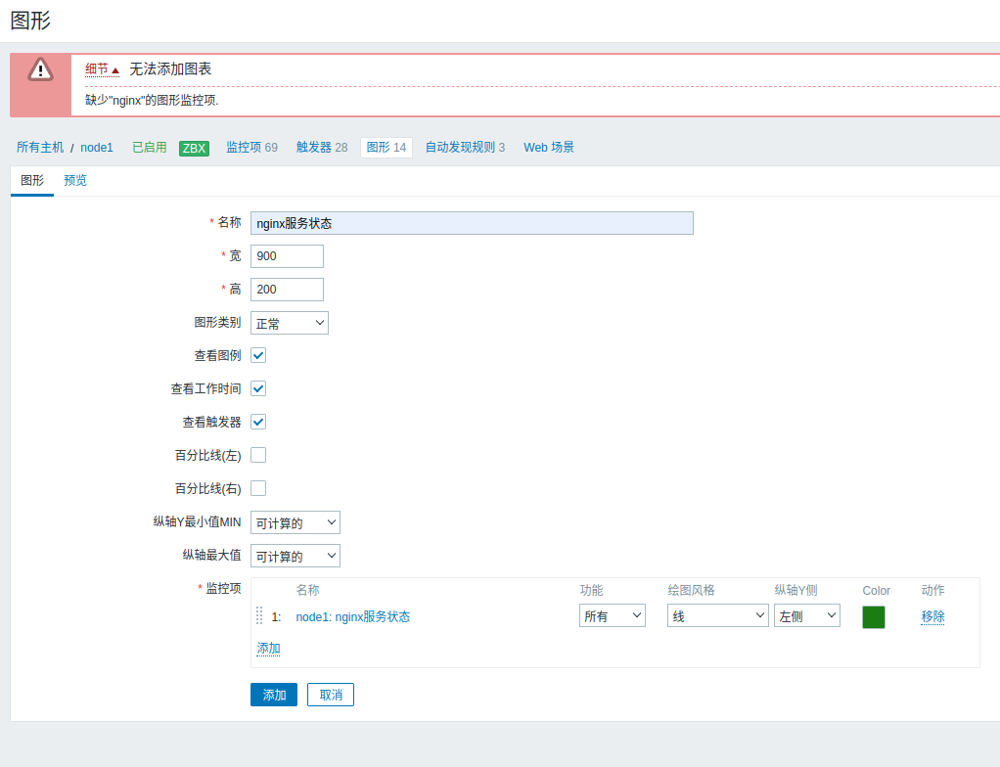

# 极速上手指南

·系统：Cent0S7.x不支持yum方式安装zabbix服务端。

·安装方式：

1. ozabbix服务端编译安装

2. ozabbix客户端yum安装

部署zabbix服务端流程

1. 部署ngx+php环境并测试

2. 部署数据库 mariadb10.5及以上然后进行配置

3. 编译安装zabbix-servers服务端及后续配置

4. 部署前端代码代码进行访问

5. web访问

## 部署ngx+php环境并测试

### nginx

```bash
vim /etc/yum/yum.repos.d/nginx.repo
```


```ini
[nginx-stable]
name=nginx stable repo
baseurl=http://nginx.org/packages/centos/$releasever/$basearch
gpgcheck=1
enabled=1
gpgkey=https://nginx.org/keys/nginx_signing.key
module_hotfixes=true

```

```bash
yum -y install nginx  --enablerepo=nginx-stable
```

```bash
server {
    listen 80;
    server_name zbx.cn;
    root /app/code/zbx;
    location / {
        index index.php;
    }
    location ~ \.php$ {
        fastcgi_pass 127.0.0.1:9000;
        fastcgi_index index.php;
        fastcgi_param SCRIPT_FILENAME   $document_root$fastcgi_script_name;
        include fastcgi_params;
    }

}

```

### php

```bash
curl -o /etc/yum.repos.d/CentoS-Base.repo http://mirrors.aliyun.com/repo/Centos-7.repo
yum install epel-release.noarch -y
#webtatic 要求
curl -o /etc/yum.repos.d/epel.repo http://mirrors.aliyun.com/repo/epel-7.repo
rpm -Uvh https://mirror.webtatic.com/yum/el7/webtatic-release.rpm
#webtatic源
yum install php72w-cli php72w-fpm php72w-gd php72w-mbstring php72w-bcmath php72w-xml php72w-Ldap php72w-mysqlnd -y

```

```bash
sed -ri '/^(user|group)/s#apache#nginx#g' /etc/php-fpm.d/www.conf # 修改配置
```

```bash
egrep '^(user|group)' /etc/php-fpm.d/www.conf # 查看修改结果
```


### 检查安装结果

```bash
rpm -qa |egrep 'php|nginx'
```

### 创建测试文件

```bash
mkdir -p /app/code/zbx
```

```php
# /app/code/zbx/info.php
<?php
    phpinfo()
?>    
```

### 启动服务

```bash
systemctl enable nginx php-fpm --now
```


访问http://zbx.cn/info.php

## 部署数据库

zabbix 6.０ 不支持 mariadb 5.5(默认源中的mariadb)安装mariadb 10.5

### 配置maraidb yum源

```bash
vi /etc/yum.repos.d/mariadb.repo
```


```ini
[mariadb]

name=MariaDB

baseurl=http://mirrors.aliyun.com/mariadb/yum/10.5/centos7-amd64/

gpgkey=http://mirrors.aliyun.com/mariadb/yum/RPM-GPG-KEY-MariaDB

gpgcheck=1

enabled=1

```

### 安装

```bash
yum -y install mariadb-server
```

### 启动

```bash
systemctl enable mariadb --now
```

### 初始化mariadb

```bash
mysql_secure_installation 

NOTE: RUNNING ALL PARTS OF THIS SCRIPT IS RECOMMENDED FOR ALL MariaDB
      SERVERS IN PRODUCTION USE!  PLEASE READ EACH STEP CAREFULLY!

In order to log into MariaDB to secure it, we'll need the current
password for the root user. If you've just installed MariaDB, and
haven't set the root password yet, you should just press enter here.

Enter current password for root (enter for none): 
OK, successfully used password, moving on...

Setting the root password or using the unix_socket ensures that nobody
can log into the MariaDB root user without the proper authorisation.

You already have your root account protected, so you can safely answer 'n'.

Switch to unix_socket authentication [Y/n] n
 ... skipping.

You already have your root account protected, so you can safely answer 'n'.

Change the root password? [Y/n] y
New password: 
Re-enter new password: 
Password updated successfully!
Reloading privilege tables..
 ... Success!


By default, a MariaDB installation has an anonymous user, allowing anyone
to log into MariaDB without having to have a user account created for
them.  This is intended only for testing, and to make the installation
go a bit smoother.  You should remove them before moving into a
production environment.

Remove anonymous users? [Y/n] y
 ... Success!

Normally, root should only be allowed to connect from 'localhost'.  This
ensures that someone cannot guess at the root password from the network.

Disallow root login remotely? [Y/n] y
 ... Success!

By default, MariaDB comes with a database named 'test' that anyone can
access.  This is also intended only for testing, and should be removed
before moving into a production environment.

Remove test database and access to it? [Y/n] y
 - Dropping test database...
 ... Success!
 - Removing privileges on test database...
 ... Success!

Reloading the privilege tables will ensure that all changes made so far
will take effect immediately.

Reload privilege tables now? [Y/n] y
 ... Success!

Cleaning up...

All done!  If you've completed all of the above steps, your MariaDB
installation should now be secure.

Thanks for using MariaDB!
```

### 创建数据库

```bash
mysql -uroot -p
```

```sql

# 创建数据库并指定字符集
create database zabbix charset utf8 collate utf8_bin;
# 创建用户并授予权限
grant all on zabbix.* to 'zabbix'@'localhost' identified by '1';
```

### 导入sql数据

#### 下载zabbix源码

```bash
wget https://cdn.zabbix.com/zabbix/sources/stable/6.0/zabbix-6.0.17.tar.gz
```

#### 解压

```bash
tar -zxvf zabbix-6.0.17.tar.gz
```

#### 导入sql文件

```bash
cd zabbix-6.0.17/database/mysql
mysql -uroot -p12344321 < schema.sql
mysql -uroot -p12344321  zabbix < schema.sql
mysql -uroot -p12344321  zabbix < images.sql 
mysql -uroot -p12344321  zabbix < data.sql 
mysql -uroot -p12344321  zabbix < double.sql 
mysql -uroot -p12344321  zabbix < history_pk_prepare.sql 
```

## 编译安装zabbix-server服务端及后续配置

1. 准备编译安装zabbix-server

2. 书写systemct配置文件

3. 修改zbx服务端配置文件

4. 启动zbx服务端

### 准备编译安装zabbix-server

#### 安装依赖

```bash
yum install -y mysql-devel pcre-devel openssl-devel zlib-devel libxml2-devel net-snmp-devel \
net-snmp libssh2-devel OpenIPMI-devel libevent-devel openldap-devel libcurl-devel
```

#### 编译安装

```bash
./configure --sysconfdir=/etc/zabbix/ --enable-server --with-mysql --with-net-snmp --with-libxml2 --with-ssh2 --with-openipmi --with-zlib --with-libpthread --with-libevent --with-openssl --with-ldap --with-libcurl --with-libpcre 
make CFLAGS=-std=gnu99
make && make install

```

```bash
./configure \ #默认安装到/usr/Local/下面
--sysconfdir=/etc/zabbix/ \ #指定配置文件的目录
-enable-server \ #安装的是服务端
--with-mysql \ #开启对mysqL数据库支持。
# 依赖与功能
--with-net-snmp \
--With-libxml2 \
--With-ssh2 \
--With-openipmi \
--with-zlib \
--with-libpthread \
--with-libevent \
--with-openssl \
--With-ldap \
--With-libcurl \
--with-libpcre 

```

#### 报错

```bash
parse.c: 在函数‘eval_get_last_function_token’中:
parse.c:391:2: 错误：只允许在 C99 模式下使用‘for’循环初始化声明
  for(int i = ctx->ops.values_num - 1; i >= 0; i --)
  ^
parse.c:391:2: 附注：使用 -std=c99 或 -std=gnu99 来编译您的代码
make clean
make CFLAGS=-std=gnu99
make && make install
```

#### 检查安装

```bash
zabbix_server --version
:<<!
zabbix_server (Zabbix) 6.0.17
Revision c81d82859a8 24 April 2023, compilation time: Apr 29 2023 11:05:18

Copyright (C) 2023 Zabbix SIA
License GPLv2+: GNU GPL version 2 or later <https://www.gnu.org/licenses/>.
This is free software: you are free to change and redistribute it according to
the license. There is NO WARRANTY, to the extent permitted by law.

This product includes software developed by the OpenSSL Project
for use in the OpenSSL Toolkit (http://www.openssl.org/).

Compiled with OpenSSL 1.0.2k-fips  26 Jan 2017
Running with OpenSSL 1.0.2k-fips  26 Jan 2017
!
```

### 修改配置文件

```sh
vi /etc/zabbix/zabbix_server.conf

grep -n '^[a-Z]' /etc/zabbix/zabbix_server.conf
12:ListenPort=10051
38:LogFile=/tmp/zabbix_server.log
87:DBHost=localhost
99:DBName=zabbix
115:DBUser=zabbix
123:DBPassword=1
507:Timeout=4
593:LogSlowQueries=3000
708:StatsAllowedIP=127.0.0.1
```

### 启动服务

```sh
zabbix_server 
:<<!
zabbix_server [2746]: user zabbix does not exist
zabbix_server [2746]: cannot run as root!
!
```

#### 添加用户

```
useradd -s /sbin/nologin -M zabbix
# 启动
zabbix_server
```

### 编写systemct配置文件

```bash
# 查看zabbix所在目录
whereis zabbix_server
zabbix_server: /usr/local/sbin/zabbix_server

```

/usr/lib/systemd/system/zabbix_server.service

```ini
[Unit]
Description=Zabbix Server with MySQL DB
After=syslog.target network.target mysqld.service

[Service]
Type=simple
ExecStart=/usr/local/sbin/zabbix_server -f 
User=zabbix

[Install]
WantedBy=multi-user.target
```

```bash
# 重载systemctl服务
systemctl dameon-reload
# 结束zabbix服务
pkill zabbix
# 设置zabbix开机启动并现在启动
systemctl enable zabbix_server --now
# 查看状态
systemctl status zabbix_server
● zabbix_server.service - Zabbix Server with MySQL DB
   Loaded: loaded (/usr/lib/systemd/system/zabbix_server.service; enabled; vendor preset: disabled)
   Active: active (running) since 六 2023-04-29 11:34:03 CST; 24s ago

```

### 部署前端页面

```bash
# 拷贝ui页面至nginx工作目录
cp -r ui/* /app/code/zbx/
# 修改/app/code/zbx/所属权限
chown -R nginx.nginx /app/code/abx/

```

### 访问页面

http://zbx.cn


#### 条件检测


修改对应/etc/php.ini配置即可

完成后首页


### 安装客户端

```bash
rpm -ivh https://mirrors.tuna.tsinghua.edu.cn/zabbix/zabbix/6.0/rhel/7/x86_64/zabbix-release-latest.el7.noarch.rpm
```

查看一下

```bash
rpm -qa |grep zabbix-agent2

zabbix-agent2.x86_64                     6.0.17-release1.el7           zabbix   
zabbix-agent2-plugin-mongodb.x86_64      6.0.17-release1.el7           zabbix   
zabbix-agent2-plugin-postgresql.x86_64   6.0.17-release1.el7           zabbix 

```

安装

```bash
yum -y install zabbix-agent2
```

启动

```bash
systemctl enable zabbix-agent2 --now
```

配置文件

```bash
grep '^[a-Z]' /etc/zabbix/zabbix_agent2.conf 

PidFile=/run/zabbix/zabbix_agent2.pid
LogFile=/var/log/zabbix/zabbix_agent2.log
LogFileSize=0
Server=127.0.0.1
ServerActive=127.0.0.1
Hostname=Zabbix server
Include=/etc/zabbix/zabbix_agent2.d/*.conf
PluginSocket=/run/zabbix/agent.plugin.sock
ControlSocket=/run/zabbix/agent.sock
Include=./zabbix_agent2.d/plugins.d/*.conf
```

字体问题

将字体文件拷贝到/app/code/zbx/assets/fonts中并命名为DejaVuSans.ttf，注意备份原有的字体文件

# 监控任意主机

## 安装客户端

```bash
rpm -ivh https://mirrors.tuna.tsinghua.edu.cn/zabbix/zabbix/6.0/rhel/7/x86_64/zabbix-release-latest.el7.noarch.rpm
```

## 修改配置文件

```bash
sed -i 's#Server=127.0.0.1#Server=192.168.0.134#g' /etc/zabbix/zabbix_agent2.conf 
```

## 启动服务

```bash
systemctl enable zabbix-agent2 --now
```

## 添加主机


# 自定义监控

## 概述

·我们通过zbx客户端+各种模板实现监控

·Linux zabbix agent模板

cpu

- 磁盘

- 内存，swap

- 网络，网卡

- 系统负载

- 进程数量

- 用户登录数量

- 系统运行时长

## 自定义监控应用场景

- 模板中没有我们所要的监控项

- 默认的模板中监控项过多。

## 写入自定义key(键值）

```bash
cat /etc/zabbix/zabbix_agent2.d/web.conf
```

```ini
#UserParameter=key,cmd

#UserParameter=check.ngx,sh /server/scripts/xxx.sh

UserParameter=check.ngx,ss -tunlp|grep -w 80|wc -l
```

重启客户端

客户端本地测试键值

```bash
zabbix_agent2 -t check.ngx
```

## 服务端安装zzbbix_get

```bash
yum -y install zabbix-get
```

### 使用

```bash
# -s 源客户端
# -p 源客户源端口
# -k 键名

zabbix_get -s 192.168.0.132 -p 10050 -k systemctl.hostname
```

## web添加与调试

### 添加监控项


### 添加触发器


```bash
last(/node1/check.ngx)=0
```


### 添加图形



## 常用表达式

```perl6
# 判断密码是否被修改
last(/AIX by Zabbix agent/vfs.file.cksum[/etc/passwd,sha256],#1)<>last(/AIX by Zabbix agent/vfs.file.cksum[/etc/passwd,sha256],#2)
```

## 自定义带参数的监控项

vi /etc/zabbix/zabbix_agent2.d/login.conf

```bash
# $1 为[]里的第一个参数
# $$3 真正的取出第三列,自定义传参时使用
UserParameter=user.login.check[*],lastlog|grep -w "$1"|awk '{print $$3}
```

触发器表达式

```perl
last(/node1/user.login.check[root],#1)
<>
last(/node1/user.login.check[root],#2)
```

# 配置邮箱告警

## 配置报警媒介类型


## 配置收件人


## 配置触发器动作


# 换个角度看监控

## zabbix客户端概述

### zabbix客户端

#### Zabbix-agent2

(最常用)

适用于几乎所有情况，支持自定义监控,Linux，Windows，android/ios

#### SNMP客户端

用于监控网络设备：SimpLeNetworkManagement ProtocaL简单网络管理协议 监控网络设备

#### JMX

Java-gateway

监控java app(tomcat)

未来推荐自定义监控(zabbix_agents2 + jmap/jstats）

#### IPMI

监控硬件(物理服务器，联想（IBM X86架构 ThinkServer），华为，浪潮，Det,IBM,HP）直接

使用自定义监控(ipmitoo+ megacti）

## 网络监控SNMP

流程

1. 开启网络设备的SNMP功能，设置暗号（社团名字)

2. WEB添加主机，关联模板.

SNMP有多个版本

1. V2c版本使用团体名作为认证

2. V3版本用户名和密码认证。

```bash
yum install -y net-snmp-utils

snmpwalk -V 2c- c oldboykey 192.168.50.1 SysDesc
```


